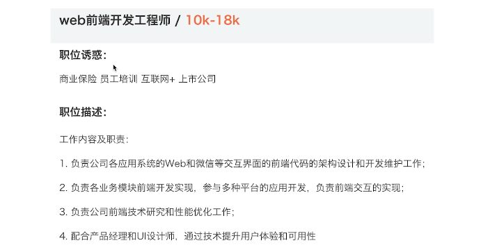

# 分析 JD 招聘要求

JD, Job Description 职位描述，分析 JD 可以看到公司对候选人的要求和期望。

::: tip
如有疑问，可免费 [加群](/docs/services/group.md) 讨论咨询，也可参与 [1v1 面试咨询服务](/docs/services/1v1.md)， 专业、系统、高效、全流程 准备前端面试
:::

## 通过 JD 能看到什么

- 工作内容，负责什么产品和业务
- 薪资范围（参考**最小值**即可，如 15k-20k 那就是 15k）和福利待遇
- 技术栈，但不一定写的很清楚
- 经验要求，例如要求多少年工作经验

根据这些内容，review 一下自己的经验和能力，看是否要投递这个职位。

## 案例分析

从这个 JD 可以看出如下关键信息

- 工资 10k 多一点，不算高
- 上市公司，公司规模很大，有利于自我成长
- 和微信有交互，面试之前需要多看看微信开发文档 —— 重要！
- 有产品经理和 UI 设计师，说明团队、项目都比较正规
- 有商业保险

## 不要过于在意 JD

- JD 是 HR 发布的，很多内容都是从网上抄来的
- HR 不懂技术，写的可能会比较含糊
- 要求会过于理想化，所以“面试造火箭，工作拧螺丝”

所以，不要过于在意 JD ，如果你觉得这个机会比较适合自己，就大胆投递简历，博取一个机会。
