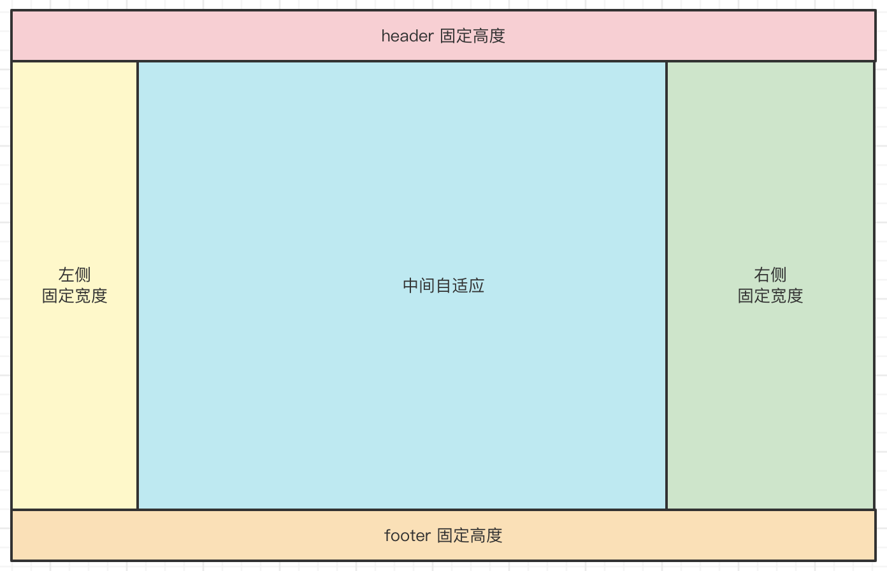

# HTML 和 CSS

随着 Vue React 等框架，和各种 CSS UI 组件库的普及，HTML 和 CSS 很容易被忽略。

如果你是实习生、应届生或刚毕业不久，HTML 和 CSS 知识一定要认真准备，大厂必考。

::: tip
如有疑问，可免费 [加群](/docs/services/group.md) 讨论咨询，也可参与 [1v1 面试咨询服务](/docs/services/1v1.md)， 专业、系统、高效、全流程 准备前端面试
:::

## DOCTYPE 是什么，都有哪些属性？

参考答案

::: details

HTML 的 `<!DOCTYPE>` 声明是文档类型声明，用于告知浏览器当前 HTML 文档使用的 HTML 版本，从而确保文档以正确的模式渲染。它通常出现在 HTML 文档的第一行。

在现代开发中，推荐使用 HTML5 的简单声明

```html
<!DOCTYPE html>
```

在之前的 HTML 版本中，如 HTML4 ，会有其他写法，不过现在已经不常用。

```html
<!DOCTYPE html PUBLIC "-//W3C//DTD HTML 4.01//EN" "http://www.w3.org/TR/html4/strict.dtd">
```

:::

## meta 标签是干什么的，都有什么属性和作用

参考答案

::: details

HTML 中的 `<meta>` 标签用于提供页面的**元信息**，这些信息不会直接显示在网页内容中，但对浏览器、搜索引擎和其他服务非常重要。

常见的 meta 信息如下：

1. 字符编码。指定网页的字符编码，确保正确显示内容。

```html
<meta charset="UTF-8" />
```

2. 页面视口设置（响应式设计）。控制页面在移动设备上的显示和缩放行为。

```html
<meta name="viewport" content="width=device-width, initial-scale=1.0" />
```

- `width=device-width`：页面宽度匹配设备屏幕宽度
- `initial-scale=1.0`：初始缩放比例为 1

3. 搜索引擎优化（SEO）。提供描述性信息，便于搜索引擎索引。

```html
<meta
  name="keywords"
  content="前端, 面试, 前端面试, 面试题, 刷题, 面试流程, 前端面试流程, 面试准备, 简历, 前端简历, Javascript, Typescript, React, Vue, webpack, vite, HTTP, 算法"
/>
<meta name="description" content="面试派，双越老师整理的前端面试真实流程，大厂面试规范，开源免费" />
<meta name="robots" content="index, follow" />
```

4. 作者信息。提供网页作者信息。

```html
<meta name="author" content="双越老师" />
```

:::

## 什么是 DOM ，它和 HTML 有什么区别？

参考答案

::: details

DOM 即 Document Object Model 文档对象模型，它是一个 JS 对象。而 HTML 是一种标记语言（和 XML 类似）用于定义网页的内容和结构。

DOM 的特点

- 树形结构，DOM 树
- 可编程，可以使用 Javascript 读取和修改 DOM 数据
- 动态性，通过 DOM API 动态修改结构和数据

HTML 到 DOM 的过程

- HTML 解析：浏览器解析 HTML 代码，生成 DOM 树。
- CSSOM 生成：解析 CSS，生成 CSSOM（CSS 对象模型）。
- 渲染树：结合 DOM 和 CSSOM，生成渲染树。
- 页面渲染：根据渲染树将内容显示在页面上。

:::

## 如何理解 HTML5 语义化 ？有哪些常见的语义化标签？

理解 HTML5 语义化

::: details

HTML5 语义化是指通过使用具有明确含义的标签，使网页的结构和内容更加清晰，方便浏览器、开发者以及搜索引擎理解网页内容。

语义化的核心在于让标签不仅描述外观，还能表达内容的含义，从而提升网页的可读性、可维护性和可访问性。

- 提高代码可读性：开发者无需额外注释即可理解代码结构。
- 增强 SEO（搜索引擎优化）：搜索引擎能更好地抓取和理解网页内容。
- 提升可访问性：辅助技术（如屏幕阅读器）可以更准确地解释页面内容。
- 支持更好的浏览器兼容性：现代浏览器能够更高效地渲染语义化结构。

:::

常见的 HTML5 语义化标签

::: details

- `<header>` 注意：要区别于 `<head>`
- `<nav>`
- `<main>`
- `<article>`
- `<section>`
- `<aside>`
- `<footer>`
- `<figure>`
- `<figcaption>`
- `<mark>`
- `<time>`
- `<summary>`
- `<details>`

:::

写一个 HTML5 语义化的例子

::: details

```html
<!DOCTYPE html>
<html lang="en">
  <head>
    <meta charset="UTF-8" />
    <meta name="viewport" content="width=device-width, initial-scale=1.0" />
    <title>HTML5 语义化示例</title>
  </head>
  <body>
    <header>
      <h1>面试派</h1>
      <nav>
        <ul>
          <li><a href="#home">首页</a></li>
          <li><a href="#about">关于</a></li>
          <li><a href="#contact">联系</a></li>
        </ul>
      </nav>
    </header>

    <main>
      <section id="home">
        <h2>欢迎访问</h2>
        <p>这是一个 HTML5 语义化的示例。</p>
      </section>
      <section id="about">
        <h2>关于我们</h2>
        <article>
          <h3>我们的历史</h3>
          <p>这是关于我们历史的介绍。</p>
        </article>
      </section>
    </main>

    <aside>
      <h3>相关文章</h3>
      <ul>
        <li><a href="#">文章 1</a></li>
        <li><a href="#">文章 2</a></li>
      </ul>
    </aside>

    <footer>
      <p>&copy; 2025 &copy; 面试派</p>
    </footer>
  </body>
</html>
```

:::

## DOM 节点的 attr 和 property 有何区别

- attr 指的是 HTML 属性（attribute）
- property 指的是 DOM 对象的属性（property）

主要区别

::: details

定义不同

- attr 定义在 HTML 元素上的初始属性，存储在 DOM 元素的属性列表中，与 HTML 源代码一一对应。
- property 是 DOM 对象的属性，是通过浏览器解析 HTML 并生成 DOM 对象时动态创建的，供 JavaScript 操作。

存储位置不同

- attr 是 HTML 的一部分，存储在元素的 HTML 标记 中。
- property 是 DOM 的一部分，存储在 JavaScript 对象中。

行为不同

- attr 一般是静态的，表示元素初始的值，即从 HTML 源代码中解析的值，通常不会因用户操作或脚本修改而自动更新。除非你手动使用 JS 修改值。
- property 一般是动态的，表示当前状态，可以通过 JavaScript 修改，并反映在 DOM 中。

对于一些常用的属性（如 id、value、checked 等），attr 和 property 会部分同步：

- 修改 attr 会影响 property 值。
- 而修改 property 可能不会同步回 attr。

总结，一般来说，attr 用于设置元素的初始状态，而 property 用于操作和获取当前状态。

:::

## 如何一次性插入多个 DOM 节点？考虑性能

参考答案

::: details

直接多次操作 DOM（如多次 `appendChild` 或 `innerHTML` 更新）会导致性能问题，因为每次操作都会触发 DOM 的重新渲染。

`DocumentFragment` 是一个轻量级的文档片段，可以在内存中操作节点，最后一次性插入到 DOM 中，从而减少重绘和回流。

```js
// 获取目标容器
const container = document.getElementById('list')

// 创建 DocumentFragment
const fragment = document.createDocumentFragment()

// 创建多个节点并添加到 fragment 中
for (let i = 1; i <= 1000; i++) {
  const li = document.createElement('li')
  li.textContent = `item ${i}`
  fragment.appendChild(li)
}

// 一次性插入到 DOM
container.appendChild(fragment)
```

:::

## offsetHeight scrollHeight clientHeight 有什么区别

参考答案

::: details

`offsetHeight` 元素的总高度，包括内容高度、内边距（padding）、水平滚动条高度（如果存在）、以及边框（border）。不包括外边距（margin）。

`scrollHeight` 元素的实际内容高度，包括不可见的溢出部分（scrollable content），大于等于 `clientHeight`。

`clientHeight` 元素的可见内容高度，包括内容高度和内边距（padding），但不包括水平滚动条高度、边框（border）和外边距（margin）。

:::

## HTMLCollection 和 NodeList 的区别

在操作 DOM 时，`HTMLCollection` 和 `NodeList` 都是用来表示节点集合的对象，它们的区别是：

::: details

`HTMLCollection` 只包含 **HTML 元素**节点。通过 `document.getElementsByTagName` 或 `document.getElementsByClassName` 返回的结果是 `HTMLCollection。`

`NodeList` 包括 **元素节点、文本节点、注释节点** 等，不仅仅是 **HTML 元素**节点

- 通过 `document.querySelectorAll` 返回的是 静态 `NodeList`
- 通过 `childNodes` 返回的是 动态 `NodeList`

当文档结构发生变化时

- `HTMLCollection` 和 动态 `NodeList` 会随着 DOM 的变化自动更新
- 静态 `NodeList` **不会**随着 DOM 的变化自动更新

:::

## Node 和 Element 有什么区别？

在 DOM（文档对象模型）中，HTML Element 和 Node 都是表示文档结构中的对象，但它们有不同的定义和用途。

::: details

Node 是 DOM 树中所有类型对象的基类，是一个接口，表示文档树中的一个节点。它有多个子类型，Element 是其中的一个。其他的还有 Text、Comment 等。

Node 常见属性如 `nodeName` `nodeValue`

HTML Element 是 Node 的子类，专门表示 HTML 元素节点。它提供了与 HTML 元素相关的更多功能，如属性、样式等。HTML Element 仅表示 HTML 元素节点，通常对应 HTML 标签，如 `<div>`, `<p>`, `<a>` 等。

Element 常见属性和方法如 `innerHTML` `getAttribute` `setAttribute`

:::

## 开发一个无限下拉加载图片的页面，如何给每个图片绑定 click 事件？

参考答案

::: details

使用 **事件委托** 实现，避免重复绑定事件，性能高，适合动态加载的场景。

代码示例

```html
<div id="image-container" style="height: 400px; overflow-y: scroll; border: 1px solid #ccc;">
  <!-- 加载图片 -->
</div>

<script>
  const container = document.getElementById('image-container')

  // 模拟 API 请求加载图片
  let page = 1 // 当前加载的页码
  const loadImages = () => {
    for (let i = 1; i <= 10; i++) {
      const img = document.createElement('img')
      img.src = `https://via.placeholder.com/150?text=Image+${(page - 1) * 10 + i}`
      img.style.margin = '10px'
      img.alt = `Image ${(page - 1) * 10 + i}`
      img.className = 'image-item' // 添加统一的类名
      container.appendChild(img)
    }
    page++
  }

  // 绑定父容器的 click 事件
  container.addEventListener('click', (event) => {
    if (event.target.tagName === 'IMG') {
      alert(`You clicked on ${event.target.alt}`)
    }
  })

  // 监听滚动事件，实现无限加载
  container.addEventListener('scroll', () => {
    if (container.scrollTop + container.clientHeight >= container.scrollHeight) {
      loadImages() // 加载更多图片
    }
  })

  // 初次加载图片
  loadImages()
</script>
```

以上代码中，我们把 `click` 事件统一绑定在 `container` 容器中，然后判断 `event.target.tagName === 'IMG'` 即触发事件。

:::

## window.onload 和 DOMContentLoaded 的区别是什么？

这两个事件都用于检测页面的加载状态，但触发的时机和作用范围有所不同。

::: details

`DOMContentLoaded` 是当 **DOM 树构建完成**（HTML 被解析完成，不等待样式表、图片、iframe 等资源加载）时触发，不依赖于外部资源。

`window.onload` 是当 **整个页面及所有资源**（包括样式表、图片、iframe、脚本等）加载完成时触发，依赖于外部资源。

`DOMContentLoaded` 会更早触发。

使用推荐

- 如果你的逻辑只依赖 DOM 的加载（如操作页面结构、绑定事件），使用 `DOMContentLoaded`。
- 如果你的逻辑需要依赖页面所有资源加载完成（如获取图片尺寸、执行动画），使用 `window.onload`。

:::

## script 标签放在 head 里，怎么解决加载阻塞的问题

在 HTML 中，`<script>` 标签通常会阻塞页面的渲染，尤其是当它放在 `<head>` 部分时，因为浏览器会在执行 JavaScript 代码之前停止解析 HTML。

可参考的解决方案

::: details

1. 使用 `async` 属性。当 `async` 属性添加到 `<script>` 标签时，脚本会异步加载，并在加载完成后立即执行，不会阻塞页面的渲染。适用于不依赖其他脚本或页面内容的独立脚本，但多个 JS 文件时无法保证加载和执行顺序。

```html
<head>
  <script src="script.js" async></script>
</head>
```

2. 使用 `defer` 属性。`defer` 属性使得脚本延迟执行，直到 HTML 文档解析完毕。这意味着脚本不会阻塞 HTML 渲染，且会按照文档中 `<script>` 标签的顺序执行。适用于依赖 DOM 元素的脚本（如操作页面内容）。

```html
<head>
  <script src="script.js" defer></script>
</head>
```

3. 将 `<script>` 放在 `<body>` 最后。

:::

## 常见的 HTML 标签哪些是 inline 元素，哪些是 block 元素，哪些是 inline-block 元素

参考答案

::: details

1. `inline` 元素有：`a`, `span`, `img`, `strong`, `em`, `b`, `i`, `abbr`, `code`, `br`, `q`（引用）, `sub`（下标）, `sup`（上标）

2. `block` 元素有：`div`, `p`, `h1`, `h2`, `h3`, `h4`, `h5`, `h6`, `ul`, `ol`, `li`, `form`, `section`, `article`, `footer`, `header`, `nav`

3. `inline-block` 元素有：`input` `button`

注意，`table` 虽然也是独占一行，但它 `display: table` 不是 `block`

:::

## 常见的 CSS 选择器有哪些？

参考答案

::: details

| 选择器类型          | 示例                               | 说明                                       |
| ------------------- | ---------------------------------- | ------------------------------------------ |
| **元素选择器**      | `p`                                | 选择所有 `<p>` 元素                        |
| **类选择器**        | `.button`                          | 选择所有 `class="button"` 的元素           |
| **ID 选择器**       | `#header`                          | 选择 `id="header"` 的元素                  |
| **通用选择器**      | `*`                                | 选择页面中的所有元素                       |
| **后代选择器**      | `div p`                            | 选择 `div` 内的所有 `<p>` 元素             |
| **子元素选择器**    | `div > p`                          | 选择 `div` 的直接子元素 `<p>`              |
| **相邻兄弟选择器**  | `h1 + p`                           | 选择紧接在 `<h1>` 后面的 `<p>` 元素        |
| **通用兄弟选择器**  | `h1 ~ p`                           | 选择所有紧跟在 `<h1>` 后面的 `<p>` 元素    |
| **属性选择器**      | `a[href]`                          | 选择具有 `href` 属性的所有 `<a>` 元素      |
| **`:hover`**        | `a:hover`                          | 选择鼠标悬停时的 `<a>` 元素                |
| **`:first-child`**  | `p:first-child`                    | 选择父元素中的第一个 `<p>` 元素            |
| **`:nth-child(n)`** | `li:nth-child(odd)`                | 选择父元素中所有奇数位置的 `<li>` 元素     |
| **`::before`**      | `p::before { content: "Note: "; }` | 在每个 `<p>` 元素的前面插入 "Note: "       |
| **`::after`**       | `p::after { content: "."; }`       | 在每个 `<p>` 元素的后面插入一个句点        |
| **`:not()`**        | `p:not(.highlight)`                | 选择所有不具有 `highlight` 类的 `<p>` 元素 |

注意，这里的内容比较全，面试时你也许记不住所有，但只要能说上一半儿。

:::

## CSS 盒子模型，尺寸计算

如下代码，请问 `div1` 的 `offsetWidth` 是多大？

```html
<!-- 如下代码，请问 div1 的 offsetWidth 是多大？ -->
<style>
  #div1 {
    width: 100px;
    padding: 10px;
    border: 1px solid #ccc;
    margin: 10px;
  }
</style>

<div id="div1"></div>
```

答案

::: details
`offsetWidth` 是指 `元素内容 + 内间距 + 边框`的距离，不包括外间距<br>
所以 `offsetWidth` 是 `122px`
:::

追问：如果想要让 `offsetWidth` 等于 `100px` ，还需要再增加一个什么属性？

答案

::: details
增加 `box-sizing: border-box;`
:::

## margin 纵向重叠

如下代码，`AAA` 和 `BBB` 之间的距离是多少？

```html
<!-- 如下代码，AAA 和 BBB 之间的距离是多少？ -->
<style>
  p {
    font-size: 16px;
    line-height: 1;
    margin-top: 10px;
    margin-bottom: 15px;
  }
</style>

<p>AAA</p>
<p></p>
<p></p>
<p></p>
<p>BBB</p>
```

答案

::: details
`AAA` 和 `BBB` 之间的距离是 `15px`
:::

## lineHeight 如何继承？

如下代码，`<p>` 标签的行高将会是多少？

```html
<!--如下代码，p 标签的行高将会是多少？-->
<style>
  body {
    font-size: 20px;
    line-height: 200%;
  }
  p {
    font-size: 16px;
  }
</style>

<body>
  <p>AAA</p>
</body>
```

答案

::: details
`line-height` 不同类型的值，继承规则是不一样的

- 写具体的数值，如 `30px`，则继承该数值 —— 比较好理解
- 写百分比，如 `200%` ，则继承当前计算出来的值，如上述题目 —— 重要！！！
- 写比例，如 `2` 或 `1.5` ，则继承比例

所以，该问题的的答案是，继承 `40px` 。
:::

## margin 负值问题

参考答案

::: details

- `margin-left` 负值，元素左移
- `margin-top` 负值，元素上移
- `margin-right` 负值，自身宽度缩小，右侧元素会跟进，但内容不受影响
- `margin-bottom` 负值，自身高度缩小，下方元素会跟进，但内容不受影响

:::

## 什么是 BFC 如何触发 BFC？

参考答案

::: details

BFC (Block formatting context) 直译为"块级格式化上下文"。它是一个独立的渲染区域，与这个区域外部毫不相干。即，BFC 里面的的内容再怎么发生变化，也不会影响到 BFC 外面的布局，这一点是在网页布局中非常有用的。先说，能形成 BFC 的条件有：

- 根元素
- `float` 属性不为 `none`
- `position` 为 `absolute` 或 `fixed`
- `display` 为 `inline-block` `table-cell` `table-caption` `flex` `inline-flex`
- `overflow` 不为 `visible`

BFC 在网页布局中经常用来清除浮动（特别是在使用 `float` 布局的情况下），最常被用来触发 BFC 的属性是`overflow: hidden`，例如要实现一个左图右文的布局：

```html
<style>
  .bfc {
    overflow: hidden; /* 触发 BFC */
  }
  .left {
    float: left;
  }
</style>

<div class="bfc">
  
  <p class="bfc">text...</p>
</div>
```

:::

## 使用 CSS 实现居中对齐，有哪几种方式？

实现水平居中对齐

::: details

1. inline 元素用`text-align: center;`即可，如下：

```css
.container {
  text-align: center;
}
```

2. block 元素可使用`margin: auto;`

```css
.container {
  text-align: center;
}
.item {
  width: 1000px;
  margin: auto;
}
```

3. 绝对定位元素可结合`left`和`margin`实现，但是必须知道宽度

```css
.container {
  position: relative;
  width: 500px;
}
.item {
  width: 300px;
  height: 100px;
  position: absolute;
  left: 50%;
  margin-left: -150px;
}
```

:::

实现垂直居中对齐

::: details

1. inline 元素可设置`line-height`的值等于`height`值，如单行文字垂直居中：

```css
.container {
  height: 50px;
  line-height: 50px;
}
```

2. 绝对定位元素，可结合`top`和`margin`实现，但是必须知道尺寸

- 优点：兼容性好；
- 缺点：需要提前知道尺寸，

```css
.container {
  position: relative;
  height: 200px;
}
.item {
  width: 80px;
  height: 40px;
  position: absolute;
  left: 50%;
  top: 50%;
  margin-top: -20px;
  margin-left: -40px;
}
```

3. 绝对定位可结合`transform`实现居中

- 优点：不需要提前知道尺寸；
- 缺点：兼容性不好（现代浏览器都没问题）

```css
.container {
  position: relative;
  height: 200px;
}
.item {
  width: 80px;
  height: 40px;
  position: absolute;
  left: 50%;
  top: 50%;
  transform: translate(-50%, -50%);
}
```

4. 绝对定位结合`margin: auto`，不需要提前知道尺寸，兼容性好

```css
.container {
  position: relative;
  height: 300px;
}
.item {
  width: 100px;
  height: 50px;
  position: absolute;
  left: 0;
  top: 0;
  right: 0;
  bottom: 0;
  margin: auto;
}
```

:::

## 什么是 CSS 定位上下文？absolute 和 relative 分别依据谁来定位？

参考答案

::: details

- `relative` 是相对于自身定位的（且不会影响其他元素的定位）
- `absolute` 是相对于上层最近的一个定位元素来定位的，如果没有就依赖于 `body` 定位。

:::

参考资料

::: details

- https://www.ruanyifeng.com/blog/2019/11/css-position.html

:::

## CSS `overflow: hidden` `display：none` 和 `visibility: hidden` 有什么区别

参考答案

::: details

- `overflow: hidden` 溢出内容不可见，未溢出的部分正常可见
- `display：none` 隐藏内容，不占用任何空间，内容变化不会重新渲染
- `visibility: hidden` 隐藏元素，但保留其占据的空间，内容变化会重新渲染

:::

## CSS `px` `%` `em` `rem` `vw/vh` 的区别

参考答案

::: details

| 单位    | 基准                     | 绝对/相对 | 优点                       | 缺点                 | 适用场景                 |
| ------- | ------------------------ | --------- | -------------------------- | -------------------- | ------------------------ |
| `px`    | 固定像素                 | 绝对      | 精确，简单易用             | 缺乏响应式能力       | 固定尺寸元素             |
| `%`     | 父元素尺寸               | 相对      | 灵活，适合响应式设计       | 依赖父元素           | 响应式布局，流式设计     |
| `em`    | 当前元素字体大小         | 相对      | 动态调整，适合局部相对设计 | 嵌套复杂，计算难预测 | 动态字体、内外边距等     |
| `rem`   | 根元素字体大小（`html`） | 相对      | 全局一致，计算简单         | 需要设置根元素字体   | 全局比例调整，响应式设计 |
| `vw/vh` | 视口宽度或高度           | 相对      | 基于视口，适合全屏设计     | 小屏显示可能不理想   | 全屏布局，视口动态调整   |

使用建议:

- 响应式设计：结合使用 rem 和 %。
- 固定大小：使用 px 定义精确尺寸。
- 全屏布局：使用 vw 和 vh。
- 动态比例设计：em 和 rem 都是优秀的选择，但推荐 rem 更加简洁统一。

:::

## 如何实现 Retina 屏 1px 像素边框

参考答案

::: details

1. 使用 `transform: scale` 实现。

```css
.retina-border {
  position: relative;
}

.retina-border::after {
  content: '';
  position: absolute;
  left: 0;
  right: 0;
  bottom: 0;
  height: 1px; /* 边框的物理宽度 */
  background-color: black; /* 边框颜色 */
  transform: scaleY(0.5); /* 缩放到 0.5 */
  transform-origin: 0 0; /* 缩放起点 */
}
```

2. 使用 `box-shadow` 模拟边框

```css
.retina-border {
  position: relative;
  box-shadow: 0 1px 0 rgba(0, 0, 0, 0.5); /* 通过阴影模拟边框 */
}
```

:::

## 使用 CSS 画一个三角形

参考答案

::: details

使用 CSS “画”一个向上的三角形，重点在于使用透明边框。

```html
<style>
  .triangle-up {
    width: 0;
    height: 0;
    border-left: 50px solid transparent;
    border-right: 50px solid transparent;
    border-bottom: 50px solid #000; /* 底部颜色即为三角形颜色 */
  }
</style>
<div class="triangle-up"></div>
```

:::

## 如何实现黑白主题变化？

参考答案

::: details

可使用 CSS 变量

```css
/* 定义变量 */
:root,
:host {
  --color: #333;
  --bg-color: #fff;
}

/* 使用变量 */
p {
  color: var(--color);
  background-color: var(--bg-color);
}
```

:::

## 如何实现响应式布局？

CSS 实现响应式布局可以使页面在不同的设备和屏幕尺寸上有良好的显示效果，以下是几种常见的实现方式：

::: details

1. 使用媒体查询（Media Queries）。媒体查询是响应式布局的核心技术，通过检测设备的宽度、高度、分辨率等条件应用不同的样式。可根据屏幕宽度调整字体大小、布局样式等。

```css
/* 默认样式 */
body {
  font-size: 16px;
  padding: 20px;
}

/* 屏幕宽度小于等于768px时的样式 */
@media (max-width: 768px) {
  body {
    font-size: 14px;
    padding: 10px;
  }
}

/* 屏幕宽度大于1200px时的样式 */
@media (min-width: 1200px) {
  body {
    font-size: 18px;
    padding: 30px;
  }
}
```

2. 使用弹性盒子（Flexbox）。创建水平或垂直方向上的自适应布局，比如导航栏、网格布局。

```css
.container {
  display: flex;
  flex-wrap: wrap; /* 允许换行 */
}

.item {
  flex: 1 1 200px; /* 每个子项占据至少200px，随空间调整 */
  margin: 10px;
  background-color: #f0f0f0;
}
```

3. 使用网格布局（CSS Grid Layout）。 创建复杂的自适应网格布局，比如图片库、商品列表。

```css
.container {
  display: grid;
  grid-template-columns: repeat(auto-fit, minmax(200px, 1fr));
  gap: 20px;
}

.item {
  background-color: #d4edda;
  padding: 10px;
}
```

4. 使用百分比和单位 vh/vw 实现宽度和高度的自适应。实现宽度和高度随窗口变化而调整。

```css
.container {
  width: 80%; /* 占父容器的80% */
  height: 50vh; /* 占视口高度的50% */
  background-color: #e9ecef;
}
```

:::

## 如何理解 `z-index` ？

::: details

- `z-index` 是一个 CSS 属性，用于控制元素的堆叠顺序（沿 Z 轴的显示顺序）。值越大，元素越靠前显示，反之值越小，元素越靠后。
- `z-index` 只适用于**定位**的元素，需要设置 `position` 属性为 `relative`、`absolute`、`fixed` 或 `sticky`，否则 `z-index` 不生效。
- `z-index` 只在**同级**比较，父子元素的 `z-index` 不会互相影响。

:::

## 使用 flex 设计一个“四合院”布局

如下图



参考答案

::: details

```html
<html lang="en">
  <head>
    <meta charset="UTF-8" />
    <meta http-equiv="X-UA-Compatible" content="IE=edge" />
    <meta name="viewport" content="width=device-width, initial-scale=1.0" />
    <title>CSS 四合院</title>
    <style>
      html * {
        margin: 0;
        padding: 0;
      }
      html {
        height: 100%;
      }
      body {
        display: flex;
        flex-direction: column;
        height: 100%;
      }
      #header {
        height: 50px;
        background-color: red;
      }
      #container {
        flex: 1;
        display: flex;
      }
      #left-container {
        width: 100px;
        background-color: green;
      }
      #main-container {
        flex: 1;
        background-color: #ccc;
      }
      #right-container {
        width: 200px;
        background-color: yellow;
      }
      #footer {
        height: 50px;
        background-color: blue;
      }
    </style>
  </head>
  <body>
    <!-- HTML5 标签 语义化 -->
    <header id="header">header</header>
    <section id="container">
      <aside id="left-container">left</aside>
      <section id="main-container">main</section>
      <!-- 或者用 article ，看用途 -->
      <aside id="right-container">right</aside>
      <!-- 或者用 section ，看用途 -->
    </section>
    <footer id="footer">footer</footer>
  </body>
</html>
```

:::

## 你用过哪些 CSS 相关的技术，如库、框架、预处理语言、后处理语言等

参考答案

::: details

- CSS 框架：TailwindCSS BootStrap
- CSS 预处理语言：Less Sass Stylus
- CSS 后处理语言：PostCSS Autoprefixer
- CSS 组件库：ElementUI AntDesign
- CSS-in-JS：Styled-Components Emotion
- CSS 工具：Normalize.css Animate.css

:::

## CSS选择器有哪些？优先级如何计算？

::: details
CSS选择器主要包括：

- 基础选择器：标签选择器、类选择器、ID选择器、通配符选择器
- 组合选择器：后代选择器、子选择器、相邻兄弟选择器、通用兄弟选择器
- 属性选择器：如[type="text"]
- 伪类选择器：如:hover、:focus
- 伪元素选择器：如::before、::after
- CSS优先级计算规则：

- !important > 行内样式 > ID选择器 > 类/属性/伪类选择器 > 标签/伪元素选择器 > 通配符
- 计算方式：
- 行内样式：1000分
- ID选择器：100分
- 类/属性/伪类选择器：10分
- 标签/伪元素选择器：1分
- 通配符：0分
  相同优先级下，后声明的样式覆盖先声明的样式。

详细解析
CSS选择器全家桶 🧩
哎呀，CSS选择器这么多，头都大了有没有？别担心，我来帮你一一梳理清楚！

基础选择器 🔤
这些是我们天天打交道的"老朋友"：

```css
* {
  margin: 0;
} /* 通配符选择器，选中所有元素 */
div {
  color: red;
} /* 标签选择器，选中所有div标签 */
.box {
  width: 100px;
} /* 类选择器，选中所有class为box的元素 */
#app {
  height: 200px;
} /* ID选择器，选中id为app的元素 */
```

组合选择器

```css
div p {
  font-size: 16px;
} /* 后代选择器，选中div内所有p元素 */
div > p {
  color: blue;
} /* 子选择器，只选中div的直接子元素p */
div + p {
  margin-top: 10px;
} /* 相邻兄弟选择器，选中紧跟在div后的p */
div ~ p {
  text-indent: 2em;
} /* 通用兄弟选择器，选中div后的所有同级p */
```

属性选择器

```css
[type] {
  outline: none;
} /* 有type属性的元素 */
[type='text'] {
  border: 1px solid #ccc;
} /* type属性为text的元素 */
[class^='icon-'] {
  font-family: 'iconfont';
} /* class以icon-开头的元素 */
[href$='.pdf'] {
  color: red;
} /* href以.pdf结尾的元素 */
[title*='hello'] {
  text-decoration: underline;
} /* title包含hello的元素 */
```

伪类选择器

```css
a:link {
  color: blue;
} /* 未访问的链接 */
a:visited {
  color: purple;
} /* 已访问的链接 */
a:hover {
  text-decoration: none;
} /* 鼠标悬停时 */
a:active {
  color: red;
} /* 激活状态（鼠标按下时） */
input:focus {
  border-color: skyblue;
} /* 获得焦点时 */
li:first-child {
  font-weight: bold;
} /* 第一个子元素 */
li:nth-child(2n) {
  background: #f5f5f5;
} /* 偶数子元素 */
```

伪元素选择器

```css
p::first-line {
  font-weight: bold;
} /* 第一行文本 */
p::first-letter {
  font-size: 2em;
} /* 第一个字符 */
div::before {
  content: '前缀';
} /* 在元素内容前插入 */
div::after {
  content: '后缀';
} /* 在元素内容后插入 */
```

:::

## CSS中可继承与不可继承属性有哪些？

::: details

- CSS属性按继承性可分为两类：

- 可继承属性：主要是与文本相关的属性，如 color、font-size、font-family、line-height、text-align 等，这些属性会从父元素传递给子元素。

- 不可继承属性：主要是与盒模型相关的属性，如 width、height、margin、padding、border、background 等，这些属性不会从父元素传递给子元素。

- 继承性是CSS中重要的概念，合理利用继承可以减少代码冗余，提高样式的可维护性。
  :::

## 动原理及清除浮动的方法

::: details
CSS浮动(float)是一种布局机制，允许元素向左或向右浮动，使其脱离正常文档流。浮动元素会影响其他元素的排列，产生一些特殊效果。

浮动的核心原理：

- 元素设置float后会脱离正常文档流
- 浮动元素会尽量靠近父元素的左侧或右侧
- 浮动元素会影响后续元素的布局
- 浮动元素的父元素无法感知其高度，导致"高度塌陷"
  常用的清除浮动方法：

- 使用clear属性：在浮动元素后添加清除浮动的元素
- 父元素设置overflow：给父元素设置overflow: hidden/auto
- 使用伪元素::after：通过给父元素添加伪元素清除浮动
- 父元素也浮动：不推荐，会产生新的浮动问题
- 使用display: flow-root：现代解决方案，无副作用

:::

## 如何实现元素水平垂直居中？

::: details

- 实现元素水平垂直居中的常用方法有：

- Flex布局：设置父元素 `display: flex; justify-content: center; align-items: center`;

- Grid布局：设置父元素 `display: grid; place-items: center`;

- 绝对定位 + transform：设置子元素 `position: absolute; top: 50%; left: 50%; transform: translate(-50%, -50%)`;

- 绝对定位 + margin：已知宽高的元素可设置 `position: absolute; top: 0; left: 0; right: 0; bottom: 0; margin: auto`;

:::

## 主题切换的实现方案

::: details
主题切换的核心实现方案可以归纳为三种主要方式：

- CSS 变量方案 - 通过切换 CSS 变量值实现不同主题样式，是目前最推荐的方式
- 类名切换方案 - 在根元素上添加/移除特定类名
- 媒体查询方案 - 利用 prefers-color-scheme 响应系统主题偏好
- 成熟的主题切换系统需要考虑：主题持久化、无闪烁切换和动态加载主题资源。

### CSS 变量方案

```css
/* 定义默认（亮色）主题变量 */
:root {
  --primary-color: #4361ee;
  --bg-color: #ffffff;
  --text-color: #333333;
}

/* 定义暗色主题变量 */
[data-theme='dark'] {
  --primary-color: #4cc9f0;
  --bg-color: #121212;
  --text-color: #f0f0f0;
}
```

使用时只需切换 HTML 元素的 data-theme 属性：

```js
// 切换主题
function toggleTheme() {
  const currentTheme = document.documentElement.getAttribute('data-theme') || 'light'
  const newTheme = currentTheme === 'light' ? 'dark' : 'light'
  document.documentElement.setAttribute('data-theme', newTheme)
  localStorage.setItem('theme', newTheme) // 持久化存储用户偏好
}
```

### 类名切换方案

这是最传统的方案，通过在根元素上添加类名来控制样式：

```css
/* 默认亮色主题 */
body {
  background-color: #ffffff;
  color: #333333;
}

/* 暗色主题 */
body.dark-theme {
  background-color: #121212;
  color: #f0f0f0;
}
```

```js
function toggleTheme() {
  document.body.classList.toggle('dark-theme')
  const isDark = document.body.classList.contains('dark-theme')
  localStorage.setItem('isDarkTheme', isDark)
}
```

### 响应系统偏好

现代浏览器支持 prefers-color-scheme 媒体查询，可以自动跟随系统主题：

```css
/* 默认亮色主题 */
:root {
  --bg-color: #ffffff;
  --text-color: #333333;
}

/* 响应系统暗色主题 */
@media (prefers-color-scheme: dark) {
  :root {
    --bg-color: #121212;
    --text-color: #f0f0f0;
  }
}
```

还可以在 JavaScript 中监听系统主题变化：

```js
const darkModeMediaQuery = window.matchMedia('(prefers-color-scheme: dark)')

// 初始检查
applyTheme(darkModeMediaQuery.matches)

// 监听系统主题变化
darkModeMediaQuery.addEventListener('change', (e) => {
  applyTheme(e.matches)
})
```

:::

## 如何判断元素是否到达可视区域

::: details
判断元素是否到达可视区域主要有以下几种方法：

- getBoundingClientRect() - 获取元素的大小及其相对于视口的位置
- Intersection Observer API - 现代浏览器推荐的异步观察元素与视口交叉状态的方法
- 传统的 scroll 事件监听 - 结合元素位置计算判断可见性
- 其中，Intersection Observer API 是当前最推荐的解决方案，它性能更好且使用更简单。

### 1. getBoundingClientRect() 方法

这个方法返回元素的大小及其相对于视口的位置，返回的是一个 DOMRect 对象，包含 top、right、bottom、left、width、height 等属性。

```js
function isInViewport(element) {
  const rect = element.getBoundingClientRect()

  return (
    rect.top >= 0 &&
    rect.left >= 0 &&
    rect.bottom <= (window.innerHeight || document.documentElement.clientHeight) &&
    rect.right <= (window.innerWidth || document.documentElement.clientWidth)
  )
}

// 使用示例
const box = document.querySelector('.my-element')
if (isInViewport(box)) {
  console.log('元素在可视区域内')
}
```

### 2. Intersection Observer API

```js
function watchElement(element, callback) {
  const observer = new IntersectionObserver((entries) => {
    entries.forEach((entry) => {
      if (entry.isIntersecting) {
        callback(entry.target)
      }
    })
  })

  observer.observe(element)

  // 返回观察者实例，便于后续清理
  return observer
}

// 使用示例
const box = document.querySelector('.my-element')
const observer = watchElement(box, (element) => {
  console.log('元素进入可视区域了！')
  // 如果只需要触发一次，可以停止观察
  // observer.unobserve(element);
})
```

### 3. scroll 事件监听

```js
function handleVisibility() {
  const elements = document.querySelectorAll('.need-to-watch')

  elements.forEach((element) => {
    const position = element.getBoundingClientRect()
    const isVisible = position.top < window.innerHeight && position.bottom >= 0

    if (isVisible) {
      element.classList.add('visible')
    }
  })
}

window.addEventListener('scroll', handleVisibility)
// 初始检查
handleVisibility()
```

但这种方法有严重的性能问题！为了优化，我们可以使用节流技术：

```js
function throttle(fn, delay) {
  let timer = null
  return function () {
    if (!timer) {
      timer = setTimeout(() => {
        fn.apply(this, arguments)
        timer = null
      }, delay)
    }
  }
}

// 使用节流函数包装处理函数
const throttledHandler = throttle(handleVisibility, 200)
window.addEventListener('scroll', throttledHandler)
```

### 实战应用场景

- 图片懒加载：当图片滚动到可视区域时才加载，节省带宽

```js
const imgObserver = new IntersectionObserver((entries) => {
  entries.forEach((entry) => {
    if (entry.isIntersecting) {
      const img = entry.target
      const src = img.getAttribute('data-src')
      img.setAttribute('src', src)
      imgObserver.unobserve(img) // 加载后停止观察
    }
  })
})

document.querySelectorAll('img[data-src]').forEach((img) => {
  imgObserver.observe(img)
})
```

- 无限滚动列表：当用户滚动到底部时加载更多内容

- 动画触发：元素进入视口时播放动画

- 广告曝光统计：计算广告元素的实际曝光时间

- 视频自动播放控制：进入视口播放，离开暂停
