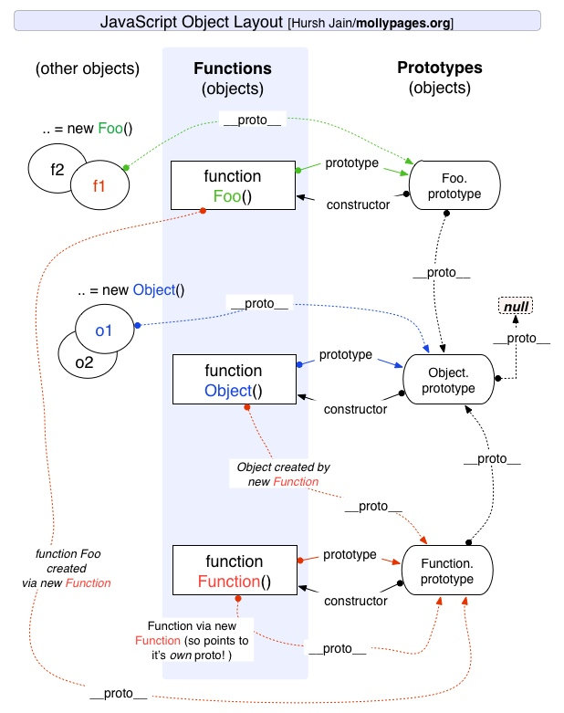
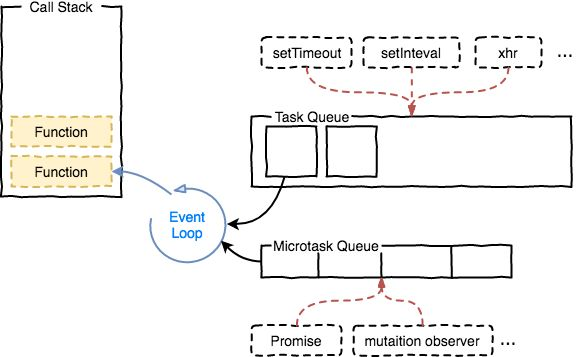

# JS 基础知识

JS 是前端开发的核心能力，面试重点考察，无论工作经验长短。

::: tip
如有疑问，可免费 [加群](/docs/services/group.md) 讨论咨询，也可参与 [1v1 面试咨询服务](/docs/services/1v1.md)， 专业、系统、高效、全流程 准备前端面试
:::

## 了解哪些最新的 ES 新特性？

参考答案

::: details

**特性 1: ES2024 的 JSON 模块**

支持直接通过 `import` 语法加载 JSON 文件，避免额外的文件读取逻辑。

```js
import config from './config.json' assert { type: 'json' }

console.log(config.setting) // 输出 JSON 文件中的指定属性
```

**特性 2: ES2023 的 Array.prototype.findLast & Array.prototype.findLastIndex**

两个数组新方法，用于从最后一个元素搜索数组元素。它们的功能与 `find() 和 findIndex()` 类似，但搜索从数组末尾开始。

这些方法可在 `Array 和 TypedArray` 原型上使用。此功能通过消除手动数组反转的过程，为逆序搜索提供了一种有效的方法。

```js
const isOdd = (number) => number % 2 === 1
const numbers = [1, 2, 3, 4, 5]

console.log(numbers.findLast(isOdd)) // 5
console.log(numbers.findLastIndex(isOdd)) // 4
```

**特性 3: ES2022 的类字段与私有方法**

支持类中的私有字段 `（#field）` 和私有方法，增强了封装性。

```js
class Counter {
  #count = 0

  increment() {
    this.#count++
  }

  #logCount() {
    console.log(this.#count)
  }
}

const counter = new Counter()
counter.increment()
// counter.#logCount(); // 报错，私有方法不可访问
```

**特性 4: ES2021 的逻辑赋值运算符**

新增 `&&=, ||=, ??=`，简化条件赋值逻辑。

```js
let user = { name: 'Alice', age: null }

user.name ||= 'Default Name' // 如果 name 为 falsy，则赋值
user.age ??= 18 // 如果 age 为 null 或 undefined，则赋值

console.log(user) // { name: 'Alice', age: 18 }
```

**特性 5: ES2020 的可选链和空值合并操作符**

简化深层嵌套对象属性的访问，并安全处理空值。

```js
const user = {
  profile: {
    details: { name: 'Alice' },
  },
}

const name = user.profile?.details?.name ?? 'Anonymous'
console.log(name) // 输出 'Alice'

const age = user.profile?.age ?? 18
console.log(age) // 输出 18
```

**特性 6: ES2019 的数组 flat 和 flatMap 方法**

flat 展开多层嵌套数组，flatMap 结合映射与扁平化操作。

```js
const nestedArray = [1, [2, [3, 4]], 5]
console.log(nestedArray.flat(2)) // [1, 2, 3, 4, 5]

const strings = ['hello', 'world']
console.log(strings.flatMap((str) => str.split('')))
// ['h', 'e', 'l', 'l', 'o', 'w', 'o', 'r', 'l', 'd']
```

:::

参考文档

::: details

- https://juejin.cn/post/7459351912133132351

:::

## `typeof` 能判断哪些类型

参考答案

::: details

| **类型**                | **返回值**    | **备注**                                               |
| ----------------------- | ------------- | ------------------------------------------------------ |
| **Undefined**           | `"undefined"` | 当变量未被定义或未赋值时，返回此值。                   |
| **Null**                | `"object"`    | 历史遗留问题，`null` 被错误地识别为对象。              |
| **Boolean**             | `"boolean"`   | 适用于 `true` 或 `false` 值。                          |
| **Number**              | `"number"`    | 适用于整数和浮点数（包括特殊值 `NaN` 和 `Infinity`）。 |
| **String**              | `"string"`    | 适用于字符串（例如 `"hello"`）。                       |
| **BigInt**              | `"bigint"`    | 适用于任意大的整数（例如 `10n`）。                     |
| **Symbol**              | `"symbol"`    | 适用于 `Symbol` 类型。                                 |
| **Function（classes）** | `"function"`  | 适用于可调用的对象（如函数和类定义）。                 |
| **其他对象**            | `"object"`    | 包括数组、普通对象、日期对象、正则表达式等非函数对象。 |

**注意：**

1. **`typeof null === "object"`**
   在 JavaScript 最初的实现中，JavaScript 中的值是由一个表示类型的标签和实际数据值表示的。对象的类型标签是 0。由于 null 代表的是空指针（大多数平台下值为 0x00），因此，null 的类型标签是 0，typeof null 也因此返回 "object"

2. **实际使用**
   对于更复杂的类型检测，可以使用工具函数，如 `Object.prototype.toString.call()` 或第三方库（如 `lodash`）。

```js
// 数值
typeof 37 === 'number'
typeof 3.14 === 'number'
typeof 42 === 'number'
typeof Math.LN2 === 'number'
typeof Infinity === 'number'
typeof NaN === 'number' // 尽管它是 "Not-A-Number" (非数值) 的缩写
typeof Number(1) === 'number' // Number 会尝试把参数解析成数值
typeof Number('shoe') === 'number' // 包括不能将类型强制转换为数字的值

typeof 42n === 'bigint'

// 字符串
typeof '' === 'string'
typeof 'bla' === 'string'
typeof `template literal` === 'string'
typeof '1' === 'string' // 注意内容为数字的字符串仍是字符串
typeof typeof 1 === 'string' // typeof 总是返回一个字符串
typeof String(1) === 'string' // String 将任意值转换为字符串，比 toString 更安全

// 布尔值
typeof true === 'boolean'
typeof false === 'boolean'
typeof Boolean(1) === 'boolean' // Boolean() 会基于参数是真值还是虚值进行转换
typeof !!1 === 'boolean' // 两次调用 !（逻辑非）运算符相当于 Boolean()

// Symbols
typeof Symbol() === 'symbol'
typeof Symbol('foo') === 'symbol'
typeof Symbol.iterator === 'symbol'

// Undefined
typeof undefined === 'undefined'
typeof declaredButUndefinedVariable === 'undefined'
typeof undeclaredVariable === 'undefined'

// 对象
typeof { a: 1 } === 'object'

// 使用 Array.isArray 或者 Object.prototype.toString.call
// 区分数组和普通对象
typeof [1, 2, 4] === 'object'

typeof new Date() === 'object'
typeof /regex/ === 'object'

// 下面的例子令人迷惑，非常危险，没有用处。避免使用它们。
typeof new Boolean(true) === 'object'
typeof new Number(1) === 'object'
typeof new String('abc') === 'object'

// 函数
typeof function () {} === 'function'
typeof class C {} === 'function'
typeof Math.sin === 'function'
```

:::

## `==` 和 `===` 有什么区别？

参考答案

::: details

- **`==`（宽松相等）**：会在比较两个操作数时执行 **类型转换**，尝试将两者转换为相同类型后再比较。
- **`===`（严格相等）**：不会执行类型转换，仅在类型和值完全相同的情况下返回 `true`。
- **推荐使用 `===`**：因为它更严格、更符合预期，能避免潜在的错误。尤其是在需要精确判断值和类型时。
- 实际工作中，使用 if (a == null) 可判断 a 是否是 null 或者 undefined。

**常见比较结果**

| **x**               | **y**               | **==** | **===** |
| ------------------- | ------------------- | ------ | ------- |
| `undefined`         | `undefined`         | ✅     | ✅      |
| `null`              | `null`              | ✅     | ✅      |
| `true`              | `true`              | ✅     | ✅      |
| `false`             | `false`             | ✅     | ✅      |
| `'foo'`             | `'foo'`             | ✅     | ✅      |
| `0`                 | `0`                 | ✅     | ✅      |
| `+0`                | `-0`                | ✅     | ✅      |
| `+0`                | `0`                 | ✅     | ✅      |
| `-0`                | `0`                 | ✅     | ✅      |
| `0n`                | `-0n`               | ✅     | ✅      |
| `0`                 | `false`             | ✅     | ❌      |
| `""`                | `false`             | ✅     | ❌      |
| `""`                | `0`                 | ✅     | ❌      |
| `'0'`               | `0`                 | ✅     | ❌      |
| `'17'`              | `17`                | ✅     | ❌      |
| `[1, 2]`            | `'1,2'`             | ✅     | ❌      |
| `new String('foo')` | `'foo'`             | ✅     | ❌      |
| `null`              | `undefined`         | ✅     | ❌      |
| `null`              | `false`             | ❌     | ❌      |
| `undefined`         | `false`             | ❌     | ❌      |
| `{ foo: 'bar' }`    | `{ foo: 'bar' }`    | ❌     | ❌      |
| `new String('foo')` | `new String('foo')` | ❌     | ❌      |
| `0`                 | `null`              | ❌     | ❌      |
| `0`                 | `NaN`               | ❌     | ❌      |
| `'foo'`             | `NaN`               | ❌     | ❌      |
| `NaN`               | `NaN`               | ❌     | ❌      |

说明：

- ✅ 表示比较结果为 `true`
- ❌ 表示比较结果为 `false`

:::

## 你熟悉哪些数组 API ？

参考答案

::: details

1. **创建数组**
   - `Array()`, `Array.of()`, `Array.from()`

```js
Array.of(1, 2, 3) // [1, 2, 3]
Array.from('123') // ['1', '2', '3']
```

2. **添加/删除元素**
   - `push()`: 在末尾添加
   - `pop()`: 删除末尾
   - `unshift()`: 在开头添加
   - `shift()`: 删除开头

```js
let arr = [1, 2]
arr.push(3) // [1, 2, 3]
arr.pop() // [1, 2]
arr.unshift(4) // [4, 1, 2]
arr.shift() // [1, 2]
```

3. **组合/拆分数组**
   - `concat()`: 合并数组，不影响原数组，浅拷贝
   - `join()`: 将数组连接为字符串
   - `slice()`: 截取部分数组（不修改原数组）

```js
;[1, 2].concat([3, 4]) // [1, 2, 3, 4]
;['a', 'b', 'c'].join('-') // 'a-b-c'
```

4. **替换/重组**
   - `splice()`: 添加、删除或替换元素

```js
let arr = [1, 2, 3]
arr.splice(1, 1, 'a') // [1, 'a', 3]
```

5. **查找单个元素**
   - `indexOf()`: 查找首次出现的索引
   - `lastIndexOf()`: 查找最后出现的索引
   - `find()`: 找到第一个满足条件的元素
   - `findIndex()`: 找到第一个满足条件的索引

```js
;[1, 2, 3].indexOf(2) // 1
;[1, 2, 3, 2].lastIndexOf(2) // 3
;[1, 2, 3].find((x) => x > 2) // 3
```

6. **判断**
   - `includes()`: 判断是否包含某元素
   - `some()`: 判断是否至少有一个元素满足条件
   - `every()`: 判断是否所有元素满足条件

```js
;[1, 2, 3].includes(2) // true
;[1, 2, 3].some((x) => x > 2) // true
;[1, 2, 3].every((x) => x > 0) // true
```

7. **迭代**
   - `forEach()`: 遍历元素，无法 break，可以用 try/catch 中 throw new Error 来停止

```js
;[1, 2, 3].forEach((item, index) => console.log(item, index))
```

8. **映射/变换**
   - `map()`: 对每个元素进行操作并生成新数组

```javascript
;[1, 2, 3].map((x) => x * 2) // [2, 4, 6]
```

9. **过滤**
   - `filter()`: 筛选出满足条件的元素

```js
;[1, 2, 3].filter((x) => x > 1) // [2, 3]
```

10. **规约**

- `reduce()`: 将数组缩减为单一值
- `reduceRight()`: 从右向左缩减

```js
;[1, 2, 3].reduce((acc, val) => acc + val, 0) // 6
;['a', 'b', 'c'].reduceRight((acc, val) => acc + val, '') // 'cba'
```

11. **排序**

- `sort()`: 对数组进行排序
- `reverse()`: 反转数组顺序

```js
;[3, 1, 2].sort((a, b) => a - b) // [1, 2, 3]
;[1, 2, 3].reverse() // [3, 2, 1]
```

12. **填充**

- `fill()`: 用指定值填充数组

```js
new Array(3).fill(0) // [0, 0, 0]
```

13. **扁平化**

- `flat()`: 将多维数组展平成一维
- `flatMap()`: 映射并展平

```js
;[1, [2, [3]]].flat(2) // [1, 2, 3]
;[1, 2].flatMap((x) => [x, x * 2]) // [1, 2, 2, 4]
```

14. **复制/填充**

- `copyWithin()`: 将数组的部分内容复制到其他位置

```js
;[1, 2, 3, 4].copyWithin(1, 2) // [1, 3, 4, 4]
```

15. **生成键值对**

- `keys()`, `values()`, `entries()`

```js
const arr = ['a', 'b', 'c']
;[...arr.keys()] // [0, 1, 2]
;[...arr.entries()] // [[0, 'a'], [1, 'b'], [2, 'c']]
```

16. **判断是否是数组**

- `Array.isArray()`

```js
Array.isArray([1, 2, 3]) // true
```

:::

## 值类型和引用类型的区别

```js
// 值类型
let a = 100
let b = a
a = 200
console.log(b) // 100
```

```js
// 引用类型
let a = { age: 20 }
let b = a
b.age = 21
console.log(a.age) // 21
```

参考答案

::: details

| 特性               | 值类型                                                                | 引用类型                                     |
| ------------------ | --------------------------------------------------------------------- | -------------------------------------------- |
| **存储内容**       | 数据值本身                                                            | 数据的引用（地址）                           |
| **存储位置**       | 栈内存                                                                | 栈存引用，堆存实际数据                       |
| **赋值方式**       | 拷贝值                                                                | 拷贝引用（地址）                             |
| **变量之间独立性** | 互相独立，互不影响                                                    | 指向同一数据，互相影响                       |
| **常见数据类型**   | 基本数据类型（如 `number，string，boolean，undefined，null，symbol`） | 复杂数据类型（如 `Object，Array，Function`） |

1. 为什么有值类型和引用类型？

- **值类型**适合存储简单、占用内存较小的数据，操作快速。
- **引用类型**适合存储复杂、占用内存较大的数据，支持动态扩展。

2. 如何避免引用类型的共享问题？

- 如果需要创建引用类型的副本，使用深拷贝，而非浅拷贝。

深拷贝例子：

```javascript
const obj1 = { name: 'Alice' }
const obj2 = JSON.parse(JSON.stringify(obj1)) // 创建深拷贝
obj2.name = 'Bob'
console.log(obj1.name) // "Alice"
```

浅拷贝例子：

```javascript
const obj1 = { name: 'Alice' }
const obj2 = { ...obj1 } // 浅拷贝
obj2.name = 'Bob'
console.log(obj1.name) // "Alice"
```

:::

## 箭头函数和普通函数的区别

参考答案

::: details

| 特性                       | 箭头函数                                       | 普通函数                              |
| -------------------------- | ---------------------------------------------- | ------------------------------------- |
| 语法                       | 简洁，使用 `=>` 定义                           | 使用 `function` 定义                  |
| `this` 绑定                | 词法绑定，继承外层 `this`                      | 动态绑定，调用时决定                  |
| `arguments` 对象           | 没有，需要使用 `...args`                       | 有自己的 `arguments` 对象             |
| 是否能作为构造函数         | 不能                                           | 可以                                  |
| 是否有 `prototype` 属性    | 没有                                           | 有                                    |
| 是否支持 `bind/call/apply` | 不支持                                         | 支持                                  |
| 适用场景                   | 用于回调函数、闭包、需要继承外层 `this` 的场景 | 需要动态绑定 `this`，或用作构造函数时 |

```js
// 箭头函数 this
const obj = {
  name: 'Alice',
  say: () => {
    console.log(this.name) // undefined (继承全局作用域的 this)
  },
}
obj.say()

// 普通函数 this
const obj = {
  name: 'Alice',
  say: function () {
    console.log(this.name) // "Alice" (this 指向 obj)
  },
}
obj.say()

// 箭头函数 不能作为构造函数
const Person = (name) => {
  this.name = name
}
const p = new Person('Alice') // TypeError: Person is not a constructor

// 普通函数 构造函数
function Person(name) {
  this.name = name
}
const p = new Person('Alice')
console.log(p.name) // "Alice"

// 箭头函数 ...args
const add = (...args) => {
  console.log(args) // [1, 2, 3]
}
add(1, 2, 3)

// 普通函数 arguments
function add() {
  console.log(arguments) // Arguments(3) [1, 2, 3]
}
add(1, 2, 3)

// 箭头函数 不支持 `bind/call/apply`
const obj = {
  value: 42,
}
const arrowFn = () => {
  console.log(this.value)
}
arrowFn.call(obj) // undefined

// 普通函数 支持 `bind/call/apply`
const obj = {
  value: 42,
}
function normalFn() {
  console.log(this.value)
}
normalFn.call(obj) // 42
```

:::

## 什么时候不能使用箭头函数

参考答案

::: details

1. 需要动态绑定 `this` 的场景。
2. 作为`构造函数`。
3. 需要 `arguments` 对象的场景。
4. 需要显式修改 `this` 的场景（使用 `bind/call/apply` 等）。
5. 类的实例方法（特别是 `getter 和 setter`）。—— 无法动态绑定 `this`

:::

## for...in 和 for...of 的区别

参考答案

::: details

| 特性               | `for...in`                   | `for...of`                              |
| ------------------ | ---------------------------- | --------------------------------------- |
| **用途**           | 遍历对象的 **可枚举属性**    | 遍历 **可迭代对象**（如数组、字符串等） |
| **返回值**         | 返回 **键**（属性名）        | 返回 **值**（元素值）                   |
| **适用范围**       | 对象、数组（不推荐用于数组） | 数组、字符串、Set、Map等可迭代对象      |
| **是否遍历原型链** | 会遍历原型链上的可枚举属性   | 不会遍历原型链                          |

```javascript
// for...in 遍历对象
const obj = { name: 'Alice', age: 25 }

for (let key in obj) {
  console.log(key) // 输出属性名：name, age
  console.log(obj[key]) // 输出属性值：Alice, 25
}

// for...in 遍历数组，不推荐
const arr = [10, 20, 30]

for (let index in arr) {
  console.log(index) // 输出索引：0, 1, 2
  console.log(arr[index]) // 输出值：10, 20, 30
}

// for...of 遍历数组
const arr = [10, 20, 30]

for (let value of arr) {
  console.log(value) // 输出值：10, 20, 30
}
```

:::

## JS 原型和原型链

参考答案

::: details



**1. 原型（Prototype）**

- 每个 **函数**（构造函数）都有一个 `prototype` 属性，指向其 **原型对象**。
- 每个 **对象** 都有一个 `__proto__` 指向其构造函数的 `prototype`，形成继承关系。

**2. 原型链（Prototype Chain）**

- 访问对象属性时，先查找自身属性，找不到则沿 `__proto__` 逐级向上查找，直到 `null` 终止。
- `Object.prototype.__proto__ === null`，原型链的顶端是 `Object.prototype`。

```js
function Person(name) {
  this.name = name
}
Person.prototype.sayHello = function () {
  console.log('Hello!')
}

const p = new Person('Rain')
console.log(p.__proto__ === Person.prototype) // true
console.log(Person.prototype.__proto__ === Object.prototype) // true
console.log(Object.prototype.__proto__ === null) // true
```

:::

## JS 继承有几种方式？

参考答案

::: details

**1. 原型链继承**

**核心思路：** 让子类的 `prototype` 指向父类实例。

```js
function Parent() {
  this.name = 'Parent'
}
Parent.prototype.sayHello = function () {
  console.log('Hello from Parent')
}

function Child() {}
Child.prototype = new Parent() // 继承 Parent
Child.prototype.constructor = Child

const child = new Child()
console.log(child.name) // "Parent"
child.sayHello() // "Hello from Parent"
```

✅ **优点：** 父类方法可复用
❌ **缺点：** 1. 共享引用类型属性（如 `arr = []` 会被多个实例共享），2. 无法向父类构造函数传参

**2. 借用构造函数继承**

**核心思路：** 在子类构造函数中使用 `call` 继承父类属性。

```js
function Parent(name) {
  this.name = name
}
function Child(name, age) {
  Parent.call(this, name) // 继承 Parent
  this.age = age
}
const child = new Child('Rain', 18)
console.log(child.name, child.age) // "Rain", 18
```

✅ **优点：** 1. 解决原型链继承共享问题，2. 可传参
❌ **缺点：** 无法继承父类原型上的方法

**3. 组合继承（原型链 + 构造函数继承，最常用）**

**核心思路：** 结合前两种方式，**继承属性用构造函数，继承方法用原型链**。

```js
function Parent(name) {
  this.name = name
}
Parent.prototype.sayHello = function () {
  console.log('Hello from Parent')
}

function Child(name, age) {
  Parent.call(this, name) // 第 1 次调用 Parent
  this.age = age
}

Child.prototype = new Parent() // 第 2 次调用 Parent
Child.prototype.constructor = Child

const child = new Child('Rain', 18)
console.log(child.name, child.age) // "Rain", 18
child.sayHello() // "Hello from Parent"
```

✅ **优点：** 解决了前两种方法的缺陷
❌ **缺点：** 调用两次 `Parent` 构造函数（一次 `call`，一次 `Object.create()`）

**4. Object.create() 继承（原型式继承）**

**核心思路：** 直接用 `Object.create()` 创建一个新对象，继承已有对象。

```js
const parent = {
  name: 'Parent',
  sayHello() {
    console.log('Hello!')
  },
}
const child = Object.create(parent)
child.age = 18
console.log(child.name, child.age) // "Parent", 18
child.sayHello() // "Hello!"
```

✅ **优点：** 适合创建对象而非类的继承
❌ **缺点：** 不能传参，只适用于简单继承

**5. 寄生组合继承（优化版，推荐）**

**核心思路：** **组合继承的优化版本**，避免了 `Parent` 被调用两次的问题。

```js
function Parent(name) {
  this.name = name
}
Parent.prototype.sayHello = function () {
  console.log('Hello from Parent')
}

function Child(name, age) {
  Parent.call(this, name)
  this.age = age
}
Child.prototype = Object.create(Parent.prototype) // 关键优化
Child.prototype.constructor = Child

const child = new Child('Rain', 18)
console.log(child.name, child.age) // "Rain", 18
child.sayHello() // "Hello from Parent"
```

✅ **优点：** 1. 继承属性和方法，2. 只调用一次 `Parent`
❌ **缺点：** 代码略微复杂

**6. ES6 class 继承（最现代化的方式）**

**核心思路：** `class` 语法糖，实际仍然基于原型继承。

```js
class Parent {
  constructor(name) {
    this.name = name
  }
  sayHello() {
    console.log('Hello from Parent')
  }
}

class Child extends Parent {
  constructor(name, age) {
    super(name) // 继承属性
    this.age = age
  }
}

const child = new Child('Rain', 18)
console.log(child.name, child.age) // "Rain", 18
child.sayHello() // "Hello from Parent"
```

✅ **优点：** 语法更清晰，易读易用
❌ **缺点：** 本质仍是 `prototype` 继承

:::

## JS 作用域和作用域链

参考答案

::: details

- **作用域**：变量的可访问范围，分为 **全局作用域、函数作用域、块级作用域**。
- **作用域链**：变量查找机制，从当前作用域 **逐级向上查找**，直到全局作用域或 `ReferenceError`。
- **ES6 关键点**：
  - `let` / `const` **具有块级作用域**，避免 `var` 变量提升带来的问题。
  - **闭包** 利用作用域链，保留外部作用域的变量。

```js
var a = 'global'

function outer() {
  var b = 'outer'

  function inner() {
    var c = 'inner'
    console.log(a, b, c) // ✅ global outer inner
  }

  inner()
}

outer()
console.log(b) // ❌ ReferenceError: b is not defined
```

:::

## JS 自由变量，如何理解

参考答案

::: details
**自由变量** 指的是 **在当前作用域中未声明，但在上层作用域中找到的变量**。

在 JavaScript 中，当代码执行时，如果遇到一个变量：

- **当前作用域** 找不到该变量，就会沿着 **作用域链** 向上查找，直到找到该变量或报 `ReferenceError`。
- **这个在外层作用域中找到的变量，就是自由变量。**

```js
var a = 10 // 全局变量（自由变量）

function foo() {
  console.log(a) // 访问自由变量 a
}

foo() // 10
```

:::

## JS 闭包，如何理解

参考答案

::: details
**闭包的核心特性：**

1. 访问外部函数作用域的变量
2. 即使外部函数执行结束，变量依然被保留
3. 不会被垃圾回收，直到闭包不再被引用

**闭包的应用场景：**

1. 私有变量（模拟封装）

```js
function createCounter() {
  let count = 0 // 私有变量，外部无法直接访问
  return {
    increment: () => ++count,
    decrement: () => --count,
    getCount: () => count,
  }
}

const counter = createCounter()
console.log(counter.increment()) // 1
console.log(counter.increment()) // 2
console.log(counter.getCount()) // 2
console.log(counter.count) // undefined（外部无法直接访问）
```

2. 回调 & 事件监听

```js
function addEventLogger(eventName) {
  return function () {
    console.log(`Event ${eventName} triggered!`)
  }
}

document.addEventListener('click', addEventLogger('click'))
```

3. 定时器 & 异步操作

```js
function delayedGreeting(name) {
  setTimeout(() => {
    console.log(`Hello, ${name}!`)
  }, 2000)
}

delayedGreeting('Rain') // 2 秒后打印 "Hello, Rain!"
```

**闭包的缺点：**

1. 可能导致内存泄漏

- 闭包会持有外部变量的引用，导致变量无法被垃圾回收
- 解决方案：手动将变量置为 null 或谨慎管理作用域

2. 滥用闭包可能影响性能

- 每次调用都会创建新的作用域，影响垃圾回收机制
- 适度使用，避免不必要的闭包

:::

## 同步和异步有什么区别？异步的意义是什么？

参考答案

::: details
**同步**：任务按顺序执行，当前任务未完成时，后续代码必须等待，代码是**阻塞**的。
**异步**：任务可以**不按顺序执行**，不会阻塞代码，后续代码可以继续执行，代码是**非阻塞**的。

| 特性         | **同步**                         | **异步**                     |
| ------------ | -------------------------------- | ---------------------------- |
| **执行方式** | 顺序执行，阻塞后续任务           | 非阻塞，任务可以并行执行     |
| **代码特点** | **阻塞**，必须等待上一个任务完成 | **非阻塞**，任务可以同时进行 |
| **适用场景** | 计算密集型、简单逻辑处理         | 网络请求、I/O 操作、高并发   |

```js
// 同步
console.log('任务 1')
alert('等待用户操作...')
console.log('任务 2') // 只有用户关闭 alert，任务 2 才能执行
```

```js
// 异步
console.log('任务 1')

setTimeout(() => {
  console.log('任务 2（延迟 2 秒）')
}, 2000)

console.log('任务 3') // 任务 3 不会等待 任务 2
// 任务 1
// 任务 3
// （2 秒后）
// 任务 2（延迟 2 秒）
```

**为什么要用异步？（异步的意义）**

1. 避免阻塞，提升用户体验

- 异步任务（如网络请求、文件读写）可以在后台执行，避免阻塞 UI，保证页面流畅。

2. 提升系统性能，支持高并发

- 服务器可以同时处理多个请求，提高吞吐量（如 Node.js 处理高并发）。

3. 更适合现代 Web 开发

- `Promise` / `async-await` 让异步代码更可读，配合 `fetch` 进行网络请求，提升开发效率。

:::

## JS Promise 有几种状态？如何变化

参考答案

::: details

**1. Promise 有几种状态？**

| 状态                    | 说明                          | 是否可变更  |
| ----------------------- | ----------------------------- | ----------- |
| **Pending（进行中）**   | 初始状态，异步操作未完成      | ✅ 可以变更 |
| **Fulfilled（已完成）** | 操作成功，返回 `resolve` 结果 | ❌ 变更结束 |
| **Rejected（已拒绝）**  | 操作失败，返回 `reject` 错误  | ❌ 变更结束 |

**2. Promise 状态如何变化？**

Promise 的状态**只会从 `Pending` → `Fulfilled` 或 `Pending` → `Rejected`**，且**一旦变化就不会再改变**（不可逆）。

```js
const promise = new Promise((resolve, reject) => {
  setTimeout(() => {
    resolve('成功')
    // reject("失败"); // 只会触发一次，状态不可逆
  }, 1000)
})

promise.then((result) => console.log('Fulfilled:', result)).catch((error) => console.log('Rejected:', error))
```

:::

## JS Promise 使用

参考答案

::: details
**1. 什么是 Promise？**

> **Promise 是 JavaScript 处理异步操作的一种方式**，用于解决回调地狱（Callback Hell）问题。
> 它表示一个未来才会完成（或失败）的异步操作，并提供 `.then()`、`.catch()`、`.finally()` 方法进行处理。

**2. Promise 的基本用法**

**创建一个 Promise**

```js
const myPromise = new Promise((resolve, reject) => {
  setTimeout(() => {
    let success = true
    success ? resolve('操作成功') : reject('操作失败')
  }, 1000)
})
```

**使用 `then`、`catch` 处理结果**

```js
myPromise
  .then((result) => console.log('成功:', result)) // 处理成功
  .catch((error) => console.log('失败:', error)) // 处理失败
  .finally(() => console.log('操作结束')) // 无论成功或失败都会执行
```

**3. Promise 串行执行**

**多个异步操作依次执行（避免回调地狱）**

```js
function step1() {
  return new Promise((resolve) => setTimeout(() => resolve('Step 1 完成'), 1000))
}
function step2() {
  return new Promise((resolve) => setTimeout(() => resolve('Step 2 完成'), 1000))
}

step1()
  .then((result) => {
    console.log(result)
    return step2() // 返回 Promise
  })
  .then((result) => console.log(result))
  .catch((error) => console.error('错误:', error))
```

**4. Promise 并行执行**

**多个异步任务同时执行，全部完成后再处理**

```js
const p1 = new Promise((resolve) => setTimeout(() => resolve('任务 1'), 1000))
const p2 = new Promise((resolve) => setTimeout(() => resolve('任务 2'), 1500))

Promise.all([p1, p2])
  .then((results) => console.log('所有任务完成:', results))
  .catch((error) => console.error('任务失败:', error))
```

**如果只要最快完成的结果**

```js
Promise.race([p1, p2])
  .then((result) => console.log('最先完成的:', result))
  .catch((error) => console.error('失败:', error))
```

**5. 面试回答总结**

> **Promise 解决异步回调问题，提供 `.then()`、`.catch()`、`.finally()` 处理状态变化。支持 `Promise.all()` 并行执行，`Promise.race()` 竞争执行。用 `async/await` 可以让异步代码更清晰。**

:::

## async/await 使用

参考答案

::: details

async/await 是 ES2017（ES8）引入的 基于 Promise 的语法糖，用于更清晰地编写异步代码，使其看起来像同步代码，提高可读性。

- async 关键字：用于声明一个异步函数，返回值始终是 Promise。
- await 关键字：只能在 async 函数中使用，等待 Promise 解析（resolve）并返回结果，而不会阻塞线程。

```js
async function fetchData() {
  try {
    let response = await fetch('https://api.example.com/data')
    let data = await response.json()
    console.log(data)
  } catch (error) {
    console.error('Error:', error)
  }
}
fetchData()
```

:::

## JS 异步执行顺序

执行以下代码，会输出什么？

```js
async function async1() {
  console.log('async1')
  await async2()
  console.log('async1 end')
}
async function async2() {
  console.log('async2')
}
console.log('script start')
setTimeout(() => {
  console.log('setTimeOut')
}, 0)
async1()
new Promise((resolve) => {
  console.log('promise')
  resolve()
}).then(() => {
  console.log('promise2')
})
console.log('script end')
```

答案

::: details

```
script start
async1
async2
promise
script end
async1 end
promise2
setTimeOut
```

:::

## 宏任务和微任务的区别

参考答案

::: details
在 JavaScript 的 事件循环（Event Loop） 机制中，任务分为 **宏任务（Macro Task）** 和 **微任务（Micro Task）**：

- **微任务优先**：微任务队列会在每次 宏任务执行完毕 后立即执行，保证微任务先执行完再进入下一个宏任务。
- **宏任务**：常见的宏任务包括 `setTimeout、setInterval、setImmediate（Node.js）、I/O、UI 渲染`。
- **微任务**：常见的微任务包括 `Promise.then、MutationObserver、queueMicrotask、process.nextTick（Node.js）`。

```js
console.log('start')

setTimeout(() => {
  console.log('setTimeout')
}, 0)

Promise.resolve()
  .then(() => {
    console.log('promise1')
  })
  .then(() => {
    console.log('promise2')
  })

console.log('end')

// 输出：
// start
// end
// promise1
// promise2
// setTimeout
```

:::

## 描述 Event Loop 运行机制

参考答案

::: details



Event Loop（事件循环）是 JavaScript 处理 **异步操作** 的核心机制。它允许 JavaScript 以 **非阻塞** 的方式执行代码，即使遇到 I/O 操作（如网络请求、定时器），也不会影响主线程继续执行其他任务。

**执行流程（核心步骤）**

1. **执行同步任务**

- 所有同步任务在 调用栈（Call Stack） 中依次执行，直到调用栈清空。

2. **处理微任务**

- 检查 微任务队列（MicroTask Queue） 是否有任务（如 Promise.then()、queueMicrotask()）。
- 依次执行所有微任务，直到微任务队列清空。

3. **执行宏任务**

- 从 宏任务队列（MacroTask Queue） 取出 一个 任务（如 setTimeout 回调、I/O 任务），放入调用栈执行。

4. **重复步骤 2（处理新的微任务）**

- 宏任务执行完毕后，再次检查微任务队列，如果有新产生的微任务，立即执行所有微任务。

5. **重复步骤 3（执行下一个宏任务）**

- 继续取出下一个 宏任务，重复整个过程，形成循环（Event Loop）

:::

## Set 和 Array 有什么区别

参考答案

::: details

| 特性               | **Array**                       | **Set**                        |
| ------------------ | ------------------------------- | ------------------------------ |
| **是否允许重复值** | ✅ 允许重复元素                 | ❌ 只能存储唯一值，自动去重    |
| **索引访问**       | ✅ 可通过索引 (`arr[0]`) 访问   | ❌ 不支持索引访问              |
| **查找性能**       | 🔴 `O(n)`，需要遍历整个数组     | 🟢 `O(1)`，基于哈希表查找更快  |
| **删除性能**       | 🔴 `O(n)`，需要遍历查找删除     | 🟢 `O(1)`，删除性能更优        |
| **遍历方式**       | ✅ `forEach` / `map` / `filter` | ✅ `forEach` / `for...of`      |
| **适合的场景**     | 存储有序数据，支持索引访问      | 需要唯一值集合，去重、快速查找 |
| **转换方式**       | `Array.from(set)` (Set → Array) | `new Set(array)` (Array → Set) |

```js
// Array 允许重复值
const arr = [1, 2, 2, 3, 4, 4]
console.log(arr) // [1, 2, 2, 3, 4, 4]

// Set 自动去重
const set = new Set(arr)
console.log([...set]) // [1, 2, 3, 4]

// Set 无索引访问
console.log(set[0]) // undefined

// Set 转 Array
const arrFromSet = Array.from(set)
console.log(arrFromSet) // [1, 2, 3, 4]
```

:::

## Map 和 Object 有什么区别

参考答案

::: details

| 特性                      | **Object**                              | **Map**                               |
| ------------------------- | --------------------------------------- | ------------------------------------- |
| **键的类型**              | 只能是 `string` 或 `symbol`             | 可以是任何类型（对象、函数等）        |
| **键值对的存储顺序**      | **无序**（属性顺序可能变化）            | **有序**（插入顺序保持不变）          |
| **查找性能**              | 相对较慢（基于哈希表）                  | 更快（专门优化的键值存储结构）        |
| **迭代方式**              | `for...in`，`Object.keys()` 等          | `forEach()`，`for...of`（支持迭代器） |
| **获取键的方式**          | `Object.keys(obj)` 只能获取 `string` 键 | `map.keys()` 可获取所有类型的键       |
| **获取大小**              | 需手动计算 `Object.keys(obj).length`    | `map.size` 直接获取大小               |
| **是否能轻松转换为 JSON** | ✅ 可以 `JSON.stringify()`              | ❌ 不能直接 `JSON.stringify()`        |
| **适用场景**              | 适用于存储结构化数据，如对象属性        | 适用于 **高效键值存储和查找**         |

```js
// Object 只能用字符串作为键
const obj = {}
obj['key1'] = 'value1'
obj[1] = 'value2' // 这里的 1 会被转换为 "1"
console.log(obj) // { '1': 'value2', key1: 'value1' }

// Map 可用任何类型作为键
const map = new Map()
map.set('key1', 'value1')
map.set(1, 'value2') // 数字 1 不会被转换为字符串
console.log(map) // Map(2) { 'key1' => 'value1', 1 => 'value2' }

// Object 迭代（无序）
console.log(Object.keys(obj)) // ['1', 'key1']

// Map 迭代（有序）
console.log([...map.keys()]) // ['key1', 1]

// Map 直接获取大小
console.log(map.size) // 2

// Object 需要手动计算大小
console.log(Object.keys(obj).length) // 2
```

:::

## setTimeout、requestAnimationFrame 和 requestIdleCallback 有什么区别

参考答案

::: details

| 特性                | `setTimeout`                 | `requestAnimationFrame`          | `requestIdleCallback`                              |
| ------------------- | ---------------------------- | -------------------------------- | -------------------------------------------------- |
| **执行时机**        | 设定时间后执行（不保证准时） | **下一帧渲染前**（16.6ms 以内）  | **浏览器空闲时**（可能延迟执行）                   |
| **主要用途**        | 延迟执行代码                 | **动画和流畅渲染**               | **低优先级任务**（如日志、分析）                   |
| **帧率控制**        | **无**，可能丢帧             | **跟随屏幕刷新率**（一般 60FPS） | **不受限制**，完全取决于浏览器                     |
| **影响页面性能**    | **可能影响页面流畅度**       | **保证流畅动画**                 | **不会阻塞主线程**                                 |
| **是否适用于动画**  | ❌ 可能卡顿                  | ✅ 适合                          | ❌ 不适合                                          |
| **是否受 CPU 影响** | ✅ 受影响                    | ✅ 受影响                        | ✅ 受影响                                          |
| **适用场景**        | **定时任务、轮询**           | **动画、过渡、流畅 UI 渲染**     | **后台任务、低优先级执行（如数据同步、日志收集）** |

**`setTimeout` - 定时执行**

```js
setTimeout(() => {
  console.log('100ms 后执行')
}, 100)
```

**`requestAnimationFrame` - 适用于动画**

```js
function animate() {
  console.log('下一帧渲染前执行')
  requestAnimationFrame(animate)
}
requestAnimationFrame(animate)
```

**`requestIdleCallback` - 空闲时执行**

```js
requestIdleCallback((deadline) => {
  while (deadline.timeRemaining() > 0) {
    console.log('空闲时执行低优先级任务')
  }
})
```

:::

## 写一个验证 email 的正则表达式

参考答案

::: details

```js
const reg = /\w+((-\w+)|(\.\w+))*@[a-zA-Z0-9]+((\.|-)[a-zA-Z0-9]+)*\.[a-zA-Z0-9]+$/
reg.test(email)
```

:::

## JS 模块化规范有哪些？

参考答案

::: details

1. **CommonJS**

   - **概述**：这是 Node.js 中使用的模块化规范。它通过 `module.exports` 和 `require()` 来导出和引入模块。
   - **特点**：同步加载，主要用于服务器端（Node.js）。
   - **使用场景**：服务器端开发，尤其是在 Node.js 中。

   ```javascript
   // 导出模块
   module.exports = function () {
     console.log('Hello, CommonJS!')
   }

   // 导入模块
   const hello = require('./hello')
   hello()
   ```

2. **AMD（Asynchronous Module Definition）**

   - **概述**：AMD 是一种异步加载模块的规范，常用于浏览器端。
   - **特点**：支持异步加载，模块和依赖是按需加载的，通常使用 `define()` 和 `require()`。
   - **使用场景**：浏览器端的模块化，尤其是当需要异步加载模块时。

   ```javascript
   define(['dependency'], function (dep) {
     return function () {
       console.log('Hello, AMD!')
     }
   })
   ```

3. **UMD（Universal Module Definition）**

   - **概述**：UMD 是一个兼容多种模块化规范（CommonJS、AMD 和全局变量）的模块化方案。
   - **特点**：确保模块在不同的环境中都能使用。
   - **使用场景**：需要在多种环境下（如 Node.js、浏览器）使用的库或框架。

   ```javascript
   ;(function (root, factory) {
     if (typeof exports === 'object' && typeof module !== 'undefined') {
       module.exports = factory()
     } else if (typeof define === 'function' && define.amd) {
       define(factory)
     } else {
       root.myModule = factory()
     }
   })(this, function () {
     return function () {
       console.log('Hello, UMD!')
     }
   })
   ```

4. **ES6 Modules（ESM）**

   - **概述**：ES6 模块化是 JavaScript 原生的模块化标准，使用 `import` 和 `export` 语法。
   - **特点**：支持静态分析，加载时可以进行优化，现代 JavaScript 标准。
   - **使用场景**：现代前端开发（浏览器和 Node.js）。

   ```javascript
   // 导出模块
   export function greet() {
     console.log('Hello, ESM!')
   }

   // 导入模块
   import { greet } from './greet.js'
   greet()
   ```

5. **SystemJS**

   - **概述**：SystemJS 是一个支持多种模块规范（CommonJS、AMD 和 ESM）的模块加载器。
   - **特点**：支持多种模块格式，动态加载模块。
   - **使用场景**：需要跨模块加载器兼容的复杂应用。

   ```javascript
   System.config({
     map: {
       greet: './greet.js',
     },
   })
   System.import('greet').then((greet) => {
     greet()
   })
   ```

:::

## JS 如何捕获异常？有几种方式？

参考答案

::: details

1. **try...catch 语句**

```js
try {
  // 可能会抛出异常的代码
  throw new Error('Something went wrong!')
} catch (error) {
  // 捕获并处理异常
  console.error('Caught an error:', error.message)
}
```

2. **Promise 中的错误捕获（catch）**

```js
someAsyncFunction()
  .then((result) => {
    console.log(result)
  })
  .catch((error) => {
    console.error('Async error caught:', error)
  })
```

3. **window.onerror（全局错误处理）**

```js
window.onerror = function (message, source, lineno, colno, error) {
  console.error(`Error occurred: ${message}`)
  return true // 阻止默认错误处理
}
```

:::

## `0.1 + 0.2 === 0.3` 表达式返回什么？

参考答案

::: details
`0.1 + 0.2 === 0.3` 在 JavaScript 中会返回 **`false`**。

**原因：**
JavaScript 中的浮点数运算存在精度问题。由于计算机在内部表示浮点数时不能精确表示某些小数，导致 `0.1 + 0.2` 的结果并不是精确的 `0.3`，而是一个接近于 `0.3` 的小数。

具体来说，`0.1 + 0.2` 的计算结果是 `0.30000000000000004`，而不是 `0.3`。因此，当你用 `===`（严格相等）进行比较时，`0.30000000000000004` 和 `0.3` 不相等，结果为 `false`。

**解决方法：**

1. **四舍五入**：

   ```javascript
   console.log(Math.abs(0.1 + 0.2 - 0.3) < Number.EPSILON) // true
   ```

2. **自定义精度比较**：
   将浮动值限制到一定的小数位，进行比较：
   ```javascript
   console.log(Math.round((0.1 + 0.2) * 100) / 100 === 0.3) // true
   ```

:::

## 如何理解 JS 单线程？

参考答案

::: details
**什么是 JavaScript 单线程？**

JavaScript 是 **单线程** 的意思是它只有一个线程来执行代码，这意味着它一次只能执行一个任务。所有的 JavaScript 代码，默认情况下，都会按照顺序在同一个线程中依次执行。单线程的特性使得 JavaScript 相比多线程语言在处理并发时有一些限制，但它也有一套机制来处理异步操作，避免阻塞主线程。

**为什么是单线程？**

JavaScript 的设计目的是为了简化开发，尤其是在浏览器环境中。单线程可以避免多线程带来的复杂性，比如线程同步、资源竞争等问题。为了不让长时间的任务阻塞 UI 渲染，JavaScript 提供了异步编程的机制。

**如何处理并发任务？**

虽然 JavaScript 是单线程的，但它通过以下机制来实现并发任务的处理：

1. **事件循环（Event Loop）**：JavaScript 使用事件循环来管理异步任务。通过事件循环，JavaScript 可以在任务执行时不中断主线程的执行。异步任务（比如 `setTimeout`、`Promise`、`XHR` 等）会先进入 **消息队列（Event Queue）**，当主线程空闲时，再从队列中取出任务执行。

2. **Web APIs**：浏览器提供了 **Web APIs**（如 `setTimeout`、`fetch`、`DOM` 等）来处理一些异步操作。这些操作会被交给浏览器的 API 处理，处理完后通过事件循环机制将回调函数推送到消息队列，等待主线程执行。

3. **异步编程**：通过 **`setTimeout`**、**`Promise`**、**`async/await`** 等方式，JavaScript 可以非阻塞地处理 I/O 操作，避免卡住整个程序的执行。

:::

## 什么是 WebWorker 如何理解它？

参考答案

::: details

**Web Worker** 是一种浏览器提供的 API，允许你在一个独立的线程中执行 JavaScript 代码，**与主线程（UI 线程）分离**。Web Worker 可以处理计算密集型任务，如数据处理、文件解析等，这些任务通常会阻塞主线程，导致 UI 卡顿。通过 Web Worker，你可以将这些耗时操作移到后台线程，确保主线程始终保持响应状态。

**工作原理：**

1. **独立线程**：Web Worker 在一个与主线程（UI 线程）分离的线程中运行，主线程和 Worker 线程之间通过消息传递（postMessage）进行通信。
2. **主线程与 Worker 通信**：主线程可以通过 `postMessage()` 方法向 Worker 发送数据，Worker 完成计算后，通过 `postMessage()` 将结果返回给主线程。

3. **异步操作**：由于 Worker 在后台线程中运行，因此它的执行不会阻塞主线程，所有的计算任务都是异步执行的。

4. **线程间通信**：Worker 无法直接访问主线程的 DOM、`window` 或者 `document` 等对象，它只能通过 `postMessage()` 与主线程进行数据交换。返回的数据是通过事件机制传递的，使用 `onmessage` 监听数据的返回。

**Web Worker 的优势：**

- **性能提升**：Web Worker 可以让长时间的计算任务在后台线程中执行，避免 UI 阻塞，提升用户体验。
- **非阻塞性**：主线程可以继续处理用户交互和渲染，而不被复杂计算所阻塞。
- **多线程处理**：对于 CPU 密集型任务，Web Worker 可以将工作分配给多个 Worker，实现并行计算，提高性能。

**Web Worker 的应用场景：**

- **大数据处理**：例如，处理大量的数组计算、排序、数据筛选等任务。
- **图像处理**：例如，进行图像的处理和转换，而不影响 UI 渲染。
- **音视频处理**：例如，音视频的编码、解码等计算密集型操作。
- **异步任务**：一些需要后台执行的异步任务，可以通过 Worker 来处理。

**Web Worker 的局限性：**

- **无法操作 DOM**：Web Worker 在独立线程中运行，不能直接访问 DOM 和 `window`，只能通过消息传递来与主线程交换数据。
- **数据传递**：数据通过 `postMessage()` 传递时会发生深拷贝，因此传递大数据时可能会有性能开销。
- **浏览器支持**：大多数现代浏览器支持 Web Worker，但在旧版浏览器中可能不被支持。

1. **创建一个 Web Worker：**

   ```javascript
   // main.js (主线程)
   const worker = new Worker('worker.js') // 创建 Worker 实例

   worker.postMessage('Hello, Worker!') // 向 Worker 发送消息

   worker.onmessage = function (event) {
     console.log('Worker says: ', event.data) // 接收 Worker 的响应
   }
   ```

2. **Worker 文件（worker.js）：**
   ```javascript
   // worker.js (Worker 线程)
   onmessage = function (event) {
     console.log('Main thread says: ', event.data)
     postMessage('Hello, Main Thread!') // 发送响应到主线程
   }
   ```

:::

## JS 如何进行内存管理和垃圾回收？

参考答案

::: details

JavaScript 的内存管理是自动的，主要通过 **垃圾回收（GC）** 来实现。

**内存管理：**

1. JavaScript 使用 自动内存管理，开发者不需要手动分配和释放内存。
2. 内存通过 堆（用于存储对象和数组等动态分配的内存）和 栈（用于存储函数调用和局部变量）进行管理。

**常用的垃圾回收机制有：**

1. **标记-清除（Mark-and-Sweep）**：标记活动对象，清除未标记对象，释放内存。
2. **引用计数**：计算对象的引用次数，引用为 0 时回收。但会有循环引用的问题。
3. **生成式垃圾回收**：通过将内存分为年轻代和老年代，优化垃圾回收频率，减少内存碎片。

:::

## 如何检测 JS 内存泄漏？内存泄漏的场景有哪些？

参考答案

::: details

1. **使用浏览器开发者工具**：

   - **Chrome DevTools** 中的 **Memory** 面板可以用来检测内存泄漏。可以查看 **Heap Snapshot** 和 **Allocation instrumentation on timeline**，分析对象分配、释放情况。
   - **Heap Snapshot**：查看对象的分配情况，并通过比较不同时间点的快照来发现泄漏。
   - **Timeline**：在页面交互过程中，查看内存的使用情况，发现持续增长的内存占用。

2. **通过 `performance.memory` API**：

   - 在支持的浏览器中，可以通过 `performance.memory` API 获取当前的内存使用情况（如 JS 堆内存大小），来跟踪内存的变化。

   ```javascript
   console.log(window.performance.memory)
   ```

3. **手动检测**：

   - 通过创建和销毁对象，使用 `setInterval` 或 `setTimeout` 来检测是否有对象未被回收。
   - 观察垃圾回收器是否清理不再使用的对象，如果内存不断增长，可能就是内存泄漏。

4. **第三方工具**：
   - **Valgrind**、**Memory.js** 等工具可以帮助检测内存泄漏。

**内存泄漏的常见场景：**

1. **全局变量**：

   - 意外的全局变量会导致对象无法被回收。
     ```javascript
     function test() {
       leakedVar = 'This is a global variable' // 未声明的变量成为全局变量
     }
     ```

2. **未移除的事件监听器**：

   - 如果事件监听器被绑定在 DOM 元素上，但没有在元素移除后正确移除，可能导致内存泄漏。
     ```javascript
     const button = document.getElementById('myButton')
     button.addEventListener('click', function () {
       /* some logic */
     })
     // 如果没有 button.removeEventListener，按钮被移除后内存仍未释放
     ```

3. **闭包（Closures）**：

   - 闭包会保持对外部函数变量的引用，如果闭包生命周期过长，会导致外部函数的变量无法释放。
     ```javascript
     function createClosure() {
       let largeObject = new Array(1000).fill('Some data')
       return function () {
         console.log(largeObject) // largeObject 被闭包引用，无法被 GC 回收
       }
     }
     let closure = createClosure()
     ```

4. **DOM 引用**：

   - 保留对已删除 DOM 元素的引用，导致内存泄漏。
     ```javascript
     let div = document.createElement('div')
     document.body.appendChild(div)
     // 如果没有将 div 设置为 null，垃圾回收器可能无法回收它
     div = null
     ```

5. **定时器（setInterval/setTimeout）未清除**：

   - 如果定时器没有清除，仍然会占用内存。
     ```javascript
     let interval = setInterval(function () {
       console.log('Running')
     }, 1000)
     // 如果没有 clearInterval(interval)，定时器将一直运行，导致内存泄漏
     ```

6. **Web Workers 和后台线程**：
   - 如果 Web Worker 或后台线程没有正确终止，可能会导致内存泄漏。
     ```javascript
     const worker = new Worker('worker.js')
     // 如果没有 worker.terminate()，worker 可能导致内存泄漏
     ```

:::

## 如何理解 WebAssembly？

参考答案

::: details

**WebAssembly（Wasm）** 是一种新的 Web 技术，它允许开发者将其他编程语言（如 C、C++、Rust 等）编译成高效的二进制代码，并在浏览器中运行。WebAssembly 旨在提供接近原生性能的 Web 体验，特别适用于高性能计算任务。

**关键点：**

1. **高效性**：WebAssembly 是一种二进制格式，比 JavaScript 的文本格式更紧凑，加载速度更快，执行速度更快，适用于 CPU 密集型任务，如图像处理、游戏开发和科学计算。

2. **与 JavaScript 协作**：WebAssembly 和 JavaScript 可以协同工作，JavaScript 用于 UI 操作和事件处理，WebAssembly 负责计算密集型任务。它们通过 **共享内存** 和 **消息传递** 进行通信。

3. **跨平台**：WebAssembly 是跨平台的，可以在所有支持 WebAssembly 的现代浏览器中运行，并且不需要针对不同操作系统和硬件做额外的修改。

4. **安全性**：WebAssembly 运行在沙盒环境中，不能直接访问操作系统资源，保证了 Web 应用的安全性。

**应用场景**：

- **游戏开发**：通过高效的计算，WebAssembly 可以让 Web 上的游戏运行得更流畅。
- **图像/视频处理**：利用 WebAssembly 进行高效的图像处理和视频编解码。
- **科学计算**：WebAssembly 能大大提升 JavaScript 在处理大数据和复杂计算时的性能。

:::

## JS V8 Nodejs Deno Bun 这几个，他们是什么关系？

参考答案

::: details

**1. V8**

- **V8** 是一个开源的 **JavaScript 引擎**，由 Google 开发，主要用于 Chrome 浏览器和 Node.js。
- V8 将 JavaScript 代码编译成机器代码并执行，从而提高 JavaScript 的执行效率。
- **作用**：V8 是 JavaScript 执行的“心脏”，负责解析和执行 JavaScript 代码。
- **关系**：V8 是 **Node.js** 和 **Deno** 的底层引擎。它本身不提供完整的 JavaScript 环境或库，只负责执行 JavaScript。

**2. Node.js**

- **Node.js** 是一个基于 V8 引擎的 **JavaScript 运行时环境**，使得 JavaScript 不仅可以在浏览器中运行，还可以在服务器端运行。
- 它为 JavaScript 提供了 I/O 操作、文件系统访问、网络请求等功能，这些功能通常由操作系统提供。
- **作用**：Node.js 使得 JavaScript 可以用于构建服务器端应用，支持事件驱动、非阻塞式 I/O 机制。
- **关系**：Node.js 使用 V8 作为其 JavaScript 引擎，除此之外，它还包含一些额外的 API（如 `fs`、`http`、`path` 等）来提供对文件系统、网络等资源的访问。

**3. Deno**

- **Deno** 是一个由 **Node.js** 的原始开发者 **Ryan Dahl** 创建的新的 JavaScript/TypeScript 运行时环境。
- 它同样使用 **V8 引擎**，但是与 Node.js 不同的是，Deno 内置了对 TypeScript 的支持，且具有现代化的安全特性（如权限控制）。
- **作用**：Deno 旨在修复 Node.js 中存在的一些设计问题，提供更简洁和安全的运行时环境。
- **关系**：Deno 使用 V8 作为 JavaScript 引擎，但它不是 Node.js 的直接继承者，而是对现有 JavaScript 运行时环境的一次重构，加入了许多新的功能和改进。

**4. Bun**

- **Bun** 是一个新兴的 **JavaScript/TypeScript 运行时**，其目标是提供更高效的性能，特别是在构建工具和服务器端应用中。
- Bun 是基于 **JavaScriptCore**（Safari 浏览器的 JavaScript 引擎）构建的，而不是 V8。
- **作用**：Bun 具有非常快速的执行速度，提供类似于 Node.js 的 API，同时它也是一个现代的构建工具（例如，能够快速打包、转译和运行 JavaScript/TypeScript 代码）。
- **关系**：Bun 不是基于 V8 引擎，它使用的是 **JavaScriptCore** 引擎，但它与 Node.js 和 Deno 类似，作为一个 JavaScript 运行时环境提供底层支持。

:::

## 有了解过WeakMap吗？WeakMap与Map的区别是什么？

参考答案

::: details

**1. 什么是WeakMap**

WeakMap 是 JavaScript 中的一种集合类型，它存储键值对，且键必须是对象，并且键是弱引用的。这意味着，如果键对象没有其他引用，它会被垃圾回收器回收，对应的键值对也会被自动删除。

**2. 与Map的区别**

**键的类型**

- **`Map`**：键可以是任意类型，包括基本数据类型（像字符串、数字等）和引用类型（如对象、函数）。
- **`WeakMap`**：键只能是对象，不能使用基本数据类型作为键。

**垃圾回收机制**

- **`Map`**：对键所引用的对象是强引用。只要 `Map` 存在，键引用的对象就不会被垃圾回收，即便其他地方无该对象的引用。
- **`WeakMap`**：对键所引用的对象是弱引用。若对象没有其他强引用，垃圾回收时对象会被回收，`WeakMap` 里对应的键值对也会自动移除。

**可遍历性**

- **`Map`**：是可迭代的，能使用 `for...of` 循环、`forEach` 方法等遍历其键值对。
- **`WeakMap`**：不可迭代，没有 `keys()`、`values()`、`entries()` 这些迭代方法，也不能用 `for...of` 或 `forEach` 遍历。

**方法和属性**

- **`Map`**：有 `size` 属性来获取键值对数量，还有 `set()`、`get()`、`has()`、`delete()`、`clear()` 等方法。
- **`WeakMap`**：只有 `set()`、`get()`、`has()`、`delete()` 方法，没有 `size` 属性和 `clear()` 方法。

**使用场景**

- **`Map`**：适用于需存储任意类型键值对，且要对这些键值对进行遍历和操作的场景，如缓存数据。
- **`WeakMap`**：常用于避免内存泄漏的场景，例如给对象添加私有数据，当对象被销毁时，`WeakMap` 里相关数据也会被清理。

:::

## 如果一个列表，给你好多条数据，没有分页，怎么优化？

参考答案

::: details

- 虚拟滚动：虚拟滚动技术可以提高性能，因为它只渲染当前可见区域内的数据，而不是整个列表。使用第三方库如vue-virtual-scroller或vue-virtual-scroll-list
- 无限滚动：无限滚动允许用户滚动列表时动态加载更多数据，而不是一次性加载所有数据。
- 懒加载：对于图片等资源的懒加载，你可以使用Vue第三方库。如vue-lazyload
- 搜索和过滤：允许用户通过搜索框输入关键字进行搜索，或者提供过滤选项来筛选数据，可以帮助用户快速找到他们感兴趣的内容，而不必浏览整个大量数据列表。使用防抖
- 数据缓存
- 数据压缩

当面对一个没有分页且数据量较大的列表时，前端可以通过以下几种方式进行优化：

- 虚拟滚动
- 原理：虚拟滚动是一种优化技术，它只渲染当前可见区域内的列表项，而不是一次性渲染所有项。当用户滚动列表时，动态地替换可见区域内的内容，这样无论列表有多长，需要渲染的元素数量始终保持在一个较小的范围内，从而显著减少内存占用和提高渲染性能。
- 实现方式：可以使用一些专门的库来实现虚拟滚动，如 react-virtualized（用于React项目）、vue-virtual-scroll-list（用于Vue项目）等。这些库提供了相应的组件和API，帮助开发者轻松地实现虚拟滚动效果。
- 懒加载
- 原理：对于列表中的图片或其他资源，采用懒加载方式可以避免在页面加载时一次性加载所有资源。只有当图片进入浏览器的可视区域时，才会触发加载操作，这样可以提高页面的初始加载速度，减少用户等待时间。
- 实现方式：可以使用 Intersection Observer API 来实现图片懒加载。通过创建一个 Intersection Observer 实例，监听图片元素与可视区域的相交状态，当图片进入可视区域时，再设置其 src 属性来加载图片。
- 分批渲染
- 原理：将大量数据分成若干批次，每次只渲染一部分数据，然后通过定时器或 requestAnimationFrame 等方式，在浏览器空闲时逐步渲染剩余的数据，避免一次性渲染大量数据导致页面卡顿。
- 实现方式：可以使用 setTimeout 或 requestAnimationFrame 函数来实现分批渲染。例如，将数据分成每批10条，然后每隔一定时间（如100毫秒）渲染一批数据。
- 列表项复用
- 原理：当列表项滚动出可视区域时，不立即销毁它们，而是将其缓存起来，当有新的列表项需要渲染时，优先复用这些缓存的列表项，而不是创建新的元素，这样可以减少DOM节点的创建和销毁操作，提高性能。
- 实现方式：可以通过维护一个缓存池来实现列表项复用。当列表项滚动出可视区域时，将其添加到缓存池中；当需要渲染新的列表项时，先从缓存池中获取可用的列表项，如果缓存池中没有可用的列表项，再创建新的列表项。
- 优化CSS样式
- 原理：合理的CSS样式可以提高列表的渲染性能。例如，使用 will-change 属性可以提前告知浏览器哪些元素可能会发生变化，让浏览器提前做好优化准备；避免使用昂贵的CSS属性，如 box-shadow、border-radius 等，这些属性可能会增加渲染成本。
- 实现方式：对于经常滚动或需要频繁更新的列表项，可以为其添加 will - change: transform 或 will - change: opacity 等属性，以提高动画性能。同时，尽量简化列表项的CSS样式，避免使用复杂的样式组合。
- 数据处理与过滤
- 原理：在渲染列表之前，对数据进行必要的处理和过滤，只保留需要显示的数据，避免渲染不必要的列表项，从而减少渲染工作量。
- 实现方式：可以根据业务需求，在前端使用JavaScript函数对数据进行筛选、排序、分组等操作。例如，如果列表中有大量的重复数据，可以先对数据进行去重处理，然后再进行渲染。

:::

## 秒传、分片传输、断点传输

::: details

- 秒传
- 文件上传前，服务器先对文件做MD5校验，如果服务器上有同样的文件，则返回一个新地址，如果不想秒传也可以，修改文件中的内容就可以了（改名字不行）
- 分片传输
- 利用Blob提供的slice方法把大文件分割为一个个小文件分别传输。全部上传完成时候由服务端进行归总整合
- 断点传输
- 在分片上传的基础上，分成一个个小文件之后，每个小文件上传完毕之后对其进行状态的存储（localStorage），如果中间发生网络断线或者刷新，下次可以接着上次的进度上传

:::

## 如何实现大文件上传

::: details

- 使用 input 接受大文件，使用file.slice进行分割分块上传（制定好一个块的大小，然后进行分割），等所有块上传完毕之后，promise.all()，运行成功回调
- 使用第三方库
- 详细解析

1. 切片上传
   将大文件分割成多个小块，分别上传这些小块，最后在服务器端将这些小块合并成完整的文件。

```html
<input type="file" id="fileInput" />
<button onclick="uploadFile()">上传</button>
<script>
  const chunkSize = 1024 * 1024 // 每个切片大小为 1MB
  async function uploadFile() {
    const file = document.getElementById('fileInput').files[0]
    if (!file) return
    let start = 0
    let index = 0
    while (start < file.size) {
      const end = Math.min(start + chunkSize, file.size)
      const chunk = file.slice(start, end)
      const formData = new FormData()
      formData.append('chunk', chunk)
      formData.append('index', index)
      formData.append('filename', file.name)
      try {
        const response = await fetch('/upload', {
          method: 'POST',
          body: formData,
        })
        if (!response.ok) {
          throw new Error('上传失败')
        }
      } catch (error) {
        console.error(error)
      }
      start = end
      index++
    }
    // 通知服务器合并切片
    await fetch('/merge', {
      method: 'POST',
      headers: {
        'Content-Type': 'application/json',
      },
      body: JSON.stringify({ filename: file.name, totalChunks: index }),
    })
  }
</script>
```

- 2. 断点续传
     在切片上传的基础上，记录已经上传的切片信息，当上传中断后，可以从断点处继续上传。前端需要在上传前检查哪些切片已经上传，只上传未上传的切片。

- 3. 使用第三方库
     一些第三方库可以简化大文件上传的实现，例如 Resumable.js ，它提供了简单易用的 API 来实现大文件的切片上传和断点续传。

代码解释
前端部分：将选择的文件分割成多个切片，通过 fetch 方法依次上传每个切片，最后通知服务器合并切片。
后端部分：使用 Flask 框架，提供 /upload 接口处理切片上传，将切片保存到临时文件；提供 /merge 接口处理切片合并，将所有切片合并成完整的文件。

:::

## 如何实现上传视频？

::: details
`<input type="file">`去接收

用 window.URL.createObjectURL(file)把 file 文件转换为 URL（现场的/前端转为 URL）

或者用 FormData 去接收， 把 file 文件append 进去，然后传给后端，使用返回的 URL

前端部分
选择视频：利用 HTML 的 `<input type="file" accept="video/*">` 标签让用户选取视频文件。

```html
<input type="file" id="videoInput" accept="video/*" />
<video id="videoPreview" width="640" height="360" controls></video>
```

预览视频（可选）：用 URL.createObjectURL() 生成临时 URL，将其赋给 `<video>` 标签的 src 属性，实现视频预览。

```js
const videoInput = document.getElementById('videoInput')
const videoPreview = document.getElementById('videoPreview')

videoInput.addEventListener('change', function () {
  const file = this.files[0]
  if (file) {
    const objectURL = URL.createObjectURL(file)
    videoPreview.src = objectURL
  }
})
```

上传视频：借助 FormData 对象把视频文件添加到表单数据里，再通过 fetch 或 XMLHttpRequest 发送 POST 请求给后端。

```js
const input = document.querySelector('input[type="file"]')
input.addEventListener('change', async () => {
  const file = input.files[0]
  const formData = new FormData()
  formData.append('video', file)
  const response = await fetch('/upload', {
    method: 'POST',
    body: formData,
  })
  const result = await response.json()
  console.log(result)
})
```

- **详细解析📚**
- 前端实现上传视频通常需要结合前端页面和后端服务器进行协作。以下是一般的步骤：

- 前端页面设计：

在前端页面中添加一个包含上传视频功能的表单，通常包括一个文件选择框和一个上传按钮。
使用 HTML `<input type="file">` 元素来创建文件上传框，用户可以通过点击此框选择要上传的视频文件。

- 处理文件选择：

当用户选择要上传的视频文件后，前端页面会获取用户选择的文件对象。
可以使用 JavaScript 来监听文件选择框的变化事件，获取用户选择的文件对象。

- 文件上传：

通过 JavaScript，将用户选择的视频文件上传到后端服务器。
可以使用 FormData 对象来构建包含文件数据的表单，并通过 AJAX 或 Fetch API 将表单数据发送到后端。

- 后端处理：

后端服务器接收到前端上传的视频文件数据后，需要进行相应的处理，如保存文件到服务器指定的位置。
后端服务器可以使用各种后端技术（如 Node.js、PHP、Python 等）来处理上传的视频文件，保存到服务器或云存储中。

- 响应处理：

后端服务器处理完上传的视频文件后，可以返回给前端相应的处理结果，如上传成功或失败的消息。
前端页面接收到后端的响应后，可以根据需求进行相应的提示或页面跳转。
总结：

- 前端页面通过表单元素和 JavaScript 实现用户选择视频文件并上传。
- 后端服务器接收前端上传的视频文件数据并进行处理，如保存文件到服务器。
- 前端和后端之间通过网络请求进行数据传输和通信。
- 需要注意安全性问题，如限制上传文件大小、文件类型，以及对上传的视频文件进行验证和处理，以防止恶意文件上传和安全漏洞。

:::

## JS数组有哪些原生方法？

:::details
数组和字符串的转换：</br>

- toString()

- toLocaleString()

- join()

添加和删除：</br>

- pop() ：尾部删除
- push() ：尾部添加
- unshift() ：头部添加
- shift()： 头部删除
- splice()：会改变原数组。可以用来添加、删除或覆盖元素

遍历数组: </br>

- forEach()：遍历数组的每个元素
- map()：创建一个新数组，其结果是该数组中的每个元素都调用一个提供的函数后的返回值。
- find()和findlndex()：返回数组中满足提供的测试函数的第一个元素的值或其索引。

筛选：</br>

- filter()：创建一个新数组，其包含通过所提供函数实现的测试的所有元素。
- some()：测试数组中的某些元素是否至少有一个通过了指定函数的测试。如果是，返回true，否则返回false。
- every()：测试数组的所有元素是否都通过了指定函数的测试。如果是，返回true，否则返回false。

？？？:</br>

- flat()和flatMap()：创建一个新数组，其中所有子数组元素递归地连接到指定的深度。

变换数组：</br>

- reduce()：对数组中的每个元素执行一个reducer函数，将其结果汇总为单个值
- sort()：对数组元素进行排序
- reverse()：反转数组中元素的顺序

复制和合并：</br>

- slice()：(start,end)不包含end，不会改变原数组。返回一个新数组，slice()是原数组的浅拷贝
- concat()：合并两个或多个数组，返回一个新数组。
  扩展运算符(...)：用于复制数组或合并数组

查找：</br>

- indexOf()：返回指定元素在数组中的第一个索引，如果不存在则返回-1
- lastIndexOf()：返回指定元素在数组中的最后一个索引，如果不存在则返回-1
- includes()：判断数组是否包含指定的元素，返回布尔值
- find()：返回符合条件的第一个元素
- findIndex()：返回符合条件的第一个元素的索引

:::

## this关键字的理解？

::: details
this的值是在函数被调用时决定的，而不是在函数定义时决定的。
它取决于函数的调用位置和方式，可以指向不同的对象。

- 在全局作用域中，非严格模式下，this指向全局对象window。
- 在全局作用域中，直接调用一个函数（非严格模式），this指向全局对象window。严格模式下，this是undefined。
- 在对象方法中，this指向调用方法的对象。
- 在构造函数中，this指向新创建的实例对象。
- 在事件处理函数中，this 指向绑定事件的DOM元素。
- 在箭头函数中，不会创建自己的this，它与包围它的非箭头函数的this值相同。就是定义时所在作用域的对象，而不是使用时所在的作用域的对象。
- 显示绑定：使用call、apply、bind可以显式绑定this。

:::

## 页面加载接口比较多，怎么优化加载时间？

::: details

- 接口合并与数据聚合：将多个相关的API请求合并成一个请求，一次性获取所有需要的数据，避免多次往返服务器。

- 使用异步加载：通过异步请求，让页面的其他部分能够继续加载，而不会因为等待接口响应而阻塞。

- 按需加载（懒加载）：仅在用户需要时才加载对应的资源，如图片、视频等。

- 接口缓存：对不经常变化的数据使用缓存策略，减少不必要的请求。

- 压缩资源：使用工具如Gulp、Webpack等对CSS和JavaScript文件进行压缩，移除注释、空白字符等非必要内容，减少文件大小。

- 文件合并：将多个CSS和JavaScript文件合并成一个文件，减少HTTP请求次数。

- 使用CDN：将静态资源部署到CDN上，确保用户可以从最近的数据中心获取资源，降低网络延迟。

- 开启HTTP/2：HTTP/2支持多路复用，可以在一个TCP连接上并行发送多个HTTP请求，从而减少网络延迟。

- 优化前端代码：减少DOM操作，使用事件委托，避免不必要的重排和重绘。

- 使用Service Worker：通过Service Worker实现离线缓存，使得部分或全部网站资源能在无网络环境下使用。

- 预加载关键资源：使用来提示浏览器某个资源很重要，应该尽快加载。

- 优化图片加载：使用合适的图片格式（如WebP），并对图片进行压缩，实现图片懒加载。

- 使用浏览器开发者工具：分析页面加载过程中的性能瓶颈，如Chrome DevTools的Performance和Network工具。

- 代码拆分：使用Webpack等构建工具进行代码拆分，按需加载代码块。

- 使用Web Worker：将计算密集型任务移至Web Worker中处理，避免阻塞主线程。

:::

## 如何在前端防止表单重复提交，并确保用户只能提交一次？

:::details
以下是前端表单防止重复提交的常见方法：

- 提交按钮禁用：点击后立即禁用按钮并显示加载状态，避免多次点击。
- 表单标记验证：提交时生成唯一标记存入本地，提交后清除标记，验证标记存在性防止重复提交。
- 页面跳转/重定向：提交后跳转到结果页，避免用户刷新重复提交。
- 防抖处理：通过 JavaScript 防抖函数限制短时间内多次提交。
- 实际应用中可结合后端验证（如令牌机制、接口幂等性设计）增强安全性。

  1.前端防止表单重复提交的常用做法

- 禁用提交按钮：用户点击提交后，立即将按钮设置为不可点击，防止再次点击。
- 前端锁机制：在提交时设置一个标志（如 isSubmitting），提交完成或失败后再重置。
- 防抖处理：对提交操作加防抖，避免短时间内多次触发。
- 唯一标识校验：为每次表单提交生成唯一 token，提交时带上，后端校验 token 是否已用过。2.确保用户只能提交一次
- 前端只做第一道防线，核心还是要后端配合校验。前端可以通过禁用按钮、提示用户“正在提交”，但不能完全杜绝恶意或异常情况。
- 后端应校验唯一 token 或请求幂等性，确保同一数据只被处理一次。

- 1. 按钮禁用（最常用方法）

```html
<form id="myForm">
  <button type="submit" id="submitBtn">提交</button>
</form>

<script>
  document.getElementById('myForm').addEventListener('submit', function (e) {
    e.preventDefault() // 阻止默认提交行为

    const submitBtn = document.getElementById('submitBtn')
    submitBtn.disabled = true // 禁用按钮
    submitBtn.textContent = '提交中...' // 更改文本

    // 模拟表单提交（实际项目中替换为真实的API调用）
    setTimeout(() => {
      // 处理完成后，恢复按钮状态（可选）
      submitBtn.disabled = false
      submitBtn.textContent = '提交'
    }, 2000)
  })
</script>
```

- 2. 时间戳限制

```js
let lastSubmitTime = 0
const submitLimit = 3000 // 3秒内不允许重复提交

document.getElementById('myForm').addEventListener('submit', function (e) {
  e.preventDefault()

  const now = Date.now()
  if (now - lastSubmitTime < submitLimit) {
    console.log('提交过于频繁，请稍后再试')
    return
  }

  lastSubmitTime = now

  // 处理表单提交...
})
```

- 3. 状态标记（适用于复杂场景）

```js
let isSubmitting = false

document.getElementById('myForm').addEventListener('submit', function (e) {
  e.preventDefault()

  if (isSubmitting) return // 如果正在提交，直接返回

  isSubmitting = true // 标记为正在提交

  // 处理表单提交...

  // 提交完成后重置状态
  setTimeout(() => {
    isSubmitting = false
  }, 2000)
})
```

- 4. 使用自定义指令（Vue.js 示例）

```js
// Vue 3 自定义指令
const preventReClick = {
  mounted(el, binding) {
    el.addEventListener('click', () => {
      if (!el.disabled) {
        el.disabled = true
        el.innerText = binding.value || '处理中...'

        setTimeout(() => {
          el.disabled = false
          el.innerText = '提交'
        }, 3000)
      }
    })
  },
}

// 在组件中使用
;<template>
  <button v-prevent-re-click="'保存中...'">保存</button>
</template>
```

- 5. 后端配合验证（双重保障）
     前端防重复提交只是优化体验，最终需要后端配合验证，例如：

使用唯一请求标识（如UUID）防止重复请求
数据库层面添加唯一索引
