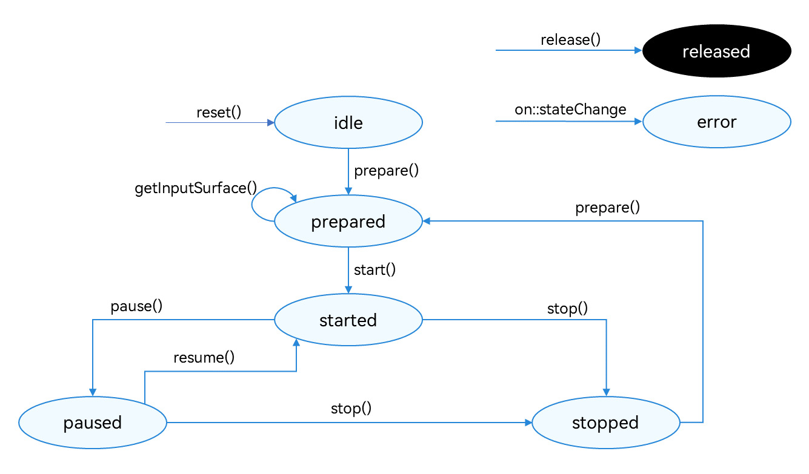
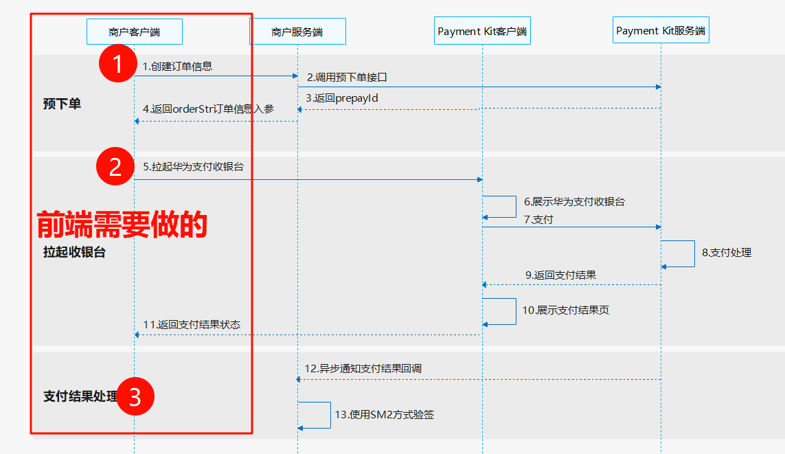
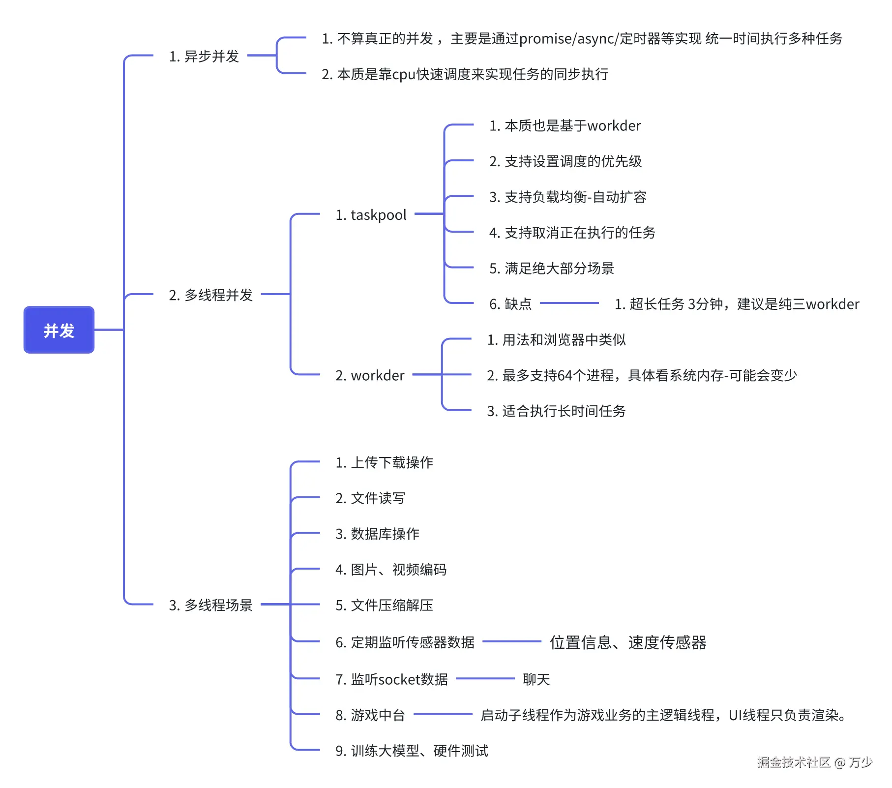

# 鸿蒙应用开发

## 鸿蒙中地图功能如何实现，申请流程是什么样的

::: details

1. 主要通过 集成 Map Kit 的功能来实现
2. Map Kit 功能很强大，比如有
   1. [创建地图](https://developer.huawei.com/consumer/cn/doc/harmonyos-guides-V5/map-creation-V5)：呈现内容包括建筑、道路、水系等。
   2. [地图交互](https://developer.huawei.com/consumer/cn/doc/harmonyos-guides-V5/map-interaction-V5)：控制地图的交互手势和交互按钮。
   3. [在地图上绘制](https://developer.huawei.com/consumer/cn/doc/harmonyos-guides-V5/map-drawing-V5)：添加位置标记、覆盖物以及各种形状等。
   4. [位置搜索](https://developer.huawei.com/consumer/cn/doc/harmonyos-guides-V5/map-location-services-V5)：多种查询 Poi 信息的能力。
   5. [路径规划](https://developer.huawei.com/consumer/cn/doc/harmonyos-guides-V5/map-navi-V5)：提供驾车、步行、骑行路径规划能力。
   6. [静态图](https://developer.huawei.com/consumer/cn/doc/harmonyos-guides-V5/map-static-diagram-V5)：获取一张地图图片。
   7. [地图 Picker](https://developer.huawei.com/consumer/cn/doc/harmonyos-guides-V5/map-advanced-controls-V5)：提供地点详情展示控件、地点选取控件、区划选择控件。
   8. [通过 Petal 地图应用实现导航等能力](https://developer.huawei.com/consumer/cn/doc/harmonyos-guides-V5/map-petalmaps-V5)：查看位置详情、查看路径规划、发起导航、发起内容搜索。
   9. [地图计算工具](https://developer.huawei.com/consumer/cn/doc/harmonyos-guides-V5/map-calculation-tool-V5)：华为地图涉及的 2 种坐标系及其使用区域和转换
3. 在编码之前需要
   1. 完成证书的申请和公钥指纹的一些配置
   2. 还要在 AGC 平台上开通地图服务应用
   3. 代码中使用 项目的 client_id
   4. 最后开始编码

:::

## 一多开发是如何实现的

::: details

1. 一多开发是一次开发多端部署
2. 主要分成三个核心部分
   1. 工程级一多
   2. 界面级一多
   3. 能力级一多
3. 工程级一多主要指的是使用华为鸿蒙推荐的三层架构来搭建项目，比如
   1. 第一层，最底层是 common-公共能力层，用于存放公共基础能力集合（如工具库、公共配置等），一般是使用 HSP 包(动态共享包)，这样它被项目中多个模块引入的话，也只会保留一个备份。
   2. 第二层，是 features-基础特性层，用于存放基础特性集合（如应用中相对独立的各个功能的 UI 及业务逻辑实现等）
   3. 顶层是，products-产品定制层，用于针对不同设备形态进行功能和特性集成
4. 界面级一多指的是一套代码可以适配不同尺寸、形态的设备，主要通过以下这些技术来实现
   1. 自适应布局 等比拉伸缩放等等相关技术
   2. 响应式布局 通过断点、媒体查询、栅格布局来实现
5. 能力级一多主要指的是不同硬件设备支持能力不一样，如蓝牙、摄像头、传感器等等。这些主要通过判断当前设置是否支持该能力来决定是否调用相关的 api 功能。如利用编辑器工具的智能提示、和代码中使用的 caniuse 或者 try-catch 进行判断使用。

:::

## 三层架构

::: details

1. 第一层，最底层是 common-公共能力层，用于存放公共基础能力集合（如工具库、公共配置等），一般是使用 HSP 包(动态共享包)，这样它被项目中多个模块引入的话，也只会保留一个备份。
2. 第二层，是 features-基础特性层，用于存放基础特性集合（如应用中相对独立的各个功能的 UI 及业务逻辑实现等）
3. 顶层是，products-产品定制层，用于针对不同设备形态进行功能和特性集成

:::

## 录音有做过吗？avrecoder 有几种状态？

::: details

录音可以通过 AVRecorder 和 AudioCapturer 来实现。两者区别主要在支持录制声音的格式不同和控制录音文件的细小粒度不同上。AVRecorder 会简单一些，AudioCapturer 会复杂一些-还可以搭配 ai 语音功能使用

AVRecorder 主要有以下这些状态：

类型说明'idle'闲置状态。'prepared'参数设置完成'started'正在录制。'paused'录制暂停。'stopped'录制停止。'released'录制资源释放。'error'错误状态。



:::

## AVRecord 的录音步骤

::: details

1. 创建 AVRecorder 实例，实例创建完成进入 idle 状态。
2. 设置业务需要的监听事件，监听状态变化及错误上报。
3. 配置音频录制参数，调用 prepare()接口，此时进入 prepared 状态。
4. 开始录制，调用 start()接口，此时进入 started 状态。

:::

## 图片上传有做过吗？图片处理，旋转、缩放、图片保存有做过吗？

::: details

做过相册图片的上传（如果是沙箱内的图片只需要 1 个步骤即可，直接上传），流程主要有 3 个步骤，基于 photoAccessHelper 、CoreFileKit、NetworkKit 来实现的

1. photoAccessHelper 用来实现选择要上传的相册的图片
2. CoreFileKit 将相册图片拷贝到沙箱目录
3. NetworkKit 负责将沙箱目录内的图片上传到服务器上

图片处理，旋转、缩放、图片保存主要基于 Image Kit 来实现。它提供有

- 图片解码
- 指将所支持格式的存档图片解码成统一的 PixelMap，以便在应用或系统中进行图片显示或图片处理。
- PixelMap
- 指图片解码后无压缩的位图，用于图片显示或图片处理。
- 图片处理
- 指对 PixelMap 进行相关的操作，如旋转、缩放、设置透明度、获取图片信息、读写像素数据等。
- 图片编码
- 指将 PixelMap 编码成不同格式的存档图片，用于后续处理，如保存、传输等。

其中压缩图片是通过 一个 ImageKit 的 packing 函数，传入压缩比例(0-100)来是实现的。值越小体积越小

:::

## 视频有做过吗？

::: details

1. 如果是普通的视频播放直接使用 Video 组件来播放即可。功能相对弱一些
2. 如果是对视频播放进行神帝的一些处理，如流媒体、本地资源解析、媒体资源解封装、视频解码和自定义渲染的这些功能，可以使用 AVPlayer 来实现。
3. 如果类似做一个编辑视频的软件，那么就需要使用到对应的 CAPI 接口来实现了(调用底层 c++的能力)

:::

## 同事发给你代码，你怎么知道它的 bundlename

::: details

一般直接看 AppScope 中的字段就行

:::

## 鸿蒙如何和网页端通信？

::: details

1. 如果是应用的话，使用 web 组件和对应的 controller 的一些接口，如 [runJavaScript()](https://developer.huawei.com/consumer/cn/doc/harmonyos-references-V5/js-apis-webview-V5#runjavascript)和[registerJavaScriptProxy](https://developer.huawei.com/consumer/cn/doc/harmonyos-references-V5/js-apis-webview-V5#registerjavascriptproxy)
2. 如果是元服务的话，使用 AtomicServiceWeb 来实现，因为 2025 年 1 月 22 日后不支持使用 web。还有 AtomicServiceWeb 没有了 web 中的如 [runJavaScript()](https://developer.huawei.com/consumer/cn/doc/harmonyos-references-V5/js-apis-webview-V5#runjavascript)和[registerJavaScriptProxy](https://developer.huawei.com/consumer/cn/doc/harmonyos-references-V5/js-apis-webview-V5#registerjavascriptproxy)接口，但是它一样可以通过页面的 url 进行参数的传递和鸿蒙端提供了 js sdk，也可以很方便的让 h5 端调用鸿蒙端的功能

:::

## 跨域是怎么处理的？

::: details

> 跨域存在于不同源的浏览器和服务器的网络通信中，因为鸿蒙端嵌套了 web 组件，理解成就是一个浏览器，因此也会存在跨域

为了提高安全性，ArkWeb 内核不允许 file 协议或者 resource 协议访问 URL 上下文中来自跨域的请求。因此，在使用 Web 组件加载本地离线

资源的时候，Web 组件会拦截 file 协议和 resource 协议的跨域访问。

主要有两种解决方案

1. 将本地资源替换成网络资源，也就是 file 协议访问的是本地的资源，我们将本地资源放在网络上，通过 http 请求的方式来加载，然后在后端设置 cors 跨域即可。同时，开发者需利用 Web 组件的[onInterceptRequest](https://developer.huawei.com/consumer/cn/doc/harmonyos-references-V5/ts-basic-components-web-V5#oninterceptrequest9)方法，对本地资源进行拦截和相应的替换
2. 通过[setPathAllowingUniversalAccess 白名单](https://developer.huawei.com/consumer/cn/doc/harmonyos-references-V5/js-apis-webview-V5#setpathallowinguniversalaccess12)设置一个路径列表。当使用 file 协议访问该列表中的资源时，允许进行跨域访问本地文件

:::

## 录音过程中息屏怎么处理？

::: details

可以通过申请[长时任务](https://developer.huawei.com/consumer/cn/doc/harmonyos-guides-V5/continuous-task-V5)，实现在后台长时间运行。长时任务支持的类型，包含数据传输、音视频播放、录制、定位导航、蓝牙相关、多设备互联、WLAN 相关、音视频通话和计算任务

开发步骤如下：

1. 需要申请 ohos.permission.KEEP_BACKGROUND_RUNNING 权限
2. 声明后台模式类型（录音等）
3. 通过 @ohos.resourceschedule.backgroundTaskManager 和@ohos.app.ability.wantAgent 进行编码处理

:::

## 有做过华为支付吗？

::: details

需要企业资质、需要在 AGC 平台上开通服务。



1. 商户客户端请求商户服务器创建商品订单。
2. 商户服务器按照商户模型调用 Payment Kit 服务端[直连商户预下单](https://developer.huawei.com/consumer/cn/doc/harmonyos-references-V5/payment-prepay-V5)或[平台类商户/服务商预下单](https://developer.huawei.com/consumer/cn/doc/harmonyos-references-V5/payment-agent-prepay-V5)接口。
3. 华为支付服务端返回预支付 ID（prepayId）。
4. 商户服务端组建订单信息参数[orderStr](https://developer.huawei.com/consumer/cn/doc/harmonyos-references-V5/payment-model-V5#section159202591414)返回给商户客户端。
5. 商户客户端调用[requestPayment](https://developer.huawei.com/consumer/cn/doc/harmonyos-references-V5/payment-paymentservice-V5#section192192415554)接口调起 Payment Kit 支付收银台。
6. Payment Kit 客户端展示收银台。
7. 用户通过收银台完成支付，Payment Kit 客户端会收到支付结果信息并请求 Payment Kit 服务端处理支付。
8. Payment Kit 服务端成功受理支付订单并异步处理支付。
9. Payment Kit 服务端将支付结果返回给 Payment Kit 客户端。
10. Payment Kit 客户端展示支付结果页。
11. 用户关闭支付结果页后 Payment Kit 客户端会返回支付状态给商户客户端。
12. 支付处理完成后，Payment Kit 服务端会调用回调接口返回支付结果信息给商户服务端。
13. 商户服务端收到支付结果回调响应后，使用[SM2 验签方式](https://developer.huawei.com/consumer/cn/doc/harmonyos-references-V5/payment-rest-overview-V5#section17670192215175)对支付结果进行验签。

:::

## 说一下多线程

::: details

[参考](https://juejin.cn/post/7435302345448259622)



:::

## HarmonyOS 中的生命周期

::: details

页面生命周期

1. onpageshow：页面每次显示时触发，包括路由过程、应用进入前台等场景。例如，用户从后台切换应用到前台，或者通过路由跳转到该页面时，此方法会被调用
2. onpagehide：页面每次隐藏时触发，包括路由过程、应用进入后台等场景。比如用户按下主页键将应用切换到后台，或者通过路由跳转到其他页面时，该页面的 onpagehide 方法会被执行
3. onbackpress：当用户点击返回按钮时触发。如果返回值为 true，表示页面自己处理返回逻辑，不进行页面路由；返回 false 则表示使用默认的路由返回逻辑，不设置返回值时按照 false 处理
4. abouttoappear：组件即将出现时回调该接口，具体时机为在创建自定义组件的新实例后，在执行其 build () 函数之前执行。在该函数中可以修改变量，更改将在后续执行 build () 函数中生效
5. abouttodisappear：在自定义组件析构销毁之前执行。在此函数中不允许改变状态变量，特别是 @link 变量的修改可能会导致应用程序行为不稳定

组件生命周期独有的

1. abouttoappear：组件即将出现时回调该接口，具体时机为在创建自定义组件的新实例后，在执行其 build () 函数之前执行。在该函数中可以修改变量，更改将在后续执行 build () 函数中生效
2. abouttodisappear：在自定义组件析构销毁之前执行。在此函数中不允许改变状态变量，特别是 @link 变量的修改可能会导致应用程序行为不稳定

UIAbility 生命周期

1. create 状态：在应用加载过程中，UIAbility 实例创建完成时触发，系统会调用 oncreate () 回调。可以在该回调中进行页面初始化操作，例如变量定义、资源加载等，用于后续的 UI 展示
2. windowstagecreate 状态：UIAbility 实例创建完成之后，在进入 foreground 之前，系统会创建一个 windowstage。windowstage 创建完成后会进入 onwindowstagecreate () 回调，可以在该回调中设置 UI 加载、设置 windowstage 的事件订阅，如获焦 / 失焦、可见 / 不可见等事件
3. foreground 状态：当 UIAbility 实例切换至前台时触发，对应于 onforeground () 回调。在 onforeground () 中可以申请系统需要的资源，或者重新申请在 onbackground 中释放的资源.
4. background 状态：当 UIAbility 实例切换至后台时触发，对应于 onbackground () 回调。在该回调中可以释放 UI 界面不可见时无用的资源，或者在此回调中执行较为耗时的操作，例如状态保存等.
5. windowstagedestroy 状态：在 UIAbility 实例销毁之前，会先进入 onwindowstagedestroy 回调，可以在该回调中释放 UI 界面资源
6. destroy 状态：在 UIAbility 实例销毁时触发，可以在 ondestroy () 回调中进行系统资源的释放、数据的保存等操作

:::

## 用 Entry 和 Navigation 装饰的页面有哪些区别

::: details

1. @Entry 装饰的页面是应用的入口页面，通常用于展示应用的初始界面，而 Navigation 组件是一个导航容器，挂载在单个页面下，支持跨模块的动态路由。
2. @Entry 页面具有通用的生命周期方法，而 Navigation 组件里的页面不执行 onPageShow、onPageHide 等生命周期回调。

:::

## HarmonyOS 中里面有几种包，分别有什么作用

::: details

HarmonyOS 中有三种类型的包：HAP（HarmonyOS Ability Package）、HAR（Harmony Archive）、HSP（Harmony Shared Package）。

1. HAP 是应用安装和运行的基本单元，分为 entry 和 feature 两种类型。
2. HAR 是静态共享包，用于代码和资源的共享。
3. HSP 是动态共享包，用于应用内共享代码和资源。

:::

## 简单介绍一下 Stage 模型

::: details

1. Stage 模型是 HarmonyOS 应用开发的基础架构，它提供了面向对象的开发方式，规范化了进程创建的方式，并提供组件化开发机制。
2. Stage 模型的组件天生具备分布式迁移和协同的能力，支持多设备形态和多窗口形态，重新定义了应用能力边界。

:::

## HarmonyOS 中的动画

::: details

HarmonyOS 提供了多种动画能力，包括属性动画、显式动画、转场动画、路径动画和粒子动画。

:::

## 如何进行路由页面传参

::: details

在 HarmonyOS 中，可以通过 router.pushUrl 方法跳转到目标页面，并携带参数。在进入被分享页面时，通过 router.getParams()来获取

传递的数据。此外，还可以使用 LocalStorage 等在页面间共享状态。

:::

## ArkTS 和 TS 的区别有哪些区别

::: details

ArkTS 是 HarmonyOS 优选的主力应用开发语言，它保持了 TypeScript 的基本风格，同时通过规范定义强化开发期静态检查和分析，提升程序执行稳定性和性能。ArkTS 与 TS 的主要区别在于 ArkTS 是静态类型的，而 TS 支持动态类型。ArkTS 在编译时进行类型检查，有助于在代码运行前发现和修复错误。

1. **[强制使用静态类型](https://developer.huawei.com/consumer/cn/doc/harmonyos-guides-V5/typescript-to-arkts-migration-guide-V5#强制使用静态类型)** **ArkTS 中禁止使用 any 类型。**
2. [禁止在运行时变更对象布局](https://developer.huawei.com/consumer/cn/doc/harmonyos-guides-V5/typescript-to-arkts-migration-guide-V5#禁止在运行时变更对象布局)

- 向对象中添加新的属性或方法。
- 从对象中删除已有的属性或方法。
- 将任意类型的值赋值给对象属性。

3. [限制运算符的语义](https://developer.huawei.com/consumer/cn/doc/harmonyos-guides-V5/typescript-to-arkts-migration-guide-V5#限制运算符的语义)

```HTML
// 一元运算符`+`只能作用于数值类型：
let t = +42;   // 合法运算
let s = +'42'; // 编译时错误
```

:::

## 常见装饰器

::: details

- [@State](https://developer.huawei.com/consumer/cn/doc/harmonyos-guides-V5/arkts-state-V5)：@State 装饰的变量拥有其所属组件的状态，可以作为其子组件单向和双向同步的数据源。当其数值改变时，会引起相关组件的渲染刷新。
- [@Prop](https://developer.huawei.com/consumer/cn/doc/harmonyos-guides-V5/arkts-prop-V5)：@Prop 装饰的变量可以和父组件建立单向同步关系，@Prop 装饰的变量是可变的，但修改不会同步回父组件。深拷贝。
- [@Link](https://developer.huawei.com/consumer/cn/doc/harmonyos-guides-V5/arkts-link-V5)：@Link 装饰的变量可以和父组件建立双向同步关系，子组件中@Link 装饰变量的修改会同步给父组件中建立双向数据绑定的数据源，父组件的更新也会同步给@Link 装饰的变量。
- [@Provide/@Consume](https://developer.huawei.com/consumer/cn/doc/harmonyos-guides-V5/arkts-provide-and-consume-V5)：@Provide/@Consume 装饰的变量用于跨组件层级（多层组件）同步状态变量，可以不需要通过参数命名机制传递，通过 alias（别名）或者属性名绑定。
- [@Observed](https://developer.huawei.com/consumer/cn/doc/harmonyos-guides-V5/arkts-observed-and-objectlink-V5)：@Observed 装饰 class，需要观察多层嵌套场景的 class 需要被@Observed 装饰。单独使用@Observed 没有任何作用，需要和@ObjectLink、@Prop 联用。
- [@ObjectLink](https://developer.huawei.com/consumer/cn/doc/harmonyos-guides-V5/arkts-observed-and-objectlink-V5)：@ObjectLink 装饰的变量接收@Observed 装饰的 class 的实例，应用于观察多层嵌套场景，和父组件的数据源构建双向同步。
- [AppStorage](https://developer.huawei.com/consumer/cn/doc/harmonyos-guides-V5/arkts-appstorage-V5)是应用程序中的一个特殊的单例[LocalStorage](https://developer.huawei.com/consumer/cn/doc/harmonyos-guides-V5/arkts-localstorage-V5)对象，是应用级的数据库，和进程绑定，通过[@StorageProp](https://developer.huawei.com/consumer/cn/doc/harmonyos-guides-V5/arkts-appstorage-V5#storageprop)和[@StorageLink](https://developer.huawei.com/consumer/cn/doc/harmonyos-guides-V5/arkts-appstorage-V5#storagelink)装饰器可以和组件联动。
- AppStorage 是应用状态的“中枢”，将需要与组件（UI）交互的数据存入 AppStorage，比如持久化数据[PersistentStorage](https://developer.huawei.com/consumer/cn/doc/harmonyos-guides-V5/arkts-persiststorage-V5)和环境变量[Environment](https://developer.huawei.com/consumer/cn/doc/harmonyos-guides-V5/arkts-environment-V5)。UI 再通过 AppStorage 提供的装饰器或者 API 接口，访问这些数据。
- 框架还提供了 LocalStorage，AppStorage 是 LocalStorage 特殊的单例。LocalStorage 是应用程序声明的应用状态的内存“数据库”，通常用于页面级的状态共享，通过[@LocalStorageProp](https://developer.huawei.com/consumer/cn/doc/harmonyos-guides-V5/arkts-localstorage-V5#localstorageprop)和[@LocalStorageLink](https://developer.huawei.com/consumer/cn/doc/harmonyos-guides-V5/arkts-localstorage-V5#localstoragelink)装饰器可以和 UI 联动。

:::

## 鸿蒙的 router 和 Navigation 的对比

::: details

1. router 最多页面栈为 32 个，Navigation 无限制
2. Navigation 支持一多开发，Auto 模式自适应单栏跟双栏显示
3. Navigation 支持获取指定页面参数
4. Navigation 清理指定路由
5. Navigation 支持路由拦截

:::

## 能力对比

::: details

| 业务场景                                      | Navigation                              | Router                                      |
| :-------------------------------------------- | :-------------------------------------- | :------------------------------------------ |
| **一多能力**                                  | **支持，Auto 模式自适应单栏跟双栏显示** | **不支持**                                  |
| 跳转指定页面                                  | pushPath & pushDestination              | pushUrl & pushNameRoute                     |
| 跳转 HSP 中页面                               | 支持                                    | 支持                                        |
| 跳转 HAR 中页面                               | 支持                                    | 支持                                        |
| 跳转传参                                      | 支持                                    | 支持                                        |
| **获取指定页面参数**                          | **支持**                                | **不支持**                                  |
| 传参类型                                      | 传参为对象形式                          | 传参为对象形式，对象中暂不支持方法变量      |
| 跳转结果回调                                  | 支持                                    | 支持                                        |
| 跳转单例页面                                  | 支持                                    | 支持                                        |
| 页面返回                                      | 支持                                    | 支持                                        |
| 页面返回传参                                  | 支持                                    | 支持                                        |
| 返回指定路由                                  | 支持                                    | 支持                                        |
| 页面返回弹窗                                  | 支持，通过路由拦截实现                  | showAlertBeforeBackPage                     |
| 路由替换                                      | replacePath & replacePathByName         | replaceUrl & replaceNameRoute               |
| 路由栈清理                                    | clear                                   | clear                                       |
| **清理指定路由**                              | **removeByIndexes & removeByName**      | 不支持                                      |
| 转场动画                                      | 支持                                    | 支持                                        |
| 自定义转场动画                                | 支持                                    | 支持，动画类型受限                          |
| 屏蔽转场动画                                  | 支持全局和单次                          | 支持 设置 pageTransition 方法 duration 为 0 |
| geometryTransition 共享元素动画               | 支持（NavDestination 之间共享）         | 不支持                                      |
| 页面生命周期监听                              | UIObserver.on('navDestinationUpdate')   | UIObserver.on('routerPageUpdate')           |
| 获取页面栈对象                                | 支持                                    | 不支持                                      |
| **路由拦截**                                  | 支持通过 setInercption 做路由拦截       | 不支持                                      |
| 路由栈信息查询                                | 支持                                    | getState() & getLength()                    |
| 路由栈 move 操作                              | moveToTop & moveIndexToTop              | 不支持                                      |
| 沉浸式页面                                    | 支持                                    | 不支持，需通过 window 配置                  |
| 设置页面标题栏（titlebar）和工具栏（toolbar） | 支持                                    | 不支持                                      |
| 模态嵌套路由                                  | 支持                                    | 不支持                                      |

:::

## 页面下拉刷新和页面上拉加载

::: details

1. 下拉刷新可以使用[Refresh](https://developer.huawei.com/consumer/cn/doc/harmonyos-references-V5/ts-container-refresh-V5)组件，它提供了 onStateChange 和 onRefreshing 事件 用来实现下拉刷新的业务
2. [List](https://developer.huawei.com/consumer/cn/doc/harmonyos-references-V5/ts-container-list-V5#onreachend)、Scroll、Grid、WaterFall 等组件都提供了**上拉加载更多**事件，比如 List 组件的 onReachEnd 事件就是

:::

## 响应式布局

::: details

> [链接](https://developer.huawei.com/consumer/cn/doc/harmonyos-guides-V5/responsive-layout-V5#栅格布局)

1. 断点
   1. 在 在 UIAbility 的[onWindowStageCreate](https://developer.huawei.com/consumer/cn/doc/harmonyos-guides-V5/uiability-lifecycle-V5)生命周期回调中监听 窗口尺寸变化事件，获取到当前窗口大小
   2. 因为窗口大小单位是 px，需要调用 px2vp 函数转成 vp
   3. 然后存到 AppStorage 中
   4. 最后页面 使用 AppStorage 即可
2. 媒体查询
   1. 主要通过 mediaquery 结合 断点来使用
3. 栅格布局
   1. 通过 GridRow 和 GridCol 来实现
   2. 一列分成了 12 份， 结合栅格组件默认提供 xs、sm、md、lg 四个断点

:::

## 断点续传

::: details

> 鸿蒙发送网络请求有两套方案
>
> 1. Request ， 我们使用的 axios 就是 基于它封装的
> 2. RCP ，Remote Communication Kit（远场通信服务）是华为提供的 HTTP 发起数据请求的 NAPI 封装 目前新项目再推动它
> 3. [远场通信场景](https://developer.huawei.com/consumer/cn/doc/harmonyos-guides-V5/remote-communication-scenario-V5)
>    1. [获取服务器资源](https://developer.huawei.com/consumer/cn/doc/harmonyos-guides-V5/remote-communication-getserverresources-V5)
>    2. [发送数据到服务器](https://developer.huawei.com/consumer/cn/doc/harmonyos-guides-V5/remote-communication-senddatatoserver-V5)
>    3. [断点续传](https://developer.huawei.com/consumer/cn/doc/harmonyos-guides-V5/remote-communication-httpresume-V5)
>    4. [双向证书校验](https://developer.huawei.com/consumer/cn/doc/harmonyos-guides-V5/remote-communication-certificateverification-V5)
>    5. [拦截器](https://developer.huawei.com/consumer/cn/doc/harmonyos-guides-V5/remote-communication-interceptor-V5)
>    6. [使用自定义证书校验](https://developer.huawei.com/consumer/cn/doc/harmonyos-guides-V5/remote-communication-validation-V5)
>    7. [上传下载文件](https://developer.huawei.com/consumer/cn/doc/harmonyos-guides-V5/remote-communication-updownload-V5)
>    8. [设置 TLS 版本号和加密套件](https://developer.huawei.com/consumer/cn/doc/harmonyos-guides-V5/remote-communication-settls-V5)
>    9. [获取服务器资源 (C/C++)](https://developer.huawei.com/consumer/cn/doc/harmonyos-guides-V5/remote-communication-getserverresources-c-V5)
>    10. [发送数据到服务器 (C/C++)](https://developer.huawei.com/consumer/cn/doc/harmonyos-guides-V5/remote-communication-senddatatoserver-c-V5)
>    11. [断点续传 (C/C++)](https://developer.huawei.com/consumer/cn/doc/harmonyos-guides-V5/remote-communication-httpresume-c-V5)
>    12. [双向证书校验 (C/C++)](https://developer.huawei.com/consumer/cn/doc/harmonyos-guides-V5/remote-communication-certificateverification-c-V5)
>    13. [拦截器 (C/C++)](https://developer.huawei.com/consumer/cn/doc/harmonyos-guides-V5/remote-communication-interceptor-c-V5)
>    14. [证书锁定](https://developer.huawei.com/consumer/cn/doc/harmonyos-guides-V5/remote-communication-validationlock-V5)
>    15. [响应校验](https://developer.huawei.com/consumer/cn/doc/harmonyos-guides-V5/remote-communication-responsecheck-V5)
>    16. [读写超时](https://developer.huawei.com/consumer/cn/doc/harmonyos-guides-V5/remote-communication-readtimeout-V5)
>    17. [请求暂停和恢复](https://developer.huawei.com/consumer/cn/doc/harmonyos-guides-V5/remote-communication-pause-resume-V5)
>    18. [同步读写流](https://developer.huawei.com/consumer/cn/doc/harmonyos-guides-V5/remote-communication-asyncreadwrite-V5)

:::

### [断点续传](https://developer.huawei.com/consumer/cn/doc/harmonyos-guides-V5/re

::: details
mote-communication-httpresume-V5)

1. 利用了远场通信 RemoteCommunicationKit
2. 发送网络请求，利用[TransferRange](https://developer.huawei.com/consumer/cn/doc/harmonyos-references-V5/remote-communication-rcp-V5#section838945575618)的 from 和 to 属性 进行截取下载内容，拼接到文件上即可

:::

## 双向证书校验

::: details

> 用于验证服务端和客户端之间的身份和数据完整性，确保通信的安全性。

1. 导入远场通信模块和文件读写模块
   1. ```HTML
      import { rcp } from '@kit.RemoteCommunicationKit';
      import { fileIo } from '@kit.CoreFileKit';
      ```
2. 使用文件读写模块 读取存在客户端的证书
   1. ```HTML
      // 读取
       fileIo.read(file.fd
       // 存到字符串 content中
       // 将读取的数据转换为字符串
      let content = String.fromChar
      ```
3. 然后调用给远场通信的 configuration 方法设置到 security.certificate.content 属性中
   1. ```HTML
       request.configuration = {
            security: {
              certificate: {
                content: content,
      ```

:::

## 项目优化

::: details

- **图片懒加载**：列表里的图片滑到可见区域再加载，减少内存占用。
- **数据缓存**：用`Preferences`或数据库缓存首页数据，下次启动先展示缓存再刷新。
- **减少布局嵌套**：用@Builder 代替自定义组件，多用线性布局，少用 flex 等弹性布局
- **线程管理**：把 JSON 解析、图片解码丢到`Worker`线程，防止主线程卡顿。
- **内存泄漏排查**：用 DevEco Studio 的 Profiler 工具，发现有个页面退出后监听器没注销，赶紧加了`onPageHide`里的释放逻辑。

:::

## forEach 和 LazyForEach

::: details

1. forEach 会把数据全部渲染出来
2. LazyForEach 只会渲染可视区域

:::

## LazyForEach 如何实现更新

::: details

- **数据源绑定**：`LazyForEach` 需要与实现了 `IDataSource` 接口的数据源（如 `LazyDataSource`）绑定。当数据源发生变化（增、删、改）时，框架会自动触发更新。
- **观察者模式**：数据源通过 `DataChangeListener` 通知 `LazyForEach` 数据变更。只有实际变化的项会触发局部更新，而非重新渲染整个列表。

:::

## Class 和 interface 的区别

::: details

1. Interface 只能定义类型，class 可以定义类型和保护功能实现
2. interface 可以同时继承多个接口，class 只能同时继承一个父类
3. 工作中两个都用，比如用 class 来封装了一些工具库 avplayer、首选项、全屏-沉浸式、axios 等

:::

## AVPlayer 的播放步骤

::: details

1. 创建实例 createAVPlayer()，AVPlayer 初始化 idle 状态。

2. 设置业务需要的监听事件

   | 事件类型        | 说明                                                                                                                                                                 |
   | :-------------- | :------------------------------------------------------------------------------------------------------------------------------------------------------------------- |
   | stateChange     | 必要事件，监听播放器的 state 属性改变。                                                                                                                              |
   | error           | 必要事件，监听播放器的错误信息。                                                                                                                                     |
   | durationUpdate  | 用于进度条，监听进度条长度，刷新资源时长。                                                                                                                           |
   | timeUpdate      | 用于进度条，监听进度条当前位置，刷新当前时间。                                                                                                                       |
   | seekDone        | 响应 API 调用，监听 seek()请求完成情况。当使用 seek()跳转到指定播放位置后，如果 seek 操作成功，将上报该事件。                                                        |
   | speedDone       | 响应 API 调用，监听 setSpeed()请求完成情况。当使用 setSpeed()设置播放倍速后，如果 setSpeed 操作成功，将上报该事件。                                                  |
   | volumeChange    | 响应 API 调用，监听 setVolume()请求完成情况。当使用 setVolume()调节播放音量后，如果 setVolume 操作成功，将上报该事件。                                               |
   | bufferingUpdate | 用于网络播放，监听网络播放缓冲信息，用于上报缓冲百分比以及缓存播放进度。                                                                                             |
   | audioInterrupt  | 监听音频焦点切换信息，搭配属性 audioInterruptMode 使用。如果当前设备存在多个音频正在播放，音频焦点被切换（即播放其他媒体如通话等）时将上报该事件，应用可以及时处理。 |

3. 设置资源：设置属性 url，AVPlayer 进入 initialized 状态。

4. 准备播放：调用 prepare()，AVPlayer 进入 prepared 状态，此时可以获取 duration，设置音量。

5. 音频播控：播放 play()，暂停 pause()，跳转 seek()，停止 stop() 等操作。

6. （可选）更换资源：调用 reset()重置资源，AVPlayer 重新进入 idle 状态，允许更换资源 url。

7. 退出播放：调用 release()销毁实例，AVPlayer 进入 released 状态，退出播放。

:::

## 手动签名和自动签名的区别

::: details

:::

### **核心区别总结**

::: details

| **对比维度**     | **自动签名**                                         | **手动签名**                                                               |
| ---------------- | ---------------------------------------------------- | -------------------------------------------------------------------------- |
| **适用场景**     | 单设备调试（单真机可用）                             | 多设备调试、断网环境调试                                                   |
| **签名证书管理** | 由 DevEco Studio 自动生成签名证书并绑定当前设备 UDID | 需在**AGC**控制台申请调试证书\*\*\*\*、注册调试设备 UDID、配置调试 Profile |
| **安装限制**     | 仅允许当前绑定的设备安装                             | 支持注册的所有调试设备安装                                                 |
| **权限支持**     | **不支持**受限开放权限（如健康服务）                 | 支持受限权限（需通过 AGC 审核并提交场景说明）                              |
| **发布用途**     | **禁止用于发布**                                     | 可生成与发布版本一致的签名包（需替换为正式证书）                           |
| **受限服务依赖** | 无法使用部分依赖签名的开放能力（如 Health Kit）      | 支持所有开放能力                                                           |
| **公钥指纹管理** | 自动生成调试指纹，需在发布前手动更新为发布指纹       | 需手动维护调试和发布的指纹                                                 |

:::

## webview 的性能优化(怎么加快 webview 的响应速度)

::: details

- 可以通过[prepareForPageLoad()](https://developer.huawei.com/consumer/cn/doc/harmonyos-references-V5/js-apis-webview-V5#prepareforpageload10)来预解析或者预连接将要加载的页面
- 能够预测到 Web 组件将要加载的页面或者即将要跳转的页面。可以通过[prefetchPage()](https://developer.huawei.com/consumer/cn/doc/harmonyos-references-V5/js-apis-webview-V5#prefetchpage10)来预加载即将要加载页面
- 可以通过 prefetchResource()预获取将要加载页面中的 post 请求。在页面加载结束时，可以通过 clearPrefetchedResource()清除后续不再使用的预获取资源缓存
- 预编译生成编译缓存 可以通过 precompileJavaScript()在页面加载前提前生成脚本文件的编译缓存。

:::
