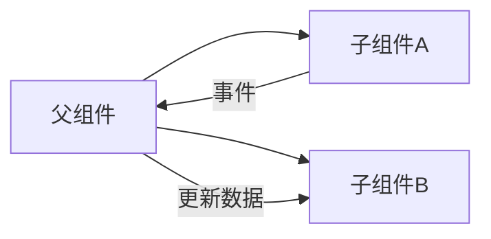

# 小程序

小程序是很容易入门和掌握的技术栈，如果你技术栈偏窄，可以考虑补充一下小程序的知识。

::: tip
如有疑问，可免费 [加群](/docs/services/group.md) 讨论咨询，也可参与 [1v1 面试咨询服务](/docs/services/1v1.md)， 专业、系统、高效、全流程 准备前端面试
:::

## 小程序双线程架构

参考答案

::: details

**1. 架构组成**

**（1）逻辑层（Service）**

- **运行环境**：独立的 JavaScript 线程（如 JavaScriptCore 或 V8 引擎）。
- **职责**：
  - 处理业务逻辑（数据请求、事件响应、状态管理）。
  - 调用小程序 API（如网络请求、本地存储）。
  - 通过 `setData` 向渲染层传递数据。
- **特点**：
  - **无法直接操作 DOM**：与渲染层隔离，避免恶意脚本攻击。
  - **单例运行**：全局状态统一管理（如 App 和 Page 对象）。

**（2）渲染层（View）**

- **运行环境**：WebView 线程（每个页面独立实例）。
- **职责**：
  - 解析 WXML/WXSS，渲染页面结构。
  - 处理用户交互事件（点击、滑动），触发逻辑层响应。
- **特点**：
  - **数据驱动更新**：根据逻辑层传递的数据动态渲染。
  - **轻量化**：不执行复杂逻辑，保障渲染流畅性。

**（3）系统层（Native）**

- **作用**：作为逻辑层与渲染层的通信桥梁，提供原生能力支持。
- **核心功能**：
  - **JSBridge**：序列化传递数据（JSON 格式）。
  - **安全管控**：拦截非法操作（如直接访问 DOM）。
  - **原生 API**：调用摄像头、地理位置等硬件功能。


:::

## 直接修改 this.data 为何不会触发视图更新？

参考答案

::: details

小程序中直接修改 `this.data` 不会触发视图更新的原因如下：

**1. 数据更新机制的设计**

小程序采用 **显式更新** 策略，只有通过 `this.setData()` 方法修改数据时，才会触发以下流程：

- **数据变更通知**：将修改的数据标记为“脏数据”（需更新）。
- **通信到渲染层**：通过 JSBridge 将数据序列化后传递到 WebView 线程。
- **视图差异化更新**：渲染层对比新旧数据差异，仅更新变化的 DOM 节点。

直接修改 `this.data` 仅改变逻辑层的数据，但 **未触发上述流程**，因此渲染层无法感知数据变化。

**2. 双线程架构的限制**

小程序的逻辑层（Service）与渲染层（View）运行在独立线程中：

- **逻辑层**：通过 JavaScriptCore 或 V8 引擎运行。
- **渲染层**：在 WebView 中解析 WXML/WXSS。

两者通过 **异步通信**（JSBridge）传递数据。

直接修改 `this.data` 不会触发系统层的数据传递，导致渲染层无法同步更新。

**3. 性能优化考量**

若每次数据修改都自动触发更新：

- **频繁通信开销**：高频数据变更（如循环中修改数据）会导致线程间通信阻塞。
- **不必要的渲染**：中间状态的数据变更可能引发多次无效渲染。

通过 `this.setData()` 的 **批量合并更新机制**，可优化性能：

```javascript
// 合并多次更新，仅触发一次通信和渲染
this.setData({ a: 1 })
this.setData({ b: 2 })
// 等效于
this.setData({ a: 1, b: 2 })
```

**4. 数据一致性与安全性**

- **脏数据风险**：直接修改 `this.data` 可能导致逻辑层与渲染层数据不一致。
- **状态管理规范**：强制使用 `this.setData()` 确保数据变更可追踪，符合单向数据流原则。

:::

## setData 底层做了哪些性能优化处理？

参考答案

::: details

**1. 核心优化机制**

**(1) 数据通信优化**

- **差异化更新（Diff 算法）**
  对比新旧数据树，仅序列化并传输变化的部分。例如：

  ```javascript
  // 旧数据：{ a: 1, list: [{ id: 1 }, { id: 2 }] }
  this.setData({ 'list[1].id': 3 })
  // 实际传输：{ 'list[1].id': 3 }（而非整个 list 数组）
  ```

  **优化效果**：减少 60%~80% 的数据传输量。

- **序列化过滤**
  自动过滤 `undefined`、`Function`、`Symbol` 等不可序列化数据，避免无效通信。

**(2) 更新调度优化**

- **批量合并（Batching）**
  同一事件循环内的多次 `setData` 调用合并为一次更新：

  ```javascript
  this.setData({ a: 1 })
  this.setData({ b: 2 })
  // 合并为 { a: 1, b: 2 }，触发单次通信
  ```

  **优化场景**：高频操作（如动画帧更新、滚动事件）。

- **异步队列与优先级调度**
  用户交互触发的更新优先级高于数据请求，优先保障交互流畅性。

**(3) 渲染层优化**

- **虚拟 DOM 对比（Virtual DOM Diff）**
  生成最小化的 DOM 操作指令，避免全量渲染：
- **WXS 脚本加速**
  在渲染层直接处理轻量逻辑（如数据格式化），减少逻辑层通信：
  ```wxml
  <wxs module="utils">
    function formatPrice(price) { return '¥' + price; }
    module.exports = { formatPrice };
  </wxs>
  <view>{{utils.formatPrice(100)}}</view>
  ```

**(4) 通信协议优化**

- **二进制传输（如 Protocol Buffers）**
  替代 JSON 序列化，体积减少 30%~50%，解析速度提升 2~5 倍。
- **通道复用与流量控制**
  复用 JSBridge 通道，避免频繁建立连接，满负荷时自动排队。

:::

## this.setData({ list: largeDataArray }) 有问题吗？

参考答案

::: details

在小程序开发中，使用 `this.setData({ list: largeDataArray })` 传递一个大型数据数组（尤其是包含成千上万条数据时）**确实存在明显的性能问题**。

**1. 核心问题分析**

**(1) 数据传输瓶颈**

- **JSBridge 序列化开销**：数据需从逻辑层（Service）序列化为 JSON 字符串，通过 JSBridge 传递到渲染层（View），数据量越大，序列化和传输时间越长。
- **典型耗时**：传输 10,000 条数据（每条 100B）约耗时 **100~300ms**（中低端手机更久）。

**(2) 渲染性能问题**

- **DOM 节点爆炸**：渲染层需解析数据并生成大量 DOM 节点，导致：
  - **内存占用高**：每个 DOM 节点消耗 0.1~1KB 内存，10,000 条数据可能占用 **1~10MB**。
  - **渲染卡顿**：首次渲染或滚动时出现明显卡顿（帧率低于 30fps）。

**(3) 频繁 GC（垃圾回收）**

- **内存抖动**：频繁创建和销毁大型临时对象，触发 JavaScript 引擎垃圾回收，导致间歇性卡顿。

**2. 优化方案**

**(1) 分页加载（懒加载）**

- **实现方式**：
  ```javascript
  Page({
    data: { list: [], page: 0 },
    onReachBottom() {
      // 滚动到底部加载下一页
      this.loadNextPage()
    },
    loadNextPage() {
      const nextPageData = fetchData(this.data.page + 1)
      this.setData({
        list: this.data.list.concat(nextPageData),
        page: this.data.page + 1,
      })
    },
  })
  ```
- **优点**：减少单次传输数据量，避免内存峰值。

**(2) 虚拟列表（按需渲染）**

- **原理**：仅渲染可视区域内的元素。
- **实现库**：使用 `wx-component` 或第三方库（如 `recycle-view`）。
  ```xml
  <!-- 微信小程序示例 -->
  <recycle-view wx:for="{{list}}" wx:key="id">
    <view>{{item.text}}</view>
  </recycle-view>
  ```
- **优点**：渲染 100 万条数据时，内存占用仅 **1~2MB**。

**(3) 纯数据字段（Pure Data）**

- **适用场景**：需要存储数据但无需渲染的字段。
  ```javascript
  Component({
    options: { pureDataPattern: /^_/ },
    data: {
      _fullList: largeDataArray, // 不触发渲染
      visibleList: largeDataArray.slice(0, 20),
    },
  })
  ```

**(4) 数据压缩**

- **精简字段**：

  ```javascript
  // 原始数据
  const rawData = [{ id: 1, title: '...', desc: '...' /* 10+ 字段 */ }]

  // 优化后
  const optimizedData = rawData.map(({ id, title }) => ({ id, title }))
  this.setData({ list: optimizedData })
  ```

- **压缩率**：减少 50%~80% 数据体积。

**(5) WebWorker 计算**

```javascript
// 在 Worker 中处理数据
const worker = wx.createWorker('workers/data-handler.js')
worker.postMessage({ action: 'filter', data: largeDataArray })
worker.onMessage((res) => {
  this.setData({ list: res.filteredData })
})
```

**(6) 原生组件替代**

- 使用 `<canvas>` 或 `<web-view>` 渲染超大数据（如地图、可视化图表）。

:::

## 小程序登录流程

参考答案

::: details


**说明**

- 调用 `wx.login()` 获取 临时登录凭证 `code`，并回传到开发者服务器。
- 调用 `auth.code2Session` 接口，换取 用户唯一标识 `OpenID` 、 用户在微信开放平台账号下的唯一标识 `UnionID`（若当前小程序已绑定到微信开放平台账号） 和 会话密钥 `session_key`。

之后开发者服务器可以根据用户标识来生成自定义登录态，用于后续业务逻辑中前后端交互时识别用户身份。

**注意事项**

- 会话密钥 `session_key` 是对用户数据进行 加密签名 的密钥。为了应用自身的数据安全，开发者服务器不应该把会话密钥下发到小程序，也不应该对外提供这个密钥。
- 临时登录凭证 `code` 只能使用一次。

**特殊字段**

- `openid`：openid 是用来唯一标识用户的一个字符串。在微信小程序中，每个用户的 openid 都是唯一的。通过 openid，小程序可以获取用户的基本信息，如头像、昵称等。

> 【注意】同一个用户在不同的小程序中拥有不同的openid。因此，在开发小程序时，不能使用openid来进行用户的唯一性判断。

- `unionid`：unionid 是在用户绑定同一微信开放平台账号下的多个应用时，用来唯一标识用户的一个字符串。如果用户在多个小程序中使用同一个微信号进行登录授权，那么这些小程序中的 unionid 都是相同的。

> 【注意】用户的 unionid 只有在用户将多个应用绑定到同一个微信开放平台账号下时才会生成。因此，如果用户没有绑定多个应用，那么小程序将无法获取用户的 unionid。

- `code`：code 是用户登录凭证，由微信服务器颁发给小程序。在用户授权登录后，小程序可以通过调用微信登录接口获取用户的 code。然后，通过 code 向微信服务器请求用户的 `openid` 和 `session_key` 等信息。

> 【注意】每个 code 只能使用一次，且有效期为 5 分钟。因此，在使用 code 进行登录时，需要及时将其转换成用户的 openid 和 session_key 等信息，以免出现 code 过期的情况。

:::

## 如何在不发版的情况下实现小程序的 AB 测试？

参考答案

::: details

在小程序中实现无需发版的 AB 测试，可通过 **动态配置 + 数据驱动** 的方案完成。

1. **云端配置管理**

- **创建 AB 测试规则**：

  ```json
  // 示例配置（存储在云数据库/Redis）
  {
    "experiment_id": "2023_button_color",
    "groups": [
      {
        "name": "group_a",
        "ratio": 50, // 50%流量
        "params": { "button_color": "#FF0000" }
      },
      {
        "name": "group_b",
        "ratio": 50,
        "params": { "button_color": "#00FF00" }
      }
    ],
    "salt": "user_id" // 分流依据
  }
  ```

- **动态更新**：通过管理后台随时调整分组比例和参数

2. **客户端分组逻辑**

```javascript
// 工具函数：一致性哈希分流
function getABGroup(experimentId, userId) {
  const hash = crypto
    .createHash('md5')
    .update(experimentId + userId)
    .digest('hex')
  const value = parseInt(hash.slice(0, 8), 16) % 100
  return value < 50 ? 'group_a' : 'group_b' // 按比例分配
}

// 小程序启动时获取配置
wx.cloud.callFunction({
  name: 'getABConfig',
  success: (res) => {
    const userId = getApp().globalData.userId
    const group = getABGroup(res.data.experiment_id, userId)
    this.setData({ abParams: res.data.groups.find((g) => g.name === group).params })
  },
})
```

3. **界面动态渲染**

```html
<!-- WXML 根据配置渲染 -->
<button style="background-color: {{abParams.button_color}};" bindtap="handleClick">立即购买</button>
```

4. **数据埋点上报**

```javascript
// 点击事件处理
handleClick() {
  wx.reportAnalytics('button_click', {
    experiment_id: '2023_button_color',
    group: this.data.abGroup,
    button_color: this.data.abParams.button_color
  });
}
```

5. **数据分析阶段**

- **指标定义**：

  ```sql
  -- 示例：计算转化率差异
  SELECT
    group,
    COUNT(DISTINCT user_id) AS total_users,
    SUM(is_converted) / COUNT(DISTINCT user_id) AS conversion_rate
  FROM
    ab_test_events
  WHERE
    experiment_id = '2023_button_color'
  GROUP BY
    group;
  ```

- **统计显著性检验**：使用 T 检验或卡方检验验证结果可靠性

**关键技术细节**

1. **流量分配算法**

- **分层采样**：不同实验独立分流（避免流量干扰）
- **Sticky Bucket**：确保用户始终处于同一分组
  ```javascript
  // 本地缓存分组结果
  const storedGroup = wx.getStorageSync(experimentId)
  if (storedGroup) return storedGroup
  ```

2. **动态更新策略**

- **定时轮询**：每 5 分钟检查配置更新
- **WebSocket 推送**：实时生效新配置

3. **灰度发布控制**

```yaml
# 云配置示例：分阶段放量
rollout:
  - stage: 1
    percentage: 10%
    start_time: 2025-01-01
  - stage: 2
    percentage: 100%
    start_time: 2025-01-03
```

:::

## 小程序的增量更新

参考答案

::: details

小程序的增量更新机制主要依赖于小程序平台的设计

- 当小程序开发者发布新版本时，小程序平台会比较新旧两个版本的差异，并生成一个包含差异信息的补丁文件。
- 然后，当用户打开小程序时，小程序平台会检查用户设备上的小程序版本。
- 如果发现用户的版本落后于服务器上的版本，那么就会下载补丁文件，而不是整个新版本的代码包。
- 接着，小程序平台会应用补丁文件，将用户设备上的小程序更新到新版本。

:::

## 小程序性能优化

参考答案

::: details

微信 IDE 的小程序评分功能位于调试器 -> Audits 面板中

小程序性能优化的具体维度：

1. 避免过大的 WXML 节点数目
2. 避免执行脚本的耗时过长的情况
3. 避免首屏时间太长的情况
4. 避免渲染界面的耗时过长的情况
5. 对网络请求做必要的缓存以避免多余的请求
6. 所有请求的耗时不应太久
7. 避免 setData 的调用过于频繁
8. 避免 setData 的数据过大
9. 避免短时间内发起太多的图片请求
10. 避免短时间内发起太多的请求

:::

## 小程序 WXSS 与 CSS 的区别？

参考答案

::: details

- wxss 背景图片只能引入外链，不能使用本地图片
- 小程序样式使用 @import 引入 外联样式文件，地址为相对路径。
- 尺寸单位为 rpx , rpx 是响应式像素,可以根据屏幕宽度进行自适应。

:::

## 小程序里拿不到 dom 相关的 api ？

参考答案

::: details

微信小程序使用类似 Web 的 WXML 和 WXSS 语言来描述页面结构和样式，但并不提供直接操作 DOM 的 API。这主要有两个原因：

- 首先，小程序运行在 JavaScriptCore 引擎中，而非浏览器中常见的 V8 引擎。

  - 由于两者在实现方式上存在较大差异，JavaScriptCore 的执行速度相对较慢。
  - 直接操作 DOM 会增加耗时，从而降低性能和用户体验。

- 其次，小程序的设计初衷是提供一种轻量、快速启动的应用模式，其定位强调“去中心化、低门槛、高灵活性”。
  - 如果允许开发者直接操作 DOM，可能会破坏这一设计理念，增加系统复杂度和开发难度。

:::

## 分包加载

参考答案

::: details

小程序分包加载是一种优化技术，用于解决主包体积过大导致的首次加载性能问题。通过将非核心功能模块拆分为独立分包，实现按需加载和动态加载。

一、分包加载核心概念

1. **包类型**

| **类型**     | **说明**                             | **特点**                     |
| ------------ | ------------------------------------ | ---------------------------- |
| **主包**     | 包含启动页面、核心公共组件和基础库   | 用户首次打开小程序时必须下载 |
| **普通分包** | 依赖主包的功能模块，按需加载         | 可访问主包资源               |
| **独立分包** | 不依赖主包的完整功能模块，可独立运行 | 无法访问主包资源             |

2. **体积限制**

| **包类型**   | **最大体积** | **总包体积限制**    |
| ------------ | ------------ | ------------------- |
| 主包         | 2MB          | 20MB (所有分包总和) |
| 单个普通分包 | 2MB          |                     |
| 单个独立分包 | 2MB          |                     |

二、分包配置实现

1. **目录结构**

```bash
├── app.js               # 主包入口
├── app.json             # 分包配置
├── subpackages          # 分包目录
│   ├── user-center      # 普通分包
│   │   ├── pages
│   │   └── components
│   └── shop             # 独立分包
│       ├── app.js       # 独立分包入口
│       └── pages
└── common               # 公共代码（主包）
```

2. **app.json 配置**

```json
{
  "pages": ["pages/index/index"], // 主包页面
  "subpackages": [
    {
      "root": "subpackages/user-center",
      "name": "user",
      "pages": ["profile", "settings"],
      "independent": false // 普通分包
    },
    {
      "root": "subpackages/shop",
      "name": "shop",
      "pages": ["home", "detail"],
      "independent": true // 独立分包
    }
  ],
  "preloadRule": {
    "pages/index/index": {
      "network": "all",
      "packages": ["user"] // 预加载普通分包
    }
  }
}
```

三、分包加载策略

1. **按需加载**

- **普通分包**：当用户首次访问分包内页面时触发下载
- **独立分包**：通过 `wx.navigateTo` 指定 `isIndependent` 参数加载
  ```javascript
  wx.navigateTo({
    url: '/subpackages/shop/pages/home',
    isIndependent: true,
  })
  ```

2. **预加载优化**

```json
// app.json 预加载配置
"preloadRule": {
  "pages/index/index": {
    "packages": ["user"],    // 预加载分包名
    "network": "wifi"        // 仅WiFi下预加载
  }
}
```

**策略建议**：

- 预加载不超过 **2个** 分包
- 仅预加载用户可能访问的高频分包

3. **懒加载配合**

```javascript
// 点击事件触发加载
onTapShop() {
  require('../../subpackages/shop/shop.js'); // 动态导入
  wx.navigateTo({ url: '/subpackages/shop/pages/home' });
}
```

:::

## 冷启动与热启动的区别

参考答案

::: details

**核心区别对比**

| **对比维度**     | **冷启动**                          | **热启动**                           |
| ---------------- | ----------------------------------- | ------------------------------------ |
| **触发条件**     | 首次打开或销毁后重新打开            | 后台存活状态下重新唤醒               |
| **资源加载**     | 重新下载代码包、初始化页面          | 直接从内存恢复页面                   |
| **启动速度**     | 较慢（需完整加载）                  | 较快（无需重新初始化）               |
| **生命周期流程** | 执行 `App.onLaunch` → `Page.onLoad` | 仅触发 `App.onShow` 和 `Page.onShow` |
| **内存占用**     | 重新分配内存                        | 复用原有内存                         |
| **数据状态**     | 全局数据需重新初始化                | 保留之前的运行状态                   |
| **存活时间**     | 无限制                              | 默认后台存活 **5分钟**               |
| **典型场景**     | 用户首次打开或主动杀死进程后重启    | 切换回微信聊天后重新进入             |

**冷启动优化方案**

1. **代码包瘦身**：

   - 主包控制在 **2MB** 以内
   - 使用分包加载（单个分包 ≤2MB）

   ```javascript
   // app.json 分包配置
   {
     "subpackages": [{
       "root": "subpackage",
       "pages": ["pageA", "pageB"]
     }]
   }
   ```

2. **预加载策略**：

   ```javascript
   // 提前加载非首屏必要资源
   wx.loadSubpackage({
     name: 'subpackage',
     success: () => console.log('分包预加载完成'),
   })
   ```

3. **缓存关键数据**：
   ```javascript
   // 冷启动时读取缓存
   App({
     onLaunch() {
       const cache = wx.getStorageSync('userInfo')
       if (cache) this.globalData.userInfo = cache
     },
   })
   ```

**热启动优化方案**

1. **状态保持**：

   ```javascript
   // 页面隐藏时保存状态
   Page({
     onHide() {
       wx.setStorageSync('pageState', this.data)
     },
   })
   ```

2. **内存管理**：

   - 避免在全局对象中存储过大数据
   - 及时清理无用定时器/事件监听

   ```javascript
   // 页面卸载时清理资源
   Page({
     onUnload() {
       clearInterval(this.timer)
       this.eventListener.close()
     },
   })
   ```

3. **后台保活策略**：
   ```javascript
   // 播放背景音频延长存活时间
   wx.playBackgroundAudio({
     dataUrl: 'silent.mp3', // 无声音频
   })
   ```

**异常场景处理**

| **场景**         | **冷启动表现** | **热启动表现**           |
| ---------------- | -------------- | ------------------------ |
| **代码更新**     | 强制下载新包   | 下次冷启动生效           |
| **网络中断**     | 可能导致白屏   | 已加载内容仍可操作       |
| **内存不足**     | 正常启动       | 可能被系统回收转为冷启动 |
| **全局数据变更** | 重新初始化     | 保持最后一次修改值       |

**调试技巧**

1. **强制冷启动**：

   ```javascript
   // 开发阶段模拟冷启动
   wx.reLaunch({ url: '/pages/index' })
   ```

2. **内存状态检查**：

   ```javascript
   // 查看当前内存占用
   console.log(wx.getPerformance())
   // 输出: { memory: 1024, ... }
   ```

3. **生命周期追踪**：
   ```javascript
   // 监听所有生命周期事件
   const originalOnShow = Page.prototype.onShow
   Page.prototype.onShow = function () {
     console.log('Page.onShow triggered')
     originalOnShow.call(this)
   }
   ```

通过理解冷/热启动的差异，开发者可针对性优化小程序性能，建议将 **冷启动耗时控制在 1.5 秒内**，**热启动耗时控制在 300 毫秒内**，以达到最佳用户体验。

:::

## 组件通信方案

参考答案

::: details

一、**父子组件通信**

1. 父 → 子：Properties 传递

```javascript
// 父组件
;<child-comp prop-data="{{parentData}}" />

// 子组件 properties 定义
Component({
  properties: {
    propData: { type: Object, value: {} },
  },
})
```

2. 子 → 父：自定义事件

```javascript
// 子组件触发事件
this.triggerEvent('customEvent', { value: data })

// 父组件监听
<child-comp bind:customEvent="handleEvent" />
Page({
  handleEvent(e) {
    console.log(e.detail.value)
  }
})
```

二、**逆向父组件访问**

3. 获取父组件实例

```javascript
// 父组件设置 id
;<child-comp id="childRef" />

// 父组件通过 selectComponent 获取
Page({
  getChild() {
    const child = this.selectComponent('#childRef')
    child.childMethod() // 调用子组件方法
  },
})
```

三、**兄弟组件通信**

4. 共同父组件中转



5. 全局事件总线

```javascript
// app.js 中创建事件中心
App({
  eventBus: {
    listeners: {},
    on(event, fn) {
      /* 监听 */
    },
    emit(event, data) {
      /* 触发 */
    },
  },
})

// 组件 A 发送
const app = getApp()
app.eventBus.emit('update', data)

// 组件 B 接收
Component({
  attached() {
    app.eventBus.on('update', this.handleUpdate)
  },
})
```

四、**跨层级通信**

6. 全局状态管理

```javascript
// app.js 定义共享数据
App({
  globalData: {
    userInfo: null,
  },
})

// 任意组件读取/写入
const app = getApp()
app.globalData.userInfo = { name: 'John' }

// 监听变化（需手动实现）
let observer = null
Component({
  attached() {
    observer = setInterval(() => {
      console.log(app.globalData.userInfo)
    }, 500)
  },
  detached() {
    clearInterval(observer)
  },
})
```

7. 页面间通信

```javascript
// PageA 跳转传参
wx.navigateTo({
  url: '/pages/pageB?id=123',
})

// PageB 获取参数
Page({
  onLoad(options) {
    console.log(options.id) // 123
  },
})

// 返回传参（需配合 getCurrentPages）
const pages = getCurrentPages()
const prevPage = pages[pages.length - 2]
prevPage.setData({ feedback: 'success' })
```

五、**高级通信模式**

8. 组件关系 (relations)

```javascript
// parent.json
{
  "component": true,
  "usingComponents": {
    "child-comp": "../child/child"
  },
  "relations": {
    "../child/child": {
      "type": "child",
      "linked(target) { /* 子组件插入时 */ }"
    }
  }
}

// parent.js
methods: {
  broadcastToChildren(data) {
    this.children.forEach(child => {
      child.receiveData(data)
    })
  }
}

// child.js
methods: {
  receiveData(data) {
    this.setData({ received: data })
  }
}
```

**六、其它第三方库**

9. 对于超大型项目，建议结合 `Vuex` 或 `MobX` 等状态管理库（需使用 `uni-app`/`Taro` 等框架）。

**方案对比**

| 方案            | 适用场景           | 优点               | 缺点                 |
| --------------- | ------------------ | ------------------ | -------------------- |
| Properties      | 父子简单数据传递   | 官方推荐，类型校验 | 单向数据流           |
| 自定义事件      | 子向父传递操作     | 解耦合             | 多层传递较复杂       |
| selectComponent | 父直接调用子方法   | 快速直接           | 破坏封装性           |
| 全局事件总线    | 任意组件间通信     | 灵活度高           | 需手动管理监听/卸载  |
| 全局状态        | 跨页面共享数据     | 集中管理           | 非响应式，需手动监听 |
| 页面路由传参    | 页面间简单数据传递 | 官方支持           | 数据类型受限         |
| relations       | 存在逻辑关联的组件 | 官方关系管理       | 配置较复杂           |

**最佳实践建议**

1. **优先选择官方方案**：对于父子通信，务必使用 `properties` + `triggerEvent`
2. **复杂场景组合使用**：全局状态管理 + 事件总线应对跨层级通信
3. **性能优化关键点**：
   - 避免在 `globalData` 中存储过大数据
   - 使用 `debounce` 控制高频事件触发
   ```javascript
   // 防抖处理示例
   let timer
   function emitDebounced(event, data) {
     clearTimeout(timer)
     timer = setTimeout(() => {
       app.eventBus.emit(event, data)
     }, 300)
   }
   ```
4. **内存泄漏防范**：
   ```javascript
   Component({
     detached() {
       // 必须移除全局监听
       app.eventBus.off('update', this.handleUpdate)
     },
   })
   ```
   :::

## wx:if 与 hidden 的区别

参考答案

::: details

小程序中 `wx:if` 与 `hidden` 的区别主要体现在 **渲染机制**、**性能影响** 和 **使用场景** 上。

**1. 核心区别**
| **特性** | **wx:if** | **hidden** |
|-------------------------|-----------------------------------------------|---------------------------------------------|
| **渲染机制** | 条件为 `true` 时渲染组件，否则 **不渲染** | 始终渲染组件，通过 `display: none` **隐藏** |
| **DOM 结构** | 条件不满足时 **移除组件节点** | 组件节点 **始终存在**，仅样式隐藏 |
| **生命周期** | 切换时触发 `attached`/`detached` 生命周期 | 无生命周期触发，仅样式变化 |
| **状态保留** | 条件切换后 **状态重置**（如输入框内容清空） | 隐藏时 **保留状态**（如输入框内容不变） |
| **性能开销** | 适合 **低频切换**（减少初始渲染节点） | 适合 **高频切换**（避免重复创建/销毁节点） |
| **使用语法** | 支持 `wx:if`/`wx:elif`/`wx:else` 链式条件判断 | 仅接受布尔值（`hidden="{{condition}}"`） |

**2. 使用场景对比**

**(1) 推荐使用 `wx:if` 的场景**

- **初始不渲染**：页面加载时不需要显示的组件（减少首屏节点数）。
- **复杂条件判断**：需要多分支逻辑（如 `wx:elif`）。
  ```html
  <view wx:if="{{score >= 90}}">优秀</view>
  <view wx:elif="{{score >= 60}}">及格</view>
  <view wx:else>不及格</view>
  ```
- **大数据量组件**：如长列表，避免隐藏时占用内存。

**(2) 推荐使用 `hidden` 的场景**

- **高频切换**：如 Tab 切换、模态框显示隐藏。
  ```html
  <view hidden="{{!showPanel}}">控制面板</view>
  ```
- **状态保留**：如表单输入中途需要临时隐藏。
- **动画控制**：通过 CSS 过渡实现显示/隐藏动画。

**3. 性能优化指南**
| **场景** | **选择方案** | **理由** |
|------------------------|-------------------|--------------------------------------------|
| 首屏隐藏的大组件 | `wx:if` | 减少初始渲染节点，提升加载速度 |
| 频繁切换的组件 | `hidden` | 避免重复创建/销毁，减少性能开销 |
| 需要保留状态的表单 | `hidden` | 隐藏时保留输入内容 |
| 多条件分支渲染 | `wx:if` | 语法支持更灵活 |

**4. 底层原理**

- **wx:if**：
  通过 Virtual DOM 动态添加/删除组件节点，触发完整生命周期。

- **hidden**：
  仅修改 CSS 的 `display` 属性，不涉及节点操作。
  ```javascript
  // 伪代码实现
  component.setStyle({
    display: condition ? 'block' : 'none',
  })
  ```
  :::

## Taro/Uni-app 跨端原理对比

参考答案

::: details

| 框架    | 技术栈    | 微信小程序 | H5  | App | 支付宝/百度小程序 |
| ------- | --------- | ---------- | --- | --- | ----------------- |
| Taro    | React/Vue | ✅         | ✅  | ✅  | ✅                |
| uni-app | Vue       | ✅         | ✅  | ✅  | ✅                |
| WePY    | Vue       | ✅         | ❌  | ❌  | ❌                |
| mpvue   | Vue       | ✅         | ✅  | ❌  | ❌                |

**1. Taro**

京东凹凸实验室

**优缺点**

- Taro 在 App 端使用的是 React Native 的渲染引擎，原生的 UI 体验较好，但据说在实时交互和高响应要求的操作方面不是很理想。
  微信小程序方面，结合度感觉没有那么顺滑，有一些常见功能还是需要自己去封装。
- 另外就是开发环境难度稍高，需要自己去搭建 iOS 和 Android 的环境，对于想要一处开发到处应用的傻瓜式操作来讲，稍显繁琐。
- 但 Taro 3 的出现，支持了 React 和 Vue 两种 DSL，适合的人群会更多一点，并且对快应用的支持也更好。

**2. uni-app**

DCloud

**优缺点**

- uni-app 在 App 渲染方面，提供了原生渲染引擎和小程序引擎的双选方案，加上自身的一些技术优化（renderjs），对于高性能和响应要求的场景展现得更为流畅。
- 另外它整体的开发配套流程也做得很容易上手。比如有丰富的插件市场，使用简单，支持大量常用场景。
- 还比如它的定制 IDE——HBuilder，提供了强大的整合能力。在用 HBuilder 之前，我心想：“还要多装一个编辑器麻烦，再好用能有 VS Code 好用？”用过之后：“真香！”
- 虽然用惯了 VS Code 对比起来还是有一些痛点没有解决，但是对于跨平台开发太友好了，其他缺点都可以忍受。HBuilder 里支持直接跳转到微信开发者工具调试，支持真机实时预览，支持直接打包小程序和App，零门槛上手。

:::

## Taro 的实现原理

参考答案

::: details

一、JSX 转换：Taro 通过 自定义 Babel/TypeScript 编译器 将 JSX 转换为通用虚拟 DOM。针对不同前端框架（React/Vue），在编译时生成对应框架的运行时代码，例如：

```jsx
// 输入
;<View>Hello</View>

// React 输出
import { createElement } from 'react'
createElement('view', {}, 'Hello')

// Vue 输出
import { h } from 'vue'
h('view', {}, 'Hello')
```

二、多端适配：Taro 的核心架构分为 `编译时 和 运行时`：

1. 编译时：通过 AST 解析将代码按目标平台转换，生成平台专属模板（如 .wxml / .swan）
2. 运行时：

- 实现 统一 API 层（如 Taro.request 映射到 wx.request / my.request）
- 提供 虚拟 DOM 渲染器，通过 React Reconciler 对接不同平台渲染引擎
- 实现 事件系统桥接，统一各端事件差异

三、跨端样式处理：Taro 样式处理包含以下关键机制：

1. 条件编译：通过 CSS 注释实现多平台样式隔离

```css
/* #ifdef weapp */
.title {
  color: red;
}
/* #endif */
```

2. 单位转换：将 px 按比例转为目标平台单位（如小程序 rpx）
3. 作用域隔离：通过 CSS Modules 自动生成唯一类名
4. JavaScript 样式：支持 styled-components 等 CSS-in-JS 方案

四、构建系统：Taro 的构建系统特点：

1. 插件化架构：通过 @tarojs/plugin- 前缀插件扩展功能
2. 多编译引擎：

- Web 端：仍使用 Webpack/Vite
- 小程序：自研模板生成器
- 按需编译：通过 Tree-shaking 仅打包使用到的组件

五、运行时性能优化：

1. 数据通信优化：

- 自动合并 setData 调用
- 使用 差异更新算法 减少数据传输量

2. 渲染优化：

- 虚拟 DOM 比对后批量更新
- 组件按平台实现懒加载

3. 包体积优化：

- 按目标平台裁剪无用代码
- 使用 分包加载 控制主包大小

:::
