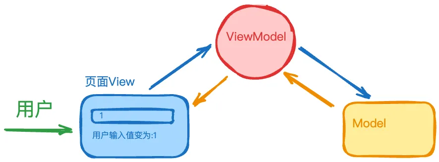
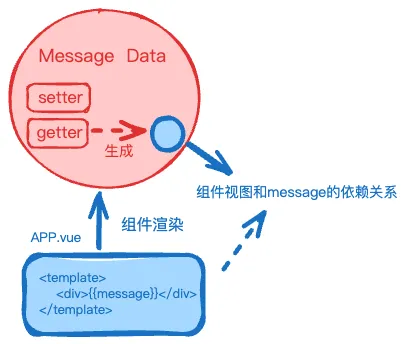
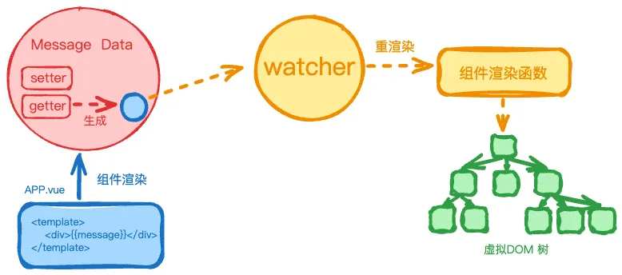
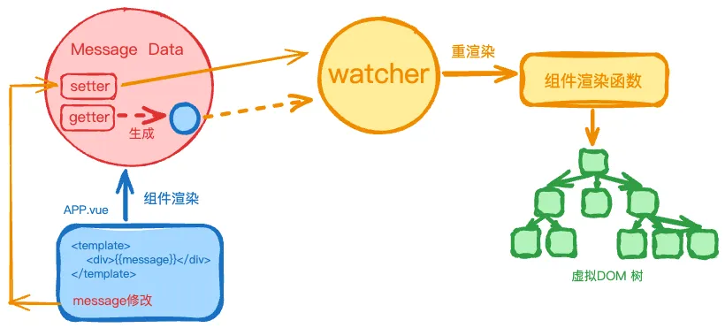
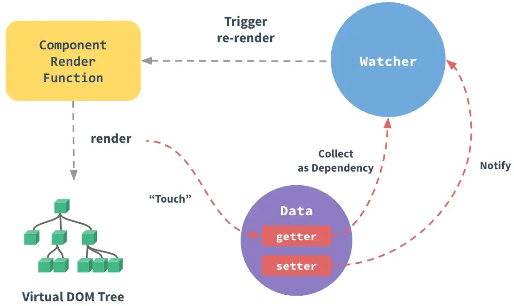
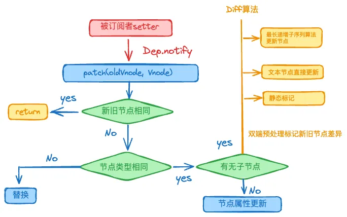
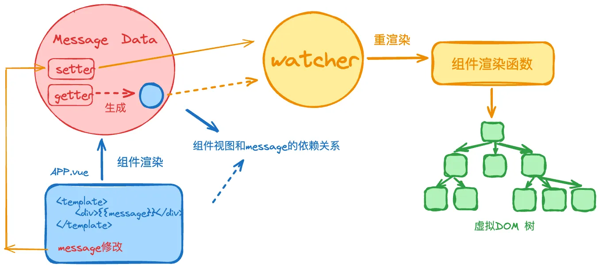

# Vue 原理

国内面试，大厂必考原理。

::: tip

1. 目标**不在**中大厂的同学，可以略过这一节。
2. 对 Vue 使用尚不熟练的同学，不要在此花费太多精力，先熟悉使用再说。

:::

::: tip
如有疑问，可免费 [加群](/docs/services/group.md) 讨论咨询，也可参与 [1v1 面试咨询服务](/docs/services/1v1.md)， 专业、系统、高效、全流程 准备前端面试
:::

## 什么是 MVVM

::: details 参考答案

**MVVM（Model-View-ViewModel）** 是一种用于构建用户界面的架构模式，用于现代的前端开发框架（Vue、Angular）。它通过 **数据绑定** 和 **视图模型** 提供了高效的 UI 更新和数据同步机制。

MVVM 模式主要由 `Model` （模型）、 `View` （视图）、 `ViewModel` （视图模型）三个部分组成。

- `Model`表示程序的核心数据和业务逻辑，它不关心用户界面，只负责数据的获取、存储和处理，并提供与外界交互的接口。
- `View`负责展示数据和用户交互，简单来说他就是我们看到的UI 组件或 HTML 页面。
- `ViewModel`是连接 `View` 和 `Model` 的桥梁，它不直接操作视图或模型，而是通过数据绑定将两者连接起来。

参考下面的示例：

```vue
<div id="app">
  <input v-model="message"/>
  <p>{{ computedValue }}</p>
</div>

<script setup>
const message = ref('Hello, MVVM!')

const computedValue = computed(() => {
  return '用户输入值变为:' + message.value
})
</script>
```

上述代码展示了一个输入框，当用户输入内容的时候，输入框下面的计算值会随之变化。在这个示例中， `message` 变量属于 `Model` ，它包含了应用的核心数据。输入框与页面展示就属于View，负责展示数据和用户交互。 `computed` 和 `v-model语法糖` 作为 `ViewModel` ，用于更新视图和数据。



:::

## 什么是 VDOM 它和 DOM 有什么关系

::: details 参考答案

页面的所有元素、属性和文本都通过 `DOM` 节点表示， `VDOM（Virtual DOM，虚拟 DOM）` 是DOM渲染的一种优化，它是一个内存中的虚拟树，是真实 DOM 的轻量级 JavaScript 对象表示。

VDOM主要用于优化 UI 渲染性能，它的工作流程大致如下：

- 1️⃣**创建虚拟 DOM**：当组件的状态或数据发生变化时，Vue 会重新生成虚拟 DOM。
- 2️⃣**比较虚拟 DOM 和真实 DOM**：Vue 使用一种高效的算法来比较新旧虚拟 DOM 的差异（即 diff 算法）。
- 3️⃣**更新 DOM**：根据差异更新真实的 DOM，仅修改有变化的部分，而不是重新渲染整个 DOM 树。

:::

## 手写 VNode 对象，表示如下 DOM 节点

```html
<div class="container">
  
  <p>hello</p>
</div>
```

> 如果你还不熟悉 `虚拟 DOM` 和 `渲染函数` 的概念的话，请先学习[vue的渲染机制](https://cn.vuejs.org/guide/extras/rendering-mechanism.html)

::: details 参考答案

Vue 模板会被预编译成**虚拟 DOM 渲染函数**，我们也可以直接手写**渲染函数**，在处理高度动态的逻辑时，渲染函数相比于模板更加灵活，因为我们可以完全地使用 `JavaScript` 来构造我们想要的 `vnode` 。

Vue 提供了一个 `h()` 函数用于创建 `vnodes`

```javascript
h(type, props, children)
```

- `type`: 表示要渲染的节点类型（例如 HTML 标签名或组件）。
- `props`: 一个对象，包含该节点的属性（例如 `class`、`style`、`src` 等）。
- `children`: 子节点，可以是文本内容、数组或者其他 VNode。

```javascript
import { h } from 'vue'

export default {
  render() {
    return h(
      'div',
      {
        class: 'container',
      },
      [
        h('img', {
          src: 'x1.png',
        }),
        h('p', null, 'hello'),
      ]
    )
  },
}
```

:::

## Vue 组件初始化的各个阶段都做了什么？

::: details 参考答案
从组件的创建到挂载到页面，再到组件的更新和销毁，每个阶段都有特定的任务和职责。

🎯 组件实例创建：当我们第一次访问页面时，Vue创建组件实例，解析`props`、`data`、`methods`等属性方法，在组合式API中，执行 `setup()`。

🎯 响应式系统建立：基于 `Proxy` 实现 `reactive`、`ref`，建立依赖收集和触发更新机制，`props` 传递时自动响应式处理。

🎯 模板编译与渲染：将 template 编译为渲染函数，Vue 3 通过 静态提升等方式优化性能，Vite 预编译 `SFC（单文件组件）`。

🎯 DOM 挂载：执行渲染函数生成 VNode，通过 `Patch 算法` 转换为真实 DOM 并插入页面，同时初始化子组件。`mounted（Options API`）或 `onMounted（Composition API）`触发，可进行 DOM 操作。

🎯 响应式更新：状态变更触发 `Diff` 算法 计算最小 DOM 更新，`beforeUpdate`、`updated（Options API）`或 `onBeforeUpdate`、`onUpdated（Composition API）`执行相应逻辑。

🎯 组件销毁：移除 DOM，清理副作用（解绑事件、销毁 `watcher`、清理 `effect`），递归卸载子组件，触发 `beforeUnmount`、`unmounted（Options API）`或 `onBeforeUnmount`、`onUnmounted（Composition API）`。

> Vue 3 通过 `Proxy` 响应式、编译优化、生命周期调整提升性能，使组件更高效。

:::

## Vue 如何实现双向数据绑定

::: details 参考答案

Vue 实现双向数据绑定的核心是通过**响应式系统**的 **数据劫持**和 **观察者模式**来实现的。

🎯 **数据劫持**

Vue 2.x 使用 `Object.defineProperty` 对数据对象的每个属性递归添加 `getter/setter` ，当数据的属性被访问时，触发 `getter` ，当属性被修改时，触发 `setter` 通知视图进行更新。通过这种方式，Vue 可以监控数据的变化，并在数据变化时通知视图更新。

> Vue 3.x 使用 Proxy通过代理对象拦截整个对象的操作，无需递归初始化所有属性，性能更好。

🎯 **观察者模式**

Vue 的响应式系统通过 **观察者模式** 来实现数据与视图的同步更新，简化的流程如下：

- **依赖收集**：当 Vue 组件的视图模板渲染时，它会读取数据对象的属性（例如 `{{ message }}`）。在读取属性时，getter方法会将视图组件与该数据属性建立依赖关系。



- **观察者（Watcher）**：每个依赖的数据都会对应一个观察者。观察者的作用是监听数据的变化，一旦数据发生变化，观察者会收到通知，进而触发视图的更新。



- **通知视图更新（Notify View Update）**：当数据通过 `setter` 修改时，Vue 会触发相应的观察者，通知相关的视图组件更新。



通过这种方式，Vue 可以监控数据的变化，并在数据变化时通知视图更新。

:::

## Vue 模板编译的过程

::: details 参考答案

Vue 的模板编译过程是将开发者编写的模板语法（例如 `{{ message }}` 和 `v-bind` 等）转换为 JavaScript 代码的过程。它主要分为三个阶段：**模板解析**、**AST优化** 和 **代码生成**：

1️⃣ **模板解析**

Vue 使用其解析器将 HTML 模板转换为 **抽象语法树（AST）**。在这个阶段，Vue 会分析模板中的标签、属性和指令，生成一颗树形结构。每个节点表示模板中的一个元素或属性。

如：

```javascript
< div >
    <
    p > {
        {
            message
        }
    } < /p> <
button v - on: click = "handleClick" > 点击 < /button> < /
div >
```

被解析成的 AST 类似于下面的结构：

```javascript
{
    type: 1, // 节点类型：1 表示元素节点
    tag: 'div', // 元素的标签名
    children: [ // 子节点（嵌套的 HTML 元素）
        {
            type: 1, // 子节点是一个元素节点
            tag: 'p',
            children: [{
                type: 2, // 2 表示插值表达式节点
                expression: 'message' // 表达式 'message'
            }]
        },
        {
            type: 1, // 另一个元素节点
            tag: 'button',
            events: { // 事件监听
                click: 'handleClick' // 绑定 click 事件，执行 handleClick 方法
            },
            children: [{
                type: 3, // 文本节点
                text: '点击' // 按钮文本
            }]
        }
    ]
}
```

2️⃣ **AST优化**

Vue 在生成渲染函数前，会对 AST 进行优化。优化的核心目标是标记 **静态节点**，在渲染时，Vue 可以跳过这些静态节点，提升性能。

> **静态节点**指所有的渲染过程中都不变化的内容，比如 `某个div标签内的静态文本`

在 `vue3` 中，如果一个节点及其子树都不依赖于动态数据，那么该节点会被提升到渲染函数外部（静态提升），仅在组件初次渲染时创建。

3️⃣ **代码生成**

生成渲染函数是编译的最终阶段，这个阶段会将优化后的 AST 转换成 JavaScript 渲染函数。

例如，像这样的模板：

```html
<div id="app">{{ message }}</div>
```

最终会生成类似这样的渲染函数：

```javascript
function render() {
  return createVNode(
    'div',
    {
      id: 'app',
    },
    [createTextVNode(this.message)]
  )
}
```

渲染函数的返回值是一个 `虚拟 DOM（VDOM）树` ，Vue 会根据 `虚拟 DOM` 来更新实际的 `DOM` 。由于 `渲染函数` 被 Vue 的响应式系统包裹，当数据发生变化时，渲染函数会被重新执行生成新的虚拟 DOM，因此页面也会实时更新。

:::

## Vue 响应式原理

::: details 参考答案

Vue 的响应式原理在 2.x 和 3.x 中有所不同，分别基于 `Object.defineProperty` 和 `Proxy` 实现。

🎯 **Vue 2.x 的实现 ( `Object.defineProperty` )**

`Object.defineProperty` 支持 IE9 及以上版本，兼容性非常好。它会递归遍历对象，对每个属性单独设置 `getter` 和 `setter` ，但也存在以下局限性：

- **无法监听动态属性增删**
  Vue 2.x 在新增或删除对象属性时不会触发视图更新，需通过 `Vue.set` 或 `Vue.delete` 手动处理。
- **数组监听受限**
  无法直接监听数组索引的修改（如 `arr[0] = 1` ）和 `length` 变化，因此 Vue 2.x 重写了数组的一些方法来解决这一问题。
- **性能开销较大**
  需要递归地为每个属性设置 `getter` 和 `setter` ，对深层嵌套的对象和大型数组性能较差。
- **不支持 Map/Set 等数据结构**
  只能代理普通对象和数组，不能处理像 `Map` 、 `Set` 等复杂数据结构。

🚀 **Vue 3.x 的实现 ( `Proxy` )**

为了解决 Vue 2.x 中的这些问题，Vue 3.x 采用了 `Proxy` ，带来了更优的性能和更全面的响应式支持：

- **动态属性增删支持**
  `Proxy` 可以直接代理整个对象，因此可以监听属性的动态增删，不再需要手动操作。
- **完美支持数组和索引修改**
  `Proxy` 能够监听数组索引的修改（如 `arr[0] = 1` ）以及 `length` 变化，避免了 Vue 2.x 中的重写数组方法。
- **性能更优**
  `Proxy` 采用懒代理模式，只有在访问属性时才会递归代理子对象，避免了递归遍历的性能开销。
- **支持更多数据结构**
  除了普通对象和数组， `Proxy` 还可以代理 `Map` 、 `Set` 等数据结构，提供了更强大的响应式能力。

| 特性         | `Object.defineProperty` <br/>（Vue 2）    | `Proxy` <br/>（Vue 3）          |
| ------------ | ----------------------------------------- | ------------------------------- |
| 动态属性增删 | ❌ 不支持（需 `Vue.set` / `Vue.delete` ） | ✅ 支持                         |
| 数组索引修改 | ❌ 需重写方法（如 `push` ）               | ✅ 直接监听                     |
| 性能         | ⚠️ 递归初始化所有属性，性能较差           | ✅ 惰性代理，按需触发，性能更优 |
| 数据结构支持 | ❌ 仅普通对象/数组                        | ✅ 支持 `Map` 、 `Set` 等       |
| 兼容性       | ✅ 支持 IE9+                              | ❌ 不支持 IE                    |
| 实现复杂度   | ⚠️ 需递归遍历对象，代码冗余               | ✅ 统一拦截，代码简洁           |

:::

## 为何 v-for 需要使用 key

::: details 参考答案

在 Vue.js 中，使用 `v-for` 渲染列表时，添加 key 属性是一个重要的最佳实践。

- **提高性能**：当 Vue 更新视图时，它会根据 `key` 来识别哪些元素被修改、添加或移除。如果没有 `key`，Vue 会依赖其默认的算法（基于元素的位置）来比较元素，这样可能导致不必要的 DOM 操作。使用 `key` 后，Vue 能精确地找到每个项，从而减少不必要的 DOM 重排和重绘，提升性能。
- **保持组件状态**：如果渲染的是一个组件（而不是普通的 DOM 元素），使用 `key` 可以确保组件在渲染更新时保持正确的状态。例如，如果列表中有表单输入框，每个输入框都有自己的状态，使用 `key` 可以确保输入框状态不会因列表排序或元素移除而丢失。
- **避免渲染错误**：key 的存在可以帮助 Vue 确保在列表更新时，元素的顺序和内容保持稳定，避免出现不稳定的渲染或顺序错乱。

:::

## Vue diff 算法的过程

::: details 参考答案

Vue的diff算法执行，依赖数据的的响应式系统：当数据发生改变时， `setter` 方法会让调用 `Dep.notify` 通知所有订阅者 `Watcher` ，订阅者会重新执行渲染函数，渲染函数内部通过diff 算法用于比较新旧虚拟 DOM 树的差异，并计算出最小的更新操作，最终更新相应的视图。



diff 算法的核心算法流程如下：

- 节点对比
  如果新旧节点类型相同，则继续比较它们的属性。如果节点类型不同（如元素和文本节点不同），则直接**替换**整个节点。
- 属性更新：
  如果节点类型相同，接下来检查节点的属性。对于不同的属性值进行更新，移除旧属性，添加新属性。
- 子节点比对：
  对于有子节点的元素（如 div），Vue 会使用不同的策略来优化子节点更新：
  🎯 文本节点的更新：如果新旧子节点都是文本节点，直接更新文本内容。
  🎯 数组类型子节点的比对：如果新旧子节点都是数组，Vue 会通过 `LIS 算法` 来优化节点的重新排列，避免过多的 DOM 操作。



:::

## Vue3 diff 算法做了哪些优化？

::: details 参考答案

- 静态标记与动态节点的区分
  Vue3引入了 `静态标记（Static Marking）` 机制，通过在模板编译阶段为静态节点添加标记，避免了对这些节点的重复比较。这使得Vue3能够更高效地处理静态内容，减少不必要的DOM操作。
- 双端对比策略
  Vue3的Diff算法采用了双端对比策略，即从新旧节点的头部和尾部同时开始比较，快速定位无序部分。这种策略显著减少了全量对比的复杂度，提升了性能。
- 最长递增子序列（LIS）优化
  在处理节点更新时，Vue3利用最长递增子序列（LIS）算法来优化对比流程。通过找到新旧节点之间的最长递增子序列，Vue3可以减少不必要的DOM操作，从而提高更新效率。
- 事件缓存与静态提升
  事件缓存：Vue3将事件缓存为静态节点，避免每次渲染时重新计算事件处理逻辑，从而减少性能开销。
  静态提升：对于不参与更新的元素，Vue3将其提升为静态节点，仅在首次创建时进行处理，后续不再重复计算。
- 类型检查与属性对比
  Vue3在Diff算法中增加了类型检查和属性对比功能。如果节点类型不同，则直接替换；如果类型相同，则进一步对比节点的属性，生成更新操作。
- 动态插槽的优化
  Vue3对动态插槽进行了优化，通过动态节点的类型化处理，进一步提升了Diff算法的效率

:::

## Vue diff 算法和 React diff 算法的区别

::: details

Vue 和 React 的 Diff 算法均基于虚拟 DOM，但在 `实现策略` 、 `优化手段` 和 `设计哲学` 上存在显著差异：

**1. 核心算法策略对比**

| **维度**     | **React**                      | **Vue 2/3**                          |
| ------------ | ------------------------------ | ------------------------------------ |
| **遍历方式** | 单向递归（同层顺序对比）       | 双端对比（头尾指针优化）             |
| **节点复用** | 类型相同则复用，否则销毁重建   | 类型相同则尝试复用，优先移动而非重建 |
| **静态优化** | 需手动优化（如 `React.memo` ） | 编译阶段自动标记静态节点             |
| **更新粒度** | 组件级更新（默认）             | 组件级 + 块级（Vue3 Fragments）      |

**2. 列表 Diff 实现细节**

**a. React 的索引对比策略**

- **无 key 时**：按索引顺序对比，可能导致无效更新

```jsx
// 旧列表：[A, B, C]
// 新列表：[D, A, B, C]（插入头部）
// React 对比结果：更新索引 0-3，性能低下
```

- **有 key 时**：通过 key 匹配节点，减少移动操作

```jsx
// key 匹配后，仅插入 D，其他节点不更新
```

**b. Vue 的双端对比策略**

分四步优化对比效率（Vue2 核心逻辑，Vue3 优化为最长递增子序列）：

1. **头头对比**：新旧头指针节点相同则复用，指针后移
2. **尾尾对比**：新旧尾指针节点相同则复用，指针前移
3. **头尾交叉对比**：旧头 vs 新尾，旧尾 vs 新头
4. **中间乱序对比**：建立 key-index 映射表，复用可匹配节点

```js
// 旧列表：[A, B, C, D]
// 新列表：[D, A, B, C]
// Vue 通过步骤3头尾对比，仅移动 D 到头部
```

**3. 静态优化机制**

**a. Vue 的编译时优化**

- **静态节点标记**：
  模板中的静态节点（无响应式绑定）会被编译为常量，跳过 Diff

```html
<!-- 编译前 -->
<div>Hello Vue</div>

<!-- 编译后 -->
_hoisted_1 = createVNode("div", null, "Hello Vue")
```

- **Block Tree（Vue3）**：
  动态节点按区块（Block）组织，Diff 时仅对比动态部分

**b. React 的运行时优化**

- **手动控制更新**：
  需通过 `React.memo` 、 `shouldComponentUpdate` 或 `useMemo` 避免无效渲染

```jsx
const MemoComp = React.memo(() => <div>Static Content</div>)
```

**4. 响应式更新触发**

| **框架** | **机制**                   | **Diff 触发条件**                |
| -------- | -------------------------- | -------------------------------- |
| React    | 状态变化触发组件重新渲染   | 父组件渲染 → 子组件默认递归 Diff |
| Vue      | 响应式数据变更触发组件更新 | 依赖收集 → 仅受影响组件触发 Diff |

```javascript
// Vue：只有 data.value 变化才会触发更新
const vm = new Vue({
  data: {
    value: 1,
  },
})

// React：需显式调用 setState
const [value, setValue] = useState(1)
```

**5. 设计哲学差异**

| **维度**     | **React**                  | **Vue**                    |
| ------------ | -------------------------- | -------------------------- |
| **控制粒度** | 组件级控制（开发者主导）   | 细粒度依赖追踪（框架主导） |
| **优化方向** | 运行时优化（Fiber 调度）   | 编译时优化（模板静态分析） |
| **适用场景** | 大型动态应用（需精细控制） | 中小型应用（快速开发）     |

:::

## 简述 Vue 组件异步更新的过程

参考答案

::: details

Vue 组件的异步更新过程是其响应式系统的核心机制，主要通过 **批量更新** 和 **事件循环** 实现高效渲染，具体流程如下：

**一、触发阶段：依赖收集与变更通知**

1. **数据变更**
   当组件内响应式数据（如 `data` 、 `props` ）被修改时，触发 `setter` 通知依赖（Watcher）。

2. **Watcher 入队**
   所有关联的 Watcher 会被推入 **异步更新队列**（ `queueWatcher` ），Vue 通过 `id` 去重，确保每个 Watcher 仅入队一次，避免重复更新。

**二、调度阶段：异步队列处理** 3. **异步执行**
Vue 将队列刷新任务放入微任务队列（优先 `Promise.then` ，降级 `setImmediate` 或 `setTimeout` ），等待当前同步代码执行完毕后处理。

```javascript
// 伪代码：nextTick 实现
const timerFunc = () => {
  if (Promise) {
    Promise.resolve().then(flushQueue)
  } else if (MutationObserver) {
    /* 使用 MO */
  } else {
    setTimeout(flushQueue, 0)
  }
}
```

4. **合并更新**
   同一事件循环中的多次数据变更会被合并为一次组件更新（如循环中修改数据 100 次，仅触发 1 次渲染）。

**三、执行阶段：虚拟 DOM 与 DOM 更新** 5. **组件重新渲染**
执行队列中的 Watcher 更新函数，触发组件的 `render` 生成新虚拟 DOM（VNode）。

6. **Diff 与 Patch**
   通过 **Diff 算法** 对比新旧 VNode，计算出最小化 DOM 操作，批量更新真实 DOM。

**四、核心优势**

- **性能优化**：避免频繁 DOM 操作，减少重排/重绘。
- **数据一致性**：确保在同一事件循环中的所有数据变更后，视图一次性更新到最终状态。
- **开发者友好**：通过 `Vue.nextTick(callback)` 在 DOM 更新后执行逻辑。

```javascript
export default {
  data() {
    return {
      count: 0,
    }
  },
  methods: {
    handleClick() {
      this.count++ // Watcher 入队
      this.count++ // 去重，仍只一个 Watcher
      this.$nextTick(() => {
        console.log('DOM已更新:', this.$el.textContent)
      })
    },
  },
}
```

点击事件中两次修改 `count` ，但 DOM 仅更新一次， `nextTick` 回调能获取最新 DOM 状态。

**总结流程图**

```
数据变更 → Watcher 入队 → 微任务队列 → 批量执行 Watcher → 生成 VNode → Diff/Patch → DOM 更新
```

通过异步更新机制，Vue 在保证性能的同时，实现了数据驱动视图的高效响应。

:::

参考资料

::: details

- https://juejin.cn/post/7054488305659805727

:::

## Vue 组件是如何渲染和更新的

::: details 参考答案

Vue 组件的渲染和更新过程涉及从 `模板编译` 到 `虚拟 DOM` 的**构建**、**更新**和最终的实际 DOM 更新。下面是 Vue 组件渲染和更新的主要步骤：

1️⃣ 组件渲染过程
Vue 的组件的渲染过程核心是其[模板编译](./vue-inner/#vue-模板编译的过程)过程，大致流程如下：
首先，Vue会通过其响应式系统完成组件的 `data、computed 和 props` 等数据和模板的绑定，这个过程Vue 会利用 `Object.defineProperty（Vue2）` 或 `Proxy（Vue3）` 来追踪数据的依赖，保证数据变化时，视图能够重新渲染。随后，Vue会将模板编译成渲染函数，这个渲染函数会在每次更新时被调用，从而生成虚拟 DOM。
最终，虚拟DOM被渲染成真实的 DOM 并插入到页面中，组件渲染完成，组件渲染的过程中，Vue 会依次触发相关的生命周期钩子。

2️⃣ 组件更新过程
当组件的状态（如 data、props、computed）发生变化时，响应式数据的 `setter` 方法会让调用Dep.notify通知所有 `订阅者Watcher` ，重新执行渲染函数触发更新。



渲染函数在执行时，会使用 diff 算法（例如：双端对比、静态标记优化等）生成新的虚拟DOM。计算出需要更新的部分后（插入、删除或更新 DOM），然后对实际 DOM 进行最小化的更新。在组件更新的过程中，Vue 会依次触发beforeUpdate、updated等相关的生命周期钩子。

:::

## 如何实现 keep-alive 缓存机制

::: details 参考答案

`keep-alive` 是 Vue 提供的一个内置组件，用来缓存组件的状态，避免在切换组件时重新渲染和销毁，从而提高性能。

```vue
<template>
  <keep-alive>
    <component :is="currentComponent" />
  </keep-alive>
</template>
```

Vue 3 的 keep-alive 的缓存机制原理如下：

- 缓存池：keep-alive 内部使用一个 Map 存储已渲染的组件实例，键通常是组件的 key（或 name）。
- 激活与挂起：如果组件切换时已经缓存，直接复用缓存的组件实例；如果组件未缓存，则渲染并缓存新的组件实例。
  此外，keep-alive 还会激活特殊的钩子函数：
- 当组件被缓存时，会触发 deactivated 钩子。
- 当组件从缓存中恢复时，会触发 activated 钩子。

一个简单的实现如下：

```javascript
const KeepAliveImpl = {
  name: 'KeepAlive',
  // 已缓存的组件实例。
  _cache: new Map(),
  _activeCache: new Map(),

  render() {
    const vnode = this.$slots.default()[0] // 获取动态组件的 vnode
    const key = vnode.key || vnode.type.name

    if (this._cache.has(key)) {
      const cachedVnode = this._cache.get(key)
      this._activeCache.set(key, cachedVnode)
      return cachedVnode
    } else {
      return vnode // 未缓存，直接渲染
    }
  },

  mounted() {
    const key = this.$vnode.key
    if (!this._cache.has(key)) {
      this._cache.set(key, this.$vnode)
    }
  },

  beforeDestroy() {
    const key = this.$vnode.key
    this._cache.delete(key)
  },
}
```

:::

## 为何 ref 需要 value 属性

::: details 参考答案

Vue 3 中， `ref` 之所以需要 `.value` 属性，主要是因为 Vue 3 使用 `Proxy` 实现响应式。 `Proxy` 对对象或数组的每个属性进行深度代理，因此可以追踪嵌套属性的变化。而 `Proxy` 无法直接处理基本数据类型（如 `number` 、 `string` 、 `boolean` ），这使得 `reactive` 无法用于基本数据类型。为了实现基本数据类型的响应式，Vue 设计了 `ref` ，它将基本数据类型封装为一个包含 `value` 属性的对象，并通过 `getter` 和 `setter` 进行依赖追踪和更新。当访问或修改 `ref.value` 时，Vue 会触发依赖更新。

:::

## Vue的双向数据绑定原理是什么？

::: details 参考答案
Vue的双向数据绑定本质上是通过数据劫持+发布订阅模式实现的。简单说就是：

- Vue 2: 用Object.defineProperty()劫持数据的get和set
- Vue 3: 用Proxy代理整个对象，性能更好
- 核心流程: 数据变化 → 触发setter → 通知依赖 → 更新视图
- 记住这个公式：数据劫持 + 依赖收集 + 派发更新 = 响应式

Vue 2用的是Object.defineProperty，我来给你手写一个简化版：

```js
// 简化版响应式实现
function reactive(data) {
  Object.keys(data).forEach((key) => {
    let value = data[key]
    const dep = new Dep() // 每个属性都有自己的依赖收集器

    Object.defineProperty(data, key, {
      get() {
        // 收集依赖：谁用了这个数据？
        if (Dep.target) {
          dep.addSub(Dep.target)
        }
        return value
      },
      set(newValue) {
        if (value === newValue) return
        value = newValue
        // 通知更新：数据变了，通知所有使用者
        dep.notify()
      },
    })
  })
}

// 依赖收集器
class Dep {
  constructor() {
    this.subs = [] // 存储依赖该数据的watcher
  }

  addSub(watcher) {
    this.subs.push(watcher)
  }

  notify() {
    this.subs.forEach((watcher) => watcher.update())
  }
}
```

Vue 3 简化版实现

```js
// Vue 3 简化版实现
function reactive(target) {
  return new Proxy(target, {
    get(obj, key) {
      // 依赖收集
      track(obj, key)
      return obj[key]
    },

    set(obj, key, value) {
      obj[key] = value
      // 触发更新
      trigger(obj, key)
      return true
    },
  })
}
```

实际应用场景

```vue
<template>
  <div>
    <!-- 这里就是双向绑定的经典场景 -->
    <input v-model="message" placeholder="输入点什么..." />
    <p>你输入的是: {{ message }}</p>
  </div>
</template>

<script setup>
import { ref } from 'vue'

const message = ref('') // Vue 3的响应式数据
</script>
```

当你在输入框打字时：

- 输入框值改变 → 触发input事件
- 更新data中的message → 触发setter
- setter通知依赖 → 模板重新渲染
- 页面显示新内容 → 用户看到实时变化
  面试中怎么回答 🎯
  面试官问这个问题，其实是想考察你对Vue核心原理的理解。你可以这样组织回答：

- 第一层：核心概念 🎪
  "Vue的双向绑定主要通过数据劫持实现，Vue 2用Object.defineProperty，Vue 3用Proxy"

- 第二层：实现细节 🔧
  "具体来说，就是在数据的getter中收集依赖，在setter中派发更新"

- 第三层：优化改进 ⚡
  "Vue 3的Proxy相比Vue 2有很大提升，解决了数组和动态属性的监听问题"

:::

## Vue中的key有什么作用？

:::details
在Vue中，key是一个特殊的属性，主要用于Vue的虚拟DOM算法，是识别节点的一个通用机制。它的核心作用有：

- 提高更新效率：帮助Vue准确地识别元素，追踪每个节点的身份，从而重用和重新排序现有元素
- 维持组件状态：确保组件在数据变化时能够保持自身的状态
- 触发过渡效果：当元素的key发生变化时，Vue会认为这是一个新元素，从而触发过渡效果
- 没有key或使用不当（如用索引作为key）可能导致：数据显示错乱、组件状态混乱、性能下降等问题。
- 记住关于Vue中key的作用，你只需要记住一句话：key就是虚拟DOM中元素的身份证，有了它，Vue才能准确知道该复用哪些元素、更新哪些元素，从而提高diff算法效率和保证组件状态的正确性。

:::

## 虚拟DOM有哪些优缺点？

::: details
虚拟DOM是用JavaScript对象描述真实DOM结构的技术方案。

主要优点 👍

- 性能优化：通过diff算法减少不必要的DOM操作
- 批量更新：将多次DOM操作合并为一次执行
- 跨平台能力：可渲染到不同平台（Web、Mobile、Desktop）
- 开发体验：声明式编程，代码更易维护
  主要缺点 👎
- 内存开销：需要维护虚拟DOM树的内存空间
- 首次渲染慢：初始化时需要创建完整的虚拟DOM
- 小量更新反而慢：简单操作可能不如直接操作DOM

- 性能优化机制

```js
// ❌ 传统方式：频繁操作DOM
for (let i = 0; i < 1000; i++) {
  const div = document.createElement('div')
  div.innerHTML = `Item ${i}`
  container.appendChild(div) // 每次都触发重排重绘
}

// ✅ 虚拟DOM方式：批量更新
const virtualNodes = []
for (let i = 0; i < 1000; i++) {
  virtualNodes.push({
    tag: 'div',
    children: `Item ${i}`,
  })
}
// 一次性渲染到DOM
render(virtualNodes, container)
```

- Diff算法优化

```js
// 虚拟DOM diff的核心思想
function diff(oldVNode, newVNode) {
  // 🎯 节点类型不同：直接替换
  if (oldVNode.tag !== newVNode.tag) {
    return { type: 'REPLACE', newVNode }
  }

  // 🎯 文本节点：比较内容
  if (typeof newVNode === 'string') {
    if (oldVNode !== newVNode) {
      return { type: 'TEXT', newVNode }
    }
    return null
  }

  // 🎯 属性diff
  const propsPatches = diffProps(oldVNode.props, newVNode.props)

  // 🎯 子节点diff
  const childrenPatches = diffChildren(oldVNode.children, newVNode.children)

  return {
    type: 'UPDATE',
    propsPatches,
    childrenPatches,
  }
}
```

:::

## Vue的diff算法是如何工作的？

::: details
Vue的Diff算法是一种高效的虚拟DOM比较算法，主要包含以下核心概念：

- 同级比较 - 只比较同一层级的节点
- 双端比较 - 新旧子节点数组的首尾两端同时比较
- key的作用 - 帮助Vue识别节点的唯一性
- 四种比较方式 - 新前与旧前、新后与旧后、新后与旧前、新前与旧后
  首尾比较

```js
// 简化版比较逻辑
while (oldStartIdx <= oldEndIdx && newStartIdx <= newEndIdx) {
  if (sameVnode(oldStartVnode, newStartVnode)) {
    // 新前与旧前比较
    patchVnode(oldStartVnode, newStartVnode)
    oldStartVnode = oldCh[++oldStartIdx]
    newStartVnode = newCh[++newStartIdx]
  } else if (sameVnode(oldEndVnode, newEndVnode)) {
    // 新后与旧后比较
    patchVnode(oldEndVnode, newEndVnode)
    oldEndVnode = oldCh[--oldEndIdx]
    newEndVnode = newCh[--newEndIdx]
  }
  // ... 其他比较逻辑
}
```

Key的重要性

```js
<!-- 不推荐 -->
<div v-for="item in items">
  {{ item }}
</div>

<!-- 推荐 -->
<div v-for="item in items" :key="item.id">
  {{ item }}
</div>
```

性能优化策略

- 1.静态节点提升

```vue
<template>
  <div>
    <h1>静态标题</h1>
    <!-- 会被提升 -->
    <div>{{ dynamicContent }}</div>
  </div>
</template>
```

- 2.合理使用key

```vue
// 好的key值 const goodKey = item.id + '-' + item.type // 避免使用 const badKey = Math.random()
```

常见问题与解决方案 🔧

- 列表渲染性能问题

- 使用v-memo缓存静态内容
- 合理使用v-show代替v-if
- 避免频繁更新大量数据
- key的使用误区

- 避免使用随机数作为key
- 避免使用数组索引作为key
- 确保key的唯一性和稳定性
