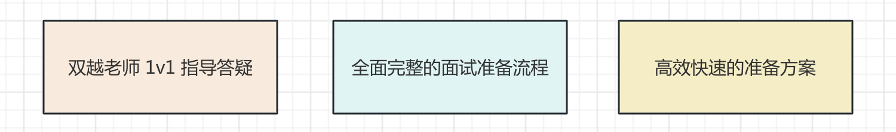
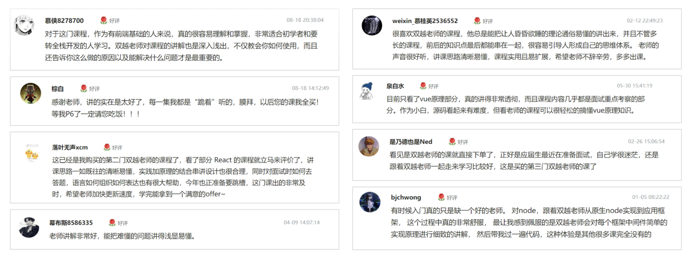
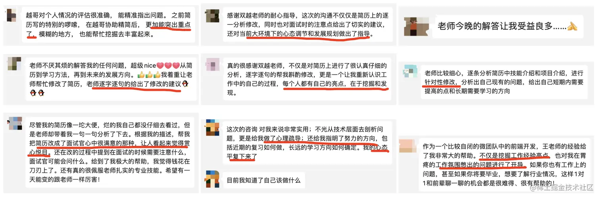
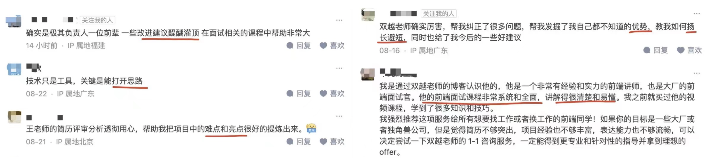
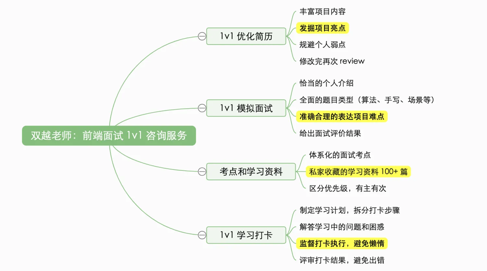

# 双越老师 1v1 面试咨询

专业解决下面的问题：

- 初入职场不知道如何写简历，如何写出内容和亮点
- 不知道如何准备面试题，搜出很多资料，但无从下手
- 工作几年，项目都是重复性的，写不出亮点和成绩
- 工作快 10 年了，但还是一线开发人员，如何体现个人经验？
- 业余不学习，基础知识很差，面试没信心
- 工作多年只会 Vue ，不懂算法，没有技术广度和深度
- 在一个公司呆久了，不知道该如何面试了
- 刚毕业，没实际项目经验
- ......

## 作者介绍

大家好我是[双越](https://juejin.cn/user/1714893868765373)，wangEditor 作者，前百度、滴滴资深前端工程师，PMP，慕课网金牌讲师，博客总流量 500w ，代表作品：

- [wangEditor](https://www.wangeditor.com/) 开源 Web 富文本编辑器，GitHub Star 18k
- [划水AI](https://www.huashuiai.com/) Node 全栈 AIGC 知识库，AI 智能写作，多人协同编辑
- [前端面试派](https://www.mianshipai.com/) 系统专业的面试导航，大厂面试流程，开源免费

我从 2017 年开始在慕课网讲授前端面试课程，是全网第一个做前端面试课程的讲师，至今已服务学员 5w+ 看过简历 2000+ 收到很多好评。而且，我此前一直是大厂面试官，非常清楚前端面试的流程和要求。

## 缘起

2023 年 5 月开始，我推出了一个简单的 1v1 技术咨询服务，可以聊任何技术话题。陆续有很多人找我咨询，但绝大部分人都是为了优化简历，发掘亮点。

于是，我就改变了咨询方向，专门进行前端简历优化，帮助发掘个人、项目亮点。没想到效果非常好，他们给出了很好的评价，我也赚到了一些零花钱。

再后来咨询的人多了，我发现大家除了简历优化之外，还有很多其他面试相关的问题。于是我就根据个人的工作、授课、咨询的经验，制定了一个**系统全面的面试准备解决方案**。可以帮大家快速全面的准备面试。

## 服务内容

更多详细内容、价格、报名方式等，可 [加群](/docs/services/group.md) 咨询群主 `双越`
