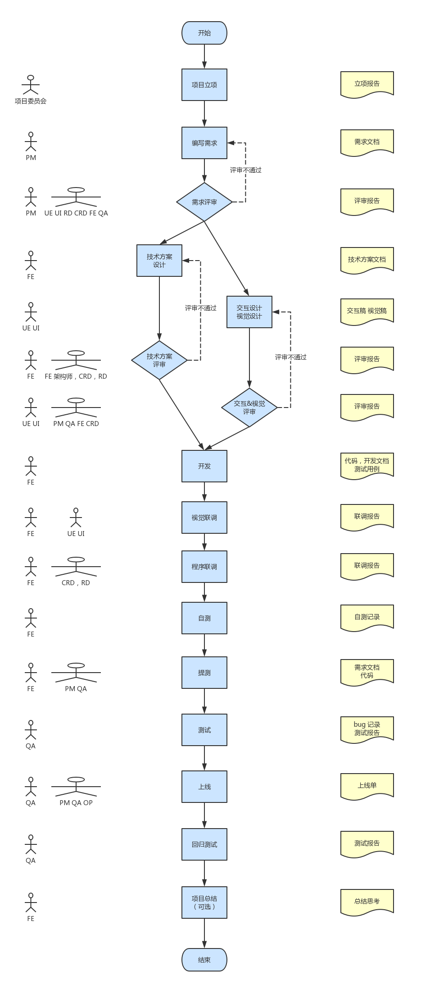

# 前端 Leader 面试

二面结束以后，前端团队 Leader 面试，不再关注技术细节，更关注项目组织和设计能力。

::: tip
如有疑问，可免费 [加群](/docs/services/group.md) 讨论咨询，也可参与 [1v1 面试咨询服务](/docs/services/1v1.md)， 专业、系统、高效、全流程 准备前端面试
:::

## 浏览器从输入 url 到显示网页的全过程

::: tip
这个问题在任何面试环节都有可能被考察，要提前准备。
:::

这个问题的答案内容比较多，回答的时候不一定要答的多细致，但一定不要错过关键步骤。

关键步骤如下

::: details

- DNS 解析出 IP 地址
- 建立 TCP 连接
- 客户端发出 HTTP 请求
- 服务端响应 HTTP 请求
- 浏览器解析 HTML CSS
- 渲染 DOM
- 执行 JS 代码，可能会 ajax 加载内容，再次渲染 DOM
- 加载媒体资源
- 浏览器缓存机制

:::

参考资料

::: details

- https://juejin.cn/post/6905931622374342670
- https://zhuanlan.zhihu.com/p/133906695
- https://juejin.cn/post/6844904194801926157

:::

## 从 0 搭建一个前端项目，需要考虑哪些方面

现在创建一个 Vue React 一般都是拿脚手架 cli 一键生成项目，这是最基础的。

在实际工作中还需要考虑更多的内容。参考答案如下

::: details

- 代码仓库，发布到哪个 npm 仓库（如有需要）
- 技术选型 Vue React 等
- 代码目录规范
- 打包构建 webpack 等，做打包优化
- eslint prettier commit-lint
- husky pre-commit
- 单元测试 + 集成测试
- CI/CD 流程，自动测试，自动发布测试环境，自动部署
- 开发环境，预发布环境
- 开发文档，研发规范

:::

## 如何实现 ajax 并发请求控制？

现有 30 个异步请求需要发送，但由于某些原因，我们必须将同一时刻并发请求数量控制在 5 个以内，同时还要尽可能快速的拿到响应结果。应该怎么做？

解题思路

::: details

- Promise.all 是需要固定数量的，并不适用这个题目的场景
- 可使用 Promise + 递归调用来实现，一个请求完成后继续下一个

:::

参考资料

::: details

- https://juejin.cn/post/6916317088521027598
- https://juejin.cn/post/7004257642130472996

:::

PS. 在一般的 web 项目中用不到这个需求，因为浏览器会自带并发请求数量的控制

::: details

- https://juejin.cn/post/7135687874250768398
- https://blog.csdn.net/qq_56392992/article/details/135631680

:::

## React 和 Vue 有什么区别？更擅长哪一个？

主要的区别

::: details

- Vue 默认使用 Vue template 模板语法（也支持 JSX）；React 默认使用 JSX 语法；
- Vue 对初学者更友好，因为它提供了更多语法糖；而 React 需要良好的 JS 基础；
- React 函数组件对 TS 的支持更加友好，因为它本身就是个 TS 函数；Vue 的 setup script 是它的自定义语法；
- React 使用 Hooks ，有调用顺序、闭包陷阱等心智负担；Vue3 使用 composables 组合式 API ，心智负担少；
- React 使用 state ，Vue3 使用 ref ，后者一直有 `.value` 的心智负担
- 服务端组件方面，React 技术栈的 Next.js 和 Remix 做的更好一些；Vue 技术栈的 Nuxt.js 也在发展之中；

:::

参考资料

::: details

- https://juejin.cn/post/7344536653463207973
- https://juejin.cn/post/7347300843001462793

:::

这两个框架/lib 虽然有些区别，但在国内的实际工作中使用都没问题，擅长哪个就用哪个。

但，你如果两个都熟悉，能让你增加很多面试机会，React 和 Vue 的都可以去面试。

## 如何做好技术选型？

当在工作中选择一个 语言/框架/工具 时，需要考虑什么？

参考答案

::: details

- 社区热门程度，搜索引擎和 StackOverflow 上能搜出多少相关资料？
- 创办时间和发展时间，不要用太新的技术，首先要求稳
- 看使用人数，参考 GitHub star 数量和 npm 下载量
- 看社区生态的完善程度，第三方的 UI 、组件、插件等，都是否完善
- 团队成员的学习成本 —— 这一点很重要，很多人会忽略

:::

另，回答这个问题的时候，尽量举一个你实际工作中的例子，会更有说服力。

## 如何理解技术方案设计？是否做过技术方案设计？

所谓技术方案设计，就是把你要开发的内容，先写个文档或 PPT 说明一下自己要怎么开发，并和团队成员讨论一下。

如果就是简单的功能或 bug ，10 几分钟就能搞定的，那不用技术方案设计。但复杂的工作，技术方案设计是很有必要的。因为

::: details

- 如果你真的成竹在胸，觉得它很简单，那你写个技术方案设计的文档应该也花不了多少时间，可能 1h 就写完了，项目不会因此而延期的。
- 如果你憋半天写不出一篇技术方案设计文档，那你开发的时候就能很顺利？不可能的。它正好能验证你是不是眼高手低。
- 技术方案评审，多人参加，会更容发现一些：功能重复、性能瓶颈、安全隐患等。

:::

技术方案设计一般包含如下部分

::: details

- state 数据结构，如会存储在 vuex 或 redux 中
- 组件 UI 结构，嵌套关系，属性如何传递
- 会用到哪些服务端的 API ，哪些是现有的，哪些需要新开发
- 如有复杂逻辑，说明计算过程，时间复杂度
- 是否有性能隐患？
- 是否有安全隐患？

:::

## 线上出了严重 bug 你该如何解决？

正确的处理步骤

::: details

- **回滚**，及时止损 —— 这一步最重要，很多人不知道这一步！！！
- 通知项目组成员，看谁最近有过上线？—— 线上 bug 一般是最近一次上线导致的
- 在本地或测试环境浮现 bug，查找原因
- 修复，测试，重新上线
- 开**复盘**会议，以后如何规避此类问题 —— 复盘会议，也是很多人不知道的

:::

另，如果你项目没有监控报警的话，最好加一个，这样线上有 bug 会及时报警。

## 你参与的项目，研发流程是怎样的？

如果是新项目研发，会采用传统的瀑布流形式

::: details

- 项目立项
- 确认需求，编写需求文档，UI 设计图
- 制定技术方案
- 制定研发计划
- 开发
- 多端联调
- 测试，修复 bug
- 上线
- 总结



:::

如果是已有项目的维护和升级，一般采用敏捷开发方式

::: details

- 项目有一个统一的任务列表，分优先级排列
- 开发人员领取一个任务，负责设计、开发、提测等流程，每一步都会在任务看板中显示步骤和进展
- 待这个任务上线以后，再领取下一个任务


:::

## 你如何保障代码质量？

代码质量和系统稳定性有直接关系，保障代码质量也是高级程序员的必备技能。

参考答案

::: details

- 配置统一的 eslint 和 prettier 规则，规范代码格式
- 每次代码合并，都进行 code review ，外加每周一次团队 code review
- 编写单元测试，提交 commit 时自动触发单元测试
- 使用 Sentry 等平台进行线上错误报警，并及时修复问题

:::

## 是否写过单元测试和 e2e 测试？

单元测试，是针对某个小型单元（组件，函数），常见的工具 Jest Vitest

e2e 端到端测试，是针对一个系统 UI 和行为进行测试，常见的工具 Cypress Puppeteer

参考资料

::: details

- https://juejin.cn/post/7123869512327233550
- https://juejin.cn/post/6896890664726822920

:::

## 自定义 DSL 流程图

请自定义 XML 来描述这个流程图


参考答案

::: details

```xml
<chart>
    <start-end id="start">开始</start-end>
    <flow id="flow1">流程1</flow>
    <judge id="judge1">评审</judge>
    <flow id="flow2">流程2</flow>
    <start-end id="end">结束</start-end>
    <arrow from="start" to="flow1"></arrow>
    <arrow from="flow1" to="judge1"></arrow>
    <arrow from="judge1" to="flow2">Y</arrow>
    <arrow from="judge1" to="end">N</arrow>
    <arrow from="flow2" to="end"></arrow>
</chart>
<!-- 另，每个节点还可以加上 x y 的定位信息，尺寸，边框、颜色等 -->
```

:::

## 最近在看什么书？或者学什么新技术吗？

如果你的简历写了自我评价，且在自我评价中写了“热爱技术” “持续学习”等描述，很可能会被问到这个问题。当然，你不写也不一定就不会被问到，还是提前准备好吧。

现在和前端相关的一些新技术，有如下方向

- Node 全栈，服务端渲染，如 Next.js 框架，这两年发展很迅速
- AI 相关的产品和工具，如各种 AI 聊天、AI 写作，还有 Copilot Cursor 等 AI 工具

也可以从你感兴趣的其他领域去说，只要能自圆其说即可。

## 你的缺点是什么？

注意，这是个坑！不要傻乎乎的真把自己的缺点说出来，暴露给别人看。

正确的方式是：说缺点，也要说自己的补救措施，最终体现自己是一个爱学习、要求进步的人。

推荐的表达方式

::: details

- 我觉得自己目前在 xxx 方面还有所欠缺
- 但我已经开始通过 xxx 学习这方面的知识了，计划 xxx 天以后即可完成

:::
