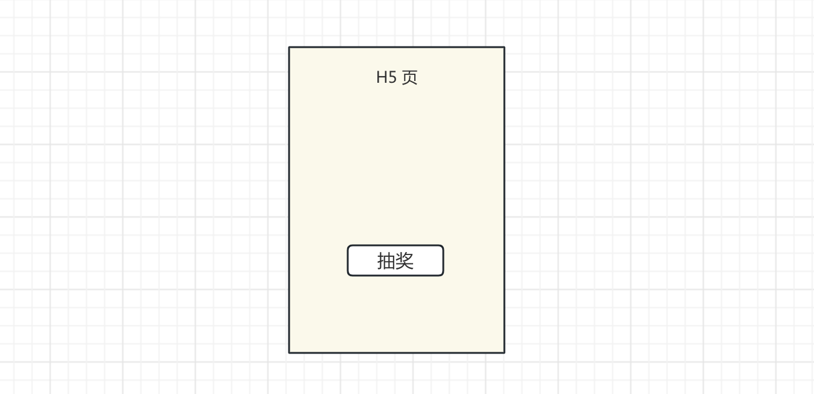

# 系统设计

综合考察一个候选人的技术方案设计能力，看能否培养为项目负责人，尤其工作经验 5 年以上的。

## 使用 Vue/React 设计 TodoList

明确功能，设计数据结构和组件结构

## 使用 Vue/React 设计一个购物车

明确功能，设计数据结构和组件结构

## 使用 Vue/React 设计一个集联选择器

如集联选择省、市、区县

## 为 input 设计一个 autoComplete

## 使用 JS + HTML 设计 撤销/重做 undo/redo

## 开发一个 H5 抽奖页，需要后端提供哪些接口

假如你刚接手一个抽奖 H5 运营页（微信朋友圈分享的），你应该和服务端确认哪些 API 接口？

参考答案

::: details

- 用户身份的验证方式
- 是否已经抽过（直接显示结果）
- 点击，触发抽奖
- 统计埋点（PV UV 自定义事件 性能 报错 分享行为等）

:::

## 设计一个前端统计 SDK

## 全栈：设计一个新闻 Feed 小程序/H5

考虑服务端接口，考虑性能等...

## 全栈：设计一个博客网站

## 全栈：设计一个购物网站

## 全栈：设计一个多人聊天室
