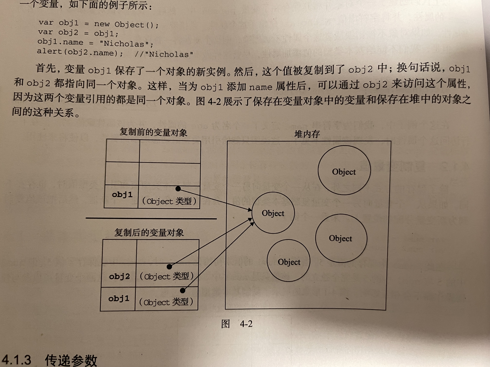

# JS 读代码

读懂面试的代码，才能读懂工作中的代码。

::: tip
如有疑问，可免费 [加群](/docs/services/group.md) 讨论咨询，也可参与 [1v1 面试咨询服务](/docs/services/1v1.md)， 专业、系统、高效、全流程 准备前端面试
:::

## JS 编译

以下代码，执行结果是什么？

```js
var func = 1
function func() {}
console.log(func + func)
```

答案

::: details

```
2
```

这题考察的 GO，也就是全局的预编译：

1. 创建 GO 对象
2. 找变量声明，将变量声明作为 key，值赋为 undefined
3. 找函数声明，将函数名作为 GO 对象的key，值赋为函数体

编译阶段：创建 GO 对象后，func 作为 key，值为 undefined，然后 func 变成了 函数体，所以在编译结束时，func 还是一个 function

运行阶段：func 被赋值为 1，所以 func + func 就是 2

:::

## JS 引用类型

以下代码，执行结果是什么？

```js
let obj1 = { x: 1 }
let obj2 = obj1
obj2.y = 2
obj2 = { y: 20 }
console.log('obj1', obj1)
```

答案

::: details

```
obj1 { x: 1, y: 2 }
```

ECMAScript 变量可能包含两种不同类型的值：基本类型值和引用类型值。

基本类型包括：Undefined、Null、Boolean、Number、String、Symbol
引用类型包括：Object、Array

引用类型的值是保存在内存中的对象。与其他语言不同，JavaScript 并不允许直接访问内存中的位置，也就是说不能直接操作对象的内存空间。在操作对象时，实际上是在操作对象的引用而不是实际的对象。

换言之，变量实际保存的是一个指针，这个指针指向放在内存中的对象

当运行 `let obj2 = obj1;` 的时候，实际上是复制了一份指针，而不是复制了一份对象。



所以 `obj2.y = 2` 能够修改对象的值，`obj1` 能够访问修改后的对象。

运行 `obj2 = { y: 20 };` 时，只是将 obj2 指向了新的对象，`obj1` 还是指向原来的对象。
:::

## JS parseInt

以下代码，执行结果是什么？

```js
;['1', '2', '3'].map(parseInt)
```

答案

::: details

```
[1, NaN, NaN]
```

查看 MDN 数组的 [map](https://developer.mozilla.org/zh-CN/docs/Web/JavaScript/Reference/Global_Objects/Array/map) 方法，它的参数是一个函数，函数的参数是 `(element, index, array)`，`element` 是数组的元素，`index` 是元素的索引，`array` 是数组本身。

查看 MDN 的 [parseInt](https://developer.mozilla.org/zh-CN/docs/Web/JavaScript/Reference/Global_Objects/parseInt) 函数，它的参数是 `(string, radix)`，`string` 是要解析的字符串，`radix` 是 2-36 之间的整数，表示被解析字符串的基数。

所以当遍历的时候，实际效果是：

parseInt('1', 0) // radix 假如指定 0 或未指定，基数将会根据字符串的值进行推算。所以结果为 1。

parseInt('2', 1) // radix 应该是 2-36 之间的整数，此时为 1，无法解析，返回 NaN

parseInt('3', 2) // radix 是 2，表示 2 进制，注意这里不是指将其解析为 2 进制，而是按照 2 进制进行解析，但 3 不是 2 进制里的数字，所以无法解析，返回 NaN
:::

## JS this 1

以下代码，执行结果是什么？

```js
const User = {
  count: 1,
  getCount: function () {
    return this.count
  },
}
console.log('a ', User.getCount()) // what?
const func = User.getCount
console.log('b', func()) // what?
```

答案

::: details

```
a 1
b undefined
```

本题考察 this 的指向。

this 是一个指向对象的指针，this 的指向与所在方法的调用位置有关，而与方法的声明位置无关。

作为方法调用时，this 指向调用它所在方法的对象；所以 a 为 1

作为函数调用时，this 指向 window。所以 b 为 undefined.

:::

## JS this 2

以下代码，执行结果是什么？

```js
const obj = {
  f1() {
    const fn = () => {
      console.log('this1', this)
    }
    fn()
    fn.call(window)
  },
  f2: () => {
    function fn() {
      console.log('this2', this)
    }
    fn()
    fn.call(this)
  },
}
obj.f1()
obj.f2()
```

答案

::: details

```
this1 obj 和 this1 obj
this2 window（严格模式下是 undefined） 和 this2 window
```

箭头函数没有自己的 this 对象

对于普通函数来说，内部的 this 指向函数运行时所在的对象，但是这一点对箭头函数不成立。它没有自己的 this 对象，内部的 this 就是定义时上层作用域中的 this。也就是说，箭头函数内部的 this 指向是固定的，相比之下，普通函数的 this 指向是可变的，比如通过 call 来改变。

obj.f1() 时，fn 是箭头函数，内部的 this 是定义时上层作用域中的 this，也就是 obj。箭头函数修改不了 this，所以 fn.call(window) 不会修改 this 指向。

obj.f2() 时，fn 是普通函数，但 f2 是箭头函数，如果 f2 是普通函数，该方法内部的 this 指向 obj，但是写成箭头函数，this 指向全局对象，这是因为对象不构成单独的作用域，导致箭头函数定义时的作用域就是全局作用域。所以都是 windows（在非严格模式下）。

:::

## JS 自由变量 1

以下代码，执行结果是什么？

```js
let i
for (i = 1; i <= 3; i++) {
  setTimeout(function () {
    console.log(i)
  }, 0)
}
```

答案

::: details

```
4 4 4
```

i 是全局变量，用来控制循环。循环调用了 3 次 setTimeout 延迟执行。当 setTimeout 执行的时候，i 已经变成了 4。

此外查看 MDN [setTimeout](https://developer.mozilla.org/zh-CN/docs/Web/API/Window/setTimeout)，第二个参数为 delay，表示定时器在执行指定的函数或代码之前应该等待的时间，单位是毫秒。如果省略该参数，则使用值 0，意味着“立即”执行，或者更准确地说，在下一个事件循环执行。所以虽然数值设置为 0，但依然是异步行为。
:::

## JS 自由变量 2

以下代码，执行结果是什么？

```js
let n = 10
function f1() {
  n++
  function f2() {
    function f3() {
      n++
    }
    let n = 20
    f3()
    n++
  }
  f2()
  n++
}
f1()
console.log('n', n)
```

答案

::: details

```
n 12
```

let 声明为 JavaScript 新增了块级作用域。所以 f2 内部的 n 是 f2 内部的变量，不会影响外层 n 的变化。

关于 let 声明可以参考 《ECMAScript 6 入门》[let 和 const 命令](https://es6.ruanyifeng.com/#docs/let)
:::

## JS 闭包 1

以下代码，执行结果是什么？

```js
const n = 10
function print() {
  console.log(n)
}

function f1(fn) {
  const n = 20
  fn()
}
f1(print)
```

答案

::: details

```
10
```

JavaScript 采用词法作用域(lexical scoping)，也就是静态作用域。换句话说，说函数的作用域在函数定义的时候就决定了。

所以当调用 print 的时候，它会根据定义的位置向外查找变量，也就是 n = 10。

关于词法作用域，参考 [《JavaScript 深入之词法作用域和动态作用域》](https://juejin.cn/post/6844903473012539405)
:::

## JS 闭包 2

以下代码，执行结果是什么？

```js
function fn() {
  let num = 10
  return {
    set: (n) => (num = n),
    get: () => num,
  }
}

let num = 20
const { get, set } = fn()
console.log('result1: ', get())
set(100)
console.log('result2: ', num)
```

答案

::: details

```
10 20
```

由于 JavaScript 的闭包特性，函数内部的变量可以持续存在。

所以当调用 `get()` 的时候，可以访问到 fn 函数作用域中的 num，所以 result1 输出 10。

set(100)修改的是 fn 函数作用域中的 num，而不是全局的 num。

所以全局的 num 值，仍然是 20。
:::

## JS Promise 1

以下代码，执行结果是什么？

```js
const promise = new Promise((resolve, reject) => {
  console.log(1)
  console.log(2)
})
promise.then(() => {
  console.log(3)
})
console.log(4)
```

答案

::: details

```
1 2 4
```

当创建新的 Promise 时，executor 函数会立即执行，所以打印了 1 和 2。

promise.then() 注册了一个回调函数，但因为 executor 函数没有调用 resolve 或 reject，所以 Promise 永远处于 pending 状态，回调函数不会被执行，所以不会打印 3。

最后执行 console.log(4)，打印 4。

:::

## JS Promise 2

以下代码，执行结果是什么？

```js
const promise = new Promise((resolve, reject) => {
  console.log(1)
  setTimeout(() => {
    console.log('timerStart')
    resolve('success')
    console.log('timerEnd')
  }, 0)
  console.log(2)
})
promise.then((res) => {
  console.log(res)
})
console.log(4)
```

答案

::: details

```
1
2
4
timerStart
timerEnd
success
```

当创建新的 Promise 时，executor 函数会立即执行，所以打印了 1 和 2。

即使 setTimeout 的延时设置为 0，它的回调函数依然是异步执行的，会被放入宏任务队列，要等到当前所有同步代码执行完毕后才会执行。

promise.then() 注册了一个回调函数，

按照代码顺序执行 console.log(4)，打印 4。

setTimeout 回调开始执行，打印 timerStart。此时调用 resolve 函数，但 Promise.then 回调也是异步的，所以不会立刻调用 then 函数，而是放入微任务队列。代码继续执行，打印 timerEnd。

最后开始执行微任务，调用 then 函数，打印 success。

:::

## JS 异步执行顺序 1

以下代码，执行结果是什么？

```js
console.log('start')
setTimeout(() => {
  console.log('a')

  Promise.resolve().then(() => {
    console.log('c')
  })
})
Promise.resolve().then(() => {
  console.log('b')

  setTimeout(() => {
    console.log('d')
  })
})
console.log('end')
```

答案

::: details

```
start end b a c d
```

本题涉及同步代码、微任务、宏任务的执行顺序。

首先执行同步代码，打印 start 和 end。

setTimeout 回调函数会被放入宏任务队列，等待同步代码执行完毕后执行。

Promise.resolve().then() 注册了一个回调函数，会被放入微任务队列。

因为微任务优先级高于宏任务，所以 then 回调函数会首先执行，打印 b。回调函数调用了 setTimeout，将函数放入宏任务队列。

然后执行之前的宏任务，打印 a。然后又注册了一个 then 回调函数，会被放入微任务队列。

因为微任务优先级高于宏任务，所以 then 回调函数会首先执行，打印 c。

最后执行宏任务，打印 d。

:::

## JS 异步执行顺序 2

以下代码，执行结果是什么？

```js
Promise.resolve()
  .then(() => {
    console.log(0)
    return Promise.resolve(4)
  })
  .then((res) => {
    console.log(res)
  })

Promise.resolve()
  .then(() => {
    console.log(1)
  })
  .then(() => {
    console.log(2)
  })
  .then(() => {
    console.log(3)
  })
  .then(() => {
    console.log(5)
  })
  .then(() => {
    console.log(6)
  })
```

答案

::: details

```
0 1 2 3 4 5 6
```

1. 初始状态：

   - 两个 Promise.resolve() 创建两个立即 resolved 的 Promise
   - 它们的 .then 回调都被加入到第一轮微任务队列

2. 第一轮微任务：
   - 执行第一个链的第一个 then：打印 0，返回 Promise.resolve(4)
   - 执行第二个链的第一个 then：打印 1
3. 第二轮微任务：
   - 第二个链的第二个 then 执行：打印 2
   - 第一个链的第二个 then 暂时不执行，因为它在等待 Promise.resolve(4) 的解析
4. 第三轮微任务：

   - 第二个链的第三个 then 执行：打印 3

5. 第四轮微任务：

   - Promise.resolve(4) 完成解析
   - 第一个链的第二个 then 执行：打印 4
   - 第二个链的第四个 then 执行：打印 5

6. 第五轮微任务：
   - 第二个链的最后一个 then 执行：打印 6

这道题的难点在于为什么 4 在 3 之后打印，延迟了 2 个微任务才执行。

这是因为等待 Promise.resolve(4) 的解析需要一个微任务（这期间打印了 2），resolve 过程中发现是 Promise（准确的说是 thenable），V8 会进行一个不同处理，将其入列一个新任务，这期间打印了 3，然后在第四轮微任务中，第一个 Promise 打印 4，第 2 个 Promise 打印 5。

拓展阅读：[promise.then 中 return Promise.resolve 后，发生了什么？](https://www.zhihu.com/question/453677175/answer/1834710779)
:::
